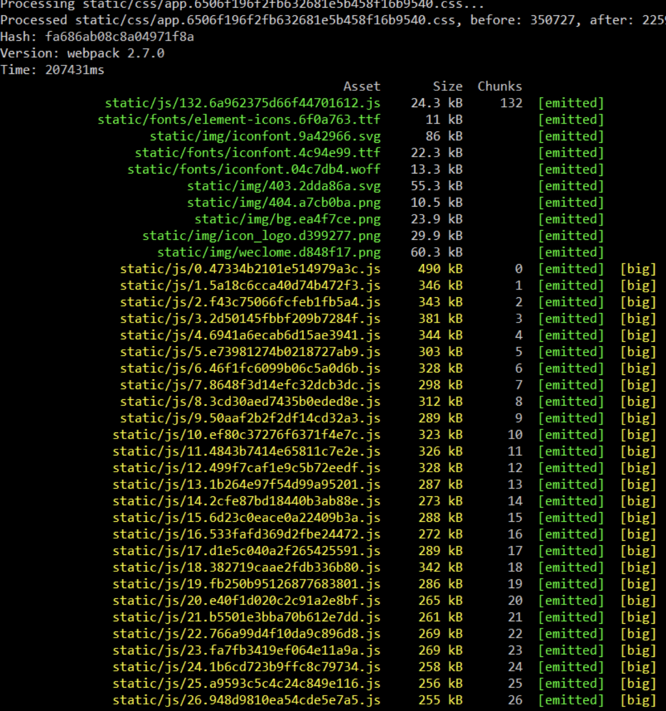
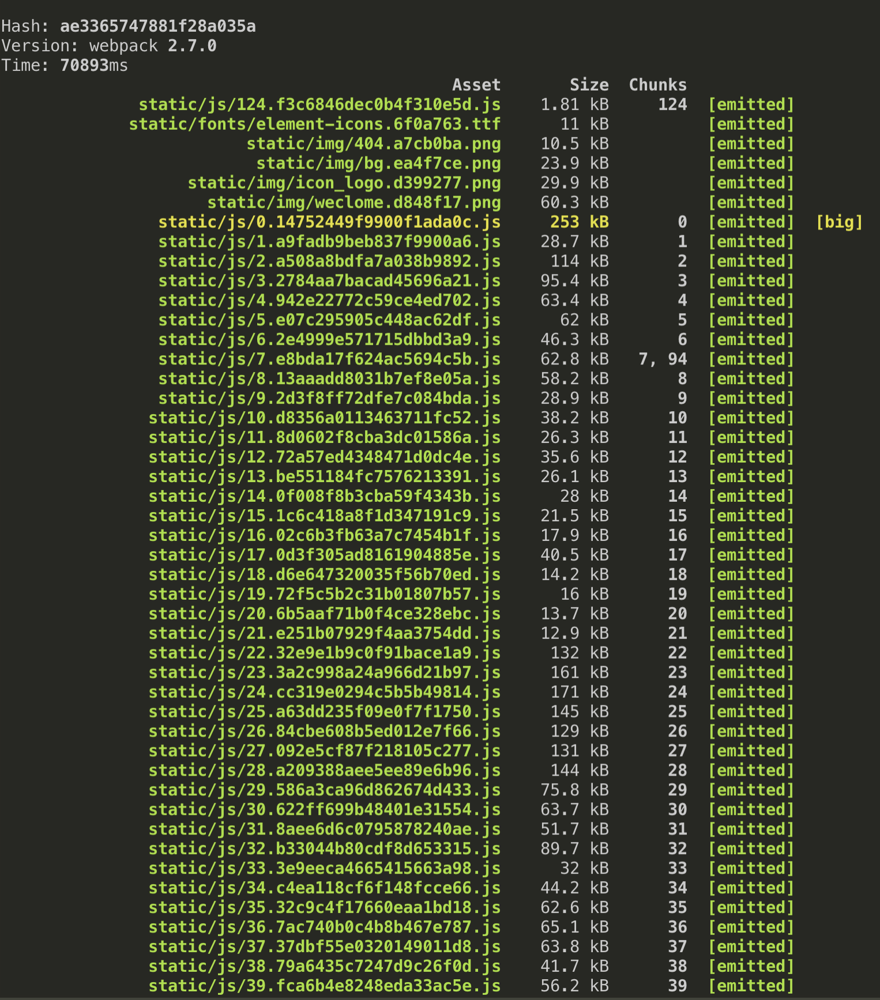

# Webpack优化

> 本篇目着重于 Webpack 速度及性能优化。暂时记录下 webpack V2版本相关的性能及构建用时优化，webpack V4版本相关优化后续补充。

## 起因

  中后台应用中因npm包体量重、模块众多、组件颗粒度细腻，导致开发时遇到两大突出问题：

  - 热更新速度缓慢，长达10s左右

  - 构建用时过长，长达200s左右

## 热更新

  在 Webpack v2版本中，当项目模块（ chunks ）众多时，热更新耗时主要用于 Webpack 内置插件 RemoveParentModulesPlugin 。

  具体详情可参阅：[RemoveParentModulesPlugin takes a long time with hundreds of chunks](https://github.com/webpack/webpack/issues/6248)

  阅读上述 issue ，可知 RemoveParentModulesPlugin 在 Webpack V2版本中会存在性能问题，在进一步查阅 Webpack 2.7 版本源码后，更加确认了此问题的存在。相关源码如下：

  ```javascript
  class RemoveParentModulesPlugin {
    apply(compiler) {
      compiler.plugin("compilation", (compilation) => {
        compilation.plugin(["optimize-chunks-basic", "optimize-extracted-chunks-basic"], (chunks) => {
          for(var index = 0; index < chunks.length; index++) {
            var chunk = chunks[index];
            if(chunk.parents.length === 0) continue;

            // TODO consider Map when performance has improved https://gist.github.com/sokra/b36098368da7b8f6792fd7c85fca6311
            var cache = Object.create(null);
            var modules = chunk.modules.slice();
            for(var i = 0; i < modules.length; i++) {
              var module = modules[i];

              var dId = debugIds(module.chunks);
              var parentChunksWithModule;
              if((dId in cache) && dId !== "no") {
                parentChunksWithModule = cache[dId];
              } else {
                parentChunksWithModule = cache[dId] = allHaveModule(chunk.parents, module);
              }
              if(parentChunksWithModule) {
                module.rewriteChunkInReasons(chunk, parentChunksWithModule);
                chunk.removeModule(module);
              }
            }
          }
        });
      });
    }
  }
  
  ```
  因项目迁移至 Webpack V4版本，成本巨大，具有风险，只能在 Webpack V2版本进行打补丁式处理。

  而在开发模式下，其实并不需要 RemoveParentModulesPlugin 提供的优化，故可以使用自定义插件来避免此次优化。相关代码如下：


  ```javascript
  
  class OptimizeChunkTraversePlugin{
    apply(compiler) {
      // apply the plugin in webpack < 4 
      // webpack4+ fixed this performance bug
      // Reference: https://github.com/webpack/webpack/issues/6248
      if (!compiler.hooks) {
        compiler.plugin('compilation', compilation => {
          // optimize webpack built-in plugin : RemoveParentModulesPlugin
          compilation.plugin(['optimize-chunks-basic', 'optimize-extracted-chunks-basic'], chunks => {
            chunks.forEach(chunk => {
              chunk.parents = [];
            })
          })
        })
      }
    }
  }
  
  ```
  
  通过此次优化，热更新耗时从 10s 下降至 2s，避免了之前开发过程中漫长等待。

## 构建时

  在 Webpack v2版本中，关于构建时长的分析主要通过 [webpack-bundle-analyzer](https://github.com/webpack-contrib/webpack-bundle-analyzer) 及 [speed-measure-webpack-plugin](https://github.com/stephencookdev/speed-measure-webpack-plugin#readme) 两个插件来进行，前者主要用于分析打包后各模块的体积和模块间的依赖关系，后者主要用于分析相关 plugin 及 loader 的运行时长。

  **优化前打包结果如下：**

  
  
  通过上述两个插件分析，针对项目进行了如下优化：

  - 包体积

  1. 首先需要做得，即不常用的第三方库采用 CDN 来进行引入。
  
  2. 其次，针对于已引入并在项目中大量使用的库，为了避免代码变动导致的影响，采用 DllPlugin 来进行预打包，而为了区分开发与生产环境的差异性，引入了 [autodll-webpack-plugin](https://github.com/asfktz/autodll-webpack-plugin#readme)。

  - 缓存

  1. loader 缓存，主要是开启 babel-loader 的 cache模式

  ```javascript
  {
    test: /\.js$/,
    loader: 'babel-loader?cacheDirectory=true',
    include: [resolve('src')],
    exclude: /node_modules/
  }
  ```
  2. uglify 缓存，主要是开启 UglifyJSPlugin 的 cache模式

  3. docker（ Jenkins ）中 node_modules 缓存

  - 多线程
  
  1. happyPack：用于多线程加速 loader 解析

  2. webpack-parallel-uglify-plugin：用于多线程加速 uglify 过程

  **优化后打包结果如下：**

  

## 构建后

  优化结束后，构建完出现下述错误：

  ```javascript

  ERROR in static/js/22.32e9e1b9c0f91bace1a9.js from UglifyJs
  Unexpected token: name (hiddenTextarea) [static/js/22.32e9e1b9c0f91bace1a9.js:43,4]
  
  ```
  参阅 [SyntaxError: Unexpected token: name (xxxxxx) from Uglify plugin](https://github.com/webpack/webpack/issues/2972)，得知 Uglify 并不能解析 ES6，因此抛出错误语法。

  为解决此类问题，引入 [babili-webpack-plugin](https://github.com/webpack-contrib/babel-minify-webpack-plugin#readme) 或 [webpack-parallel-uglify-plugin](https://github.com/gdborton/webpack-parallel-uglify-plugin#readme) 替换 Webpack 内置 UglifyJsPlugin 便可。

  ```javascript
  // 如下插件择一即可
  const UglifyJSPlugin = require('webpack-parallel-uglify-plugin')
  const BabiliPlugin = require("babili-webpack-plugin");

  plugins:[
    ...
    new BabiliPlugin(),
    new UglifyJSPlugin({
      uglifyES: {}
    })
    ...
  ]
  
  ```

## 参考链接

- [Slow webpack build time (advanced module optimization)](https://stackoverflow.com/questions/43341878/slow-webpack-build-time-advanced-module-optimization)

- [RemoveParentModulesPlugin takes a long time with hundreds of chunks](https://github.com/webpack/webpack/issues/6248)

- [SyntaxError: Unexpected token: name (xxxxxx) from Uglify plugin](https://github.com/webpack/webpack/issues/2972)


