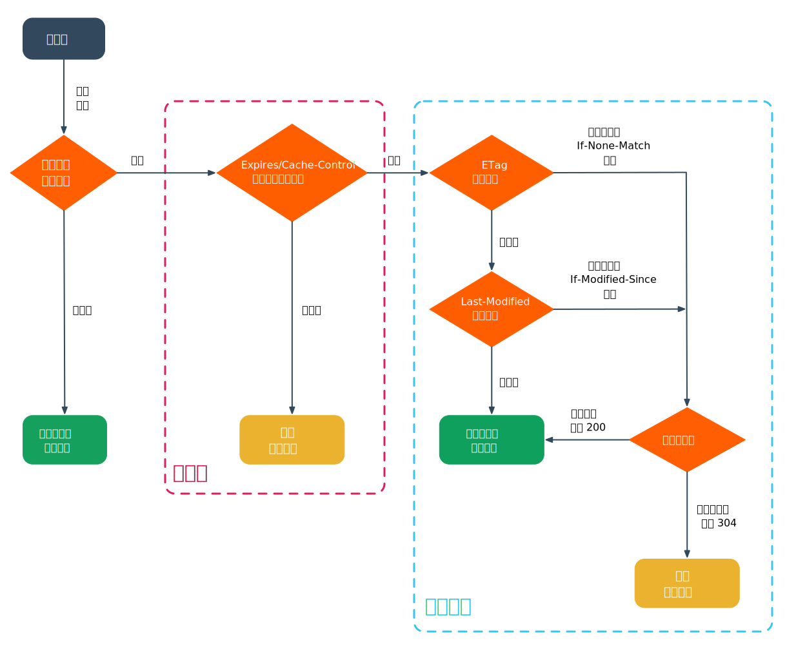

# CDN

> 内容分发网络（ Content Delivery Network，可简称为 CDN ）是指一种透过互联网互相连接的计算机网络系统，利用最靠近每位用户的服务器，更快、更可靠地将音乐、图片、影片、应用程序及其他文件发送给用户，来提供高性能、可扩展性及低成本的网络内容传递给用户。注：本篇目主要是面向前端的指南。

## 前言

互联网早期时代，用户量少，带宽低，富媒体资源体量有限，服务器的压力较低。随着互联网的发展，用户量爆炸增长，富媒体资源发展迅速，导致源内容服务器压力越来越大，主干网络拥堵越来越常见。

为解决网络拥堵这一问题，CDN应运而生，其核心理念即将内容缓存在用户周边。直白点说，当用户访问网站时，通过 CDN 负载均衡系统，将此次访问指向至最近的缓存服务器，由该缓存服务器提供网络服务。

CDN 缓存服务器一般称作 CDN 节点，其实跟电商网购平台的物流仓有点类似，为了产品更快到达用户手中，减少用户等待时长，网购订单下达后，会通过电商的物流系统分配最近的发货仓和配送站。同样，CDN 服务商会提供各区域及各运营商 CDN 节点，当用户访问网站时，会根据当前各节点负载情况及访问者的位置信息，分配最合适的节点来分发源内容网站的资源，提高用户访问该网站资源的速度。

## CDN 原理

CDN 的基本流程图如下：


举个例子，网站 <code>www.snowball.site</code> 中静态资源的预设 CDN 域名为 <code>cdn-static.snowball.site</code>，CDN 服务商提供的 CNAME 地址为 <code>ouyt4c4z5.bkt.clouddn.com</code> ，静态资源的 CDN 域名指向对应的 CNAME 地址这一绑定操作已完成。

CDN 整体分为两大步骤，即 DNS 解析 和 CDN 服务，具体步骤如下：

1. 浏览器访问 <code>cdn-static.snowball.site</code> 下的资源，倘若存在缓存，则直接使用缓存，否则对该域名进行 DNS 解析（ 此处细节可参阅 [域名解析流程](/engineering/domain.html#解析流程) ），通过网站域名服务器查询得知该域名为 CNAME 记录，指向 <code>ouyt4c4z5.bkt.clouddn.com</code> 。

2. 对域名 <code>ouyt4c4z5.bkt.clouddn.com</code> 进行 DNS 查询，由 CDN 服务商的全局负载均衡系统（ Global Server Load Balancing，可简称 GSLB ）给出该域名 A 或 AAAA 记录下 IP 地址 66.42.115.162，即离用户最近的 CDN 边缘节点，至此 DNS 解析流程完成。

3. 对 CDN 边缘节点 66.42.115.162 发起请求，倘若边缘节点存在该静态资源缓存，则直接返回缓存结果，否则向 CDN 中心节点发起请求。

4. CDN 中心节点在其缓存中查询是否存在该静态资源，若存在则返回缓存结果至 CDN 边缘节点，否则回源拉取资源。

5. CDN 中心节点依据设置的回源地址（ 可以是域名或 IP 地址，比如 <code>www.snowball.site</code> ），将请求转发至源站，由源站提供静态资源服务，至此 CDN 服务流程完成。

## CDN 加速

CDN 加速按业务主要分为五种类型：

- 小型静态资源

  以图片、网页样式文件、网页脚本文件等小文件为主的网站及应用

- 大型静态资源
  
  以安装包、系统升级包、应用升级包等大文件为主的网站及应用

- 音视频点播
  
  以音乐、语音、视频等点播资源为主的网站及应用

- 直播流媒体
  
  以视频直播、语音直播等直播资源为主的网站及应用

- 全站加速
  
  存在大量动静态内容，并且以动态资源居多的网站或应用

目前，网站通常采用动静分离的方案，即只针对网页样式文件、脚本文件及图片等静态资源进行 CDN 加速，常与静态资源存储相结合；倘若动态资源居多，也可采用动静结合的方案，即对整站动静态资源进行 CDN 加速，需要注意，动态资源加速需要回源，但针对客户端至源站的通道进行了链路优化。

## CDN 命中

当网站静态资源采用 CDN 时，CDN 命中率是常见指标，用来衡量网站加速效果。

顾名思义，CDN 命中率是指用户访问资源时命中缓存的概率。通常，CDN 命中率越高，表明网站加速效果越好。

网站静态资源通常用 Hit 及 Miss 来表明是否命中 CDN 缓存：Hit 表示命中 CDN 缓存，Miss 表示未命中 CDN 缓存。CDN 服务商会在 HTTP 响应头信息中采用自定义 HTTP 头信息方式来表明资源是否命中 CDN 缓存，不同服务商用于描述 CDN 缓存命中情况的字段往往不同，通常会采用 x-cache 或 x-cache-lookup 字段来描述。

以国内阿里云、腾讯云、七牛云、网宿、白山云为例，HTTP 响应头信息如下：

- 阿里云

  ```bash {17}
  # 请求资源
  curl -I https://img.alicdn.com/tfs/TB1Ly5oS3HqK1RjSZFPXXcwapXa-238-54.png

  # 响应头信息
  HTTP/2 200 
  server: Tengine
  content-type: image/png
  content-length: 1100
  date: Thu, 23 May 2019 05:56:00 GMT
  last-modified: Fri, 26 Apr 2019 08:36:57 GMT
  expires: Fri, 22 May 2020 05:56:00 GMT
  cache-control: max-age=31536000
  ali-swift-global-savetime: 1558590960
  via: cache15.l2hk71[0,200-0,H], cache16.l2hk71[0,0], cache5.jp3[0,200-0,H], cache12.jp3[0,0]
  access-control-allow-origin: *
  age: 7704720
  x-cache: HIT TCP_MEM_HIT dirn:9:280914441
  x-swift-savetime: Thu, 23 May 2019 07:23:54 GMT
  x-swift-cachetime: 31530726
  timing-allow-origin: *
  eagleid: 2ff604a015662956808786212e
  ```

  阿里云 CDN 缓存是否命中通过 x-cache 字段来描述： HIT TCP_MEM_HIT 表示命中 CDN 缓存，MISS TCP_MISS 表示未命中 CDN 缓存。

  有关缓存时间的字段如下：

  - x-swift-savetime：资源在 CDN 上缓存的时间。

  - x-swift-cachetime：CDN 默认缓存时间，以秒为单位。

  - age：资源在 CDN 上已缓存的时间，以秒为单位。

- 腾讯云

  ```bash
  # 请求资源
  curl -I https://imgcache.qq.com/open_proj/proj_qcloud_v2/gateway/portal/css/img/QRcode.png

  # 响应头信息
  HTTP/2 200 
  server: NWSs
  date: Sat, 24 Aug 2019 15:53:18 GMT
  content-type: image/png
  content-length: 13232
  cache-control: max-age=3600
  expires: Sat, 24 Aug 2019 16:53:17 GMT
  last-modified: Wed, 07 Aug 2019 11:47:48 GMT
  x-nws-log-uuid: ad280c57-bb5a-42fd-ac3f-45a7867200a8
  server_ip: 203.205.138.79
  vary: Accept
  x-cache-lookup: Hit From Disktank3
  x-datasrc: 2
  x-reqgue: 0
  ```

  腾讯云 CDN 缓存是否命中通过 x-cache-lookup 字段来描述： Hit From MemCache 表示命中 CDN 节点内存，Hit From Disktank 表示命中 CDN 节点磁盘，Hit From Upstream 表示未命中 CDN 缓存。

- 七牛云

  ```bash
  # 请求资源
  curl -I https://mars-assets.qnssl.com/FspZJF8xgIz24cG8xWeq8Sq3yIKB

  # 响应头信息
  HTTP/1.1 200 OK
  Server: Tengine
  Content-Type: image/jpeg
  Content-Length: 619829
  Connection: keep-alive
  Date: Fri, 23 Aug 2019 23:49:08 GMT
  Cache-Control: public, max-age=31536000
  Etag: "FspZJF8xgIz24cG8xWeq8Sq3yIKB"
  X-M-Log: QNM:jjh1877;QNM3:15/304
  X-M-Reqid: HnIAAKOV40Yssr0V
  X-Qnm-Cache: Hit
  Access-Control-Allow-Origin: *
  Access-Control-Expose-Headers: X-Log, X-Reqid
  Access-Control-Max-Age: 2592000
  X-Log: X-Log
  X-Qiniu-Zone: 0
  X-Reqid: c68AAACfQWhLZ7QV
  X-Svr: IO
  Accept-Ranges: bytes
  Content-Disposition: inline; filename="FspZJF8xgIz24cG8xWeq8Sq3yIKB"; filename*=utf-8' 'FspZJF8xgIz24cG8xWeq8Sq3yIKB
  Content-Transfer-Encoding: binary
  Last-Modified: Wed, 08 Aug 2018 06:05:56 GMT
  Ali-Swift-Global-Savetime: 1561275461
  Via: cache6.l2cn1820[0,200-0,H], cache24.l2cn1820[1,0], cache5.cn348[0,200-0,H], cache4.cn348[0,0]
  Age: 202747
  X-Cache: HIT TCP_MEM_HIT dirn:3:101958844
  X-Swift-SaveTime: Sat, 24 Aug 2019 19:26:57 GMT
  X-Swift-CacheTime: 2592000
  Timing-Allow-Origin: *
  EagleId: 75198b9015668068952507972e
  ```

  七牛云 CDN 缓存是否命中通过 X-Qnm-Cache 字段来描述： HIT 表示命中 CDN 缓存，MISS 表示未命中 CDN 缓存。

- 网宿

  ```bash
  # 请求资源
  curl -I https://www.wangsu.com/Upload/image/20190505/20190505162956_0140.jpg

  # 响应头信息
  HTTP/1.1 200 OK
  Date: Mon, 26 Aug 2019 09:34:00 GMT
  Content-Type: image/png
  Content-Length: 1446
  Connection: keep-alive
  Server: waf/2.15.3-8.el6
  Last-Modified: Thu, 25 Oct 2018 03:10:46 GMT
  ETag: "6000539-5a6-57904f2ecf980"
  Accept-Ranges: bytes
  Age: 1
  X-Via: 1.1 PSbjwjBGP2pt139:2 (Cdn Cache Server V2.0), 1.1 adianxin68:13 (Cdn Cache Server V2.0)
  Cache-Control: max-age=604800
  ```

  网宿 CDN 缓存是否命中通过 X-Via 字段来描述：Cdn Cache Server 字段表明采用了 CDN 服务。

- 白山云

  ```bash
  # 请求资源
  curl -I https://pic4.zhimg.com/v2-b43a4701f84d12e9cbd1c43a7b276be6_l.jpg

  # 响应头信息
  HTTP/2 200 
  date: Mon, 26 Aug 2019 09:17:47 GMT
  content-type: image/jpeg
  content-length: 5998
  server: AliyunOSS
  x-oss-request-id: 5B3F08BF776D387FCB8617B5
  etag: "B43A4701F84D12E9CBD1C43A7B276BE6"
  last-modified: Mon, 25 Dec 2017 04:35:25 GMT
  x-oss-object-type: Normal
  x-oss-storage-class: Standard
  x-oss-meta-format: jpeg
  x-oss-meta-height: 896
  x-oss-meta-width: 896
  x-oss-hash-crc64ecma: 11490056169299473555
  x-ser: BC34_dx-lt-yd-fujian-xiamen-8-cache-3, BC240_dx-zhejiang-jinhua-2-cache-8
  x-cache: HIT from BC240_dx-zhejiang-jinhua-2-cache-8(baishan)
  cache-control: public, max-age=31536000
  access-control-allow-origin: *
  access-control-max-age: 2592000
  x-cdn-provider: BS
  ```

  白山云 CDN 缓存是否命中通过 x-cache 字段来描述： HIT 表示命中 CDN 缓存，MISS 表示未命中 CDN 缓存。

以国外 Akamai、AWS CloudFront、Cloudflare、Fastly 为例，HTTP 响应头信息如下：

- Akamai

  ```bash
  # 请求资源
  curl -I -H "Pragma: akamai-x-cache-on,akamai-x-get-cache-key" https://a0.muscache.com/im/pictures/1e338975-3b45-4681-a493-934c1b26baf6.jpg?aki_policy=large

  # 响应头信息
  HTTP/2 200 
  etag: "672916e11cf4620bc09d3f5f1998afe000a5b3d9"
  last-modified: Fri, 26 Jul 2019 13:32:52 GMT
  server: Akamai Image Manager
  x-akamai-ssl-client-sid: SCHxwOaBMKXMexiInrJ7ZQ==
  x-edgeconnect-midmile-rtt: 63
  x-edgeconnect-origin-mex-latency: 202
  content-length: 18921
  content-type: image/jpeg
  x-serial: 1354
  x-check-cacheable: YES
  x-akamai-pragma-client-ip: 165.254.156.76, 149.28.71.143
  cache-control: private, no-transform, max-age=1683156
  expires: Sat, 14 Sep 2019 04:25:22 GMT
  date: Sun, 25 Aug 2019 16:52:46 GMT
  x-cache: TCP_HIT from a165-254-156-76.deploy.akamaitechnologies.com (AkamaiGHost/9.8.0-26986073) (-)
  x-cache-key: L1/L/16382/485063/30d/origin-images.airbnb.com/im/pictures/1e338975-3b45-4681-a493-934c1b26baf6.jpg cid=___IM_FILE_NAME=large.1.5000.generic&IM_API_TOKEN=airbnb-10168275&IM_COMB_ON=true
  x-cache-key-extended-internal-use-only: L1/L/16382/485063/30d/origin-images.airbnb.com/im/pictures/1e338975-3b45-4681-a493-934c1b26baf6.jpg vcd=12141 cid=___IM_FILE_NAME=large.1.5000.generic&IM_API_TOKEN=airbnb-10168275&IM_COMB_ON=true
  strict-transport-security: max-age=10886400; includeSubDomains
  access-control-allow-methods: GET
  access-control-allow-origin: *
  timing-allow-origin: *
  ```

  Akamai CDN 缓存是否命中通过 x-cache 字段来描述，具体缓存响应状态如下：

  - TCP_HIT：

    资源在缓存中是有效的，并且资源只缓存在磁盘中，直接从缓存中返回资源

  - TCP_MISS：

    资源不在缓存中，则从源站获取资源

  - TCP_REFRESH_HIT：
  
    资源在缓存中显示是过期的，通过 If-Modified-Since 请求源站得知资源依然是有效的

  - TCP_REFRESH_MISS：
    
    资源在缓存中显示是过期的，通过 If-Modified-Since 请求源站得知资源是过期的，则获取并返回新资源

  - TCP_REFRESH_FAIL_HIT：
  
    资源在缓存中显示是过期的，通过 If-Modified-Since 请求源站，但无法访问源站，依旧返回该资源

  - TCP_IMS_HIT：

    发现客户端之前通过 IF-Modified-Since 请求过资源，并且资源在缓存中是有效的，无需请求源站直接返回资源

  - TCP_NEGATIVE_HIT：

    资源之前响应失败，依旧会缓存这次失败响应，重复访问时，会命中之前的资源响应失败的缓存

  - TCP_MEM_HIT：

    在内存中发现缓存资源，直接返回至客户端

  - TCP_DENIED：

    无论出于何种原因拒绝客户端访问
    
  - TCP_COOKIE_DENY：

    拒绝客户端通过 cookie 验证方式访问
  
  除此之外还有 x-check-cacheable 这个字段，用于描述是否该资源在 Akamai 配置中设置为可缓存，Yes 表明已设置为可缓存，No 表明未进行设置。

- AWS CloudFront

  ```bash
  # 请求资源
  curl -I https://d1.awsstatic.com/logos/customers/Netflix-logo.0eba3826789115172a6870cff5c6c35f8d478d65.png

  # 响应头信息
  HTTP/2 200 
  content-type: image/png
  content-length: 3847
  date: Sun, 25 Aug 2019 15:42:07 GMT
  x-amz-replication-status: COMPLETED
  last-modified: Thu, 13 Dec 2018 21:50:25 GMT
  etag: "d74db421bcfcd1ece26e9990199960c7"
  x-amz-meta-version: 2018-12-13T21:48:21.932Z
  cache-control: max-age=31536000
  x-amz-version-id: e23.pgOuANwy9ERXZAB_roB7W3i4LCTt
  accept-ranges: bytes
  server: AmazonS3
  age: 12
  x-cache: Hit from cloudfront
  via: 1.1 10e0af8ebbb9eea9a777605bac3912db.cloudfront.net (CloudFront)
  x-amz-cf-pop: NRT12-C2
  x-amz-cf-id: fFy_bspNOdTBH7aOSBxxrl7C28-Yw7dcW9I8joUH7KhVcfWOtYEgRA==
  ```

  AWS CloudFront 缓存是否命中通过 x-cache 字段来描述： Hit from cloudfront 表示命中 CDN 缓存，Miss from cloudfront 表示未命中 CDN 缓存。

- Cloudflare

  ```bash
  # 请求资源
  curl -I https://cdn-images-1.medium.com/fit/c/304/312/1*5gr12p-iLOr9ySir83Gzbg.png

  # 响应头信息
  HTTP/2 200 
  date: Sun, 25 Aug 2019 15:40:11 GMT
  content-type: image/png
  content-length: 128430
  set-cookie: __cfduid=d99a08cf01203ce4cd7220812e5636dbb1566747611; expires=Mon, 24-Aug-20 15:40:11 GMT; path=/; domain=.medium.com; HttpOnly
  access-control-allow-origin: *
  cache-control: public, max-age=2592000
  etag: "16.3"
  expires: Tue, 24 Sep 2019 15:40:11 GMT
  pragma: public
  x-obvious-info: 16.3, 3197-fb89d63
  x-powered-by: Geomyidae artificij
  strict-transport-security: max-age=15552000; includeSubDomains; preload
  cf-cache-status: HIT
  age: 977007
  accept-ranges: bytes
  x-content-type-options: nosniff
  expect-ct: max-age=604800, report-uri="https://report-uri.cloudflare.com/cdn-cgi/beacon/expect-ct"
  server: cloudflare
  cf-ray: 50bea9b8cea8d63d-NRT
  ```

  Cloudflare 缓存是否命中通过 cf-cache-status 字段来描述，具体缓存响应状态如下：
  
  - HIT
    
    资源在缓存中，直接从缓存中返回

  - MISS

    资源不在缓存中，从源站获取并返回

  - EXPIRED

    资源在缓存中，但已经过期，从源站获取并返回

  - STALE

    资源在缓存中，但已经过期，向源站请求，但其未响应，依旧返回已过期资源

  - BYPASS

    源站设置 CDN 始终绕过缓存，请求头 cache-control 为不缓存

  - REVALIDATED

    缓存中资源是过期的，但已被 If-Modified-Since 或 If-None-Match 请求验证

  - UPDATING
   
    资源正在缓存中，而且现有缓存中资源是过期的。通常只有大文件或高热度资源更新时触发此状态。

- Fastly

  ```bash
  # 请求资源
  curl -I https://cdn.dribbble.com/assets/icon-shot-x-light-2x-a4fcd61bdb114023583740bd9f5a46734e243e5be2bff1baa3e1cc33e7877fcd.png

  # 响应头信息
  HTTP/2 200 
  content-type: image/png
  last-modified: Wed, 27 Feb 2019 03:35:29 GMT
  expires: Thu, 31 Dec 2037 23:55:55 GMT
  cache-control: max-age=315360000, public
  access-control-allow-origin: *
  via: 1.1 varnish
  accept-ranges: bytes
  date: Sun, 25 Aug 2019 16:47:44 GMT
  via: 1.1 varnish
  age: 12798556
  x-served-by: cache-jfk8128-JFK, cache-bur17527-BUR
  x-cache: HIT, HIT
  x-cache-hits: 785, 4638
  x-timer: S1566751665.941825,VS0,VE0
  vary: Cookie
  content-length: 1306
  ```

  Fastly 缓存是否命中通过 x-cache 字段来描述，其字段值里只要存在 HIT ，则表明命中 CDN 缓存；只有当字段值为 MISS 和  MISS, MISS 时，才表明未命中 CDN 缓存。

  需要简单说明下，x-cache 字段的值为双个或单个，仅当此时最优的 CDN 节点为中心节点时为单值。倘若为双值，第一个值代表中心节点，第二个值代表边缘节点；倘若为单值，即代表中心节点。
  
  字段 x-served-by 和 x-cache-hits 与此类似，x-served-by 为 CDN 缓存节点标识，x-cache-hits 为 CDN 缓存命中数。

概括来说，CDN 命中状态的描述与其缓存服务器（ varnish、squid 及 nginx ）紧密相连，因本文面向前端人员，在此不做扩展。除了以上流行的 CDN 服务商，自建 CDN 服务也在科技公司中屡见不鲜，比如 Twitter 、Facebook、Netflix、网易等公司。自建的 CDN 服务在其可控性、定制化、安全性上具有诸多优势，同时可以降低成本、提升用户体验。

静态资源的单次缓存命中情况不足以衡量网站加速的好坏，CDN 控制台的缓存命中率才是判断的标准。当网站资源 CDN 命中率低于50%，可以认为其命中率偏低，通常可以从缓存设置和资源本身两方面进行排查，具体如下：

- 缓存设置

  - 源站响应头信息设置不当，主要指 cache-control 设置为 cache-control：no-cache/no-store/max-age=0/private 或 Pragma 设置为 no-cache

  - CDN 控制台缓存配置不合理，CDN 缓存时间过短或未缓存

- 资源本身

  - 源站动态资源偏多，动态资源需要回源处理

  - 访问 CDN 资源的 URL 具有可变参数，每次访问会被认为是新请求，会进行回源拉取

  - 资源文件热度不够，CDN 节点上缓存会按照热度进行末尾淘汰制

  - CDN 资源刷新操作频繁，刷新缓存会让 CDN 节点重新回源，影响 CDN 命中率

## CDN 回源

CDN 命中和 CDN 回源相辅相成，当 CDN 未命中时，请求资源需要进行 CDN 回源。与 CDN 命中率恰恰相反，CDN 回源率越高，通常表明网站加速效果不理想，对源站服务器没起到分流减压的作用。

简单点说，当资源未命中 CDN 缓存，即 HTTP 响应头信息中 x-cache 或 x-cache-lookup 字段为 MISS 时，资源会发起回源请求。当然，也可能是 CDN 缓存设置或资源本身问题导致。

CDN 回源需要在 CDN 控制台配置回源地址及回源 HOST ，否则会导致回源失败。两者区别如下：

- 回源地址指预先在 CDN 服务商处配置的源站服务器 IP 或 域名，用于无缓存资源、缓存过期或非缓存资源时，回溯至源站获取资源

- 回源 HOST 指当源站服务器存在众多站点时，由回源 HOST 决定访问源站服务器上具体站点。需要注意，当回源 HOST 未配置时，默认会将其加速域名（ 以上述 cdn-static.snowball.site 为例 ）作为 回源 HOST；当回源 HOST 配置不正确时，会导致回源失败。

## CDN 缓存

当网站引入 CDN 后，会经历 HTTP 缓存 和 CDN 节点缓存两个部分，简单点说，浏览器会先判断本地缓存（ 内存及磁盘 ）是否存在，若存在则直接使用；否则请求 CDN 节点。类似的，CDN 节点也会检测资源是否存在或过期，若存在并且未过期，则直接返回；否则向源站发起回源请求，返回对应资源并进行缓存。

下面将从 HTTP 缓存 和 CDN 节点缓存两个部分来介绍：

- HTTP 缓存
  
  HTTP 缓存为客户端缓存，可分为强缓存和协商缓存两大部分：

  - 强缓存
    
    强缓存是指浏览器直接从本地缓存中获取数据，不需跟服务器进行通信。强缓存命中时，在 Chrome 浏览器上状态码如下：

    

    

    当浏览器第一次跟服务器通信请求资源时，服务器会在返回对应资源的同时，在响应头信息中追加 Expires / Cache-Control 字段，用于后续请求的资源是否在有效期内的参考，倘若在有效期内，则命中强缓存，直接返回缓存中的资源，否则请求服务器，拉取最新资源。

    强缓存的命中与否通过 HTTP 头信息中字段 expires 或 cache-control 进行判断，但 cache-control 的优先度更高。Expires 是 HTTP/1.0 年代用于判断资源是否过期的依据，其值为绝对的 GMT 时间，举个例子：

    ```bash
    # Response Headers
    expires: Sun, 29 Sep 2019 15:05:50 GMT
    # GMT 为格林尼治时间，北京处于东八区，需要加八小时处理
    # 当客户端再次请求该资源的时间超过北京时间 2019年9月29日 23:05:50 时，资源才做过期处理
    ```

    采用绝对时间的 Expires ，通过与客户端本地时间对比来判断资源是否过期，而本地时间具有不确定性，可能被更改造成缓存失效，因此 Expires 成为兼容方案，字段 Pragma: no-cache/public 同样也是如此。 在 HTTP/1.1 年代，为了解决 HTTP/1.0 中的瑕疵，融合并扩展 Pragma 和 Expires 两个字段的诸多功能，Cache-Control 应运而生。
    Cache-Control 采用相对时间来判断资源是否过期，主要指令如下：

    - public / private

      表明响应可以被何种对象缓存，public 表明其可以被任何对象缓存；private 表明其只可以被单个用户缓存（ 非共享，不包括代理服务器 ）

    - max-age / s-maxage

      设置缓存存储的最长时间，在这段时间内缓存生效，单位为秒。当字段存在时，倘若浏览器支持 HTTP/1.1 ，Expires 字段会被忽略。需要注意：s-maxage 会覆盖 max-age、expires，仅对共享缓存生效

    - no-cache / no-store

      决定是否采用缓存，no-cache 并非不缓存，而是每次需要与服务器通信来验证是否采用缓存；no-store 则是不缓存。

    - must-revalidate / stale-while-revalidate

      资源过期后处理方案，must-revalidate 表明资源过期后，必须重新进行验证后才可以使用；stale-while-revalidate 表明资源过期后，在其值规定的时间内可以继续使用，但后台会异步检查更新，在规定的时间之后，才会完全过期。需要注意，两字段不可同时存在，若同时存在，must-revalidate 会覆盖 stale-while-revalidate ；stale-while-revalidate 浏览器兼容性依旧较差。这两字段在浏览器端还存在些许问题，不推荐使用。

    当需缓存静态资源时，如下设置：

    ```bash
    # HTTP/1.1
    cache-control: public, max-age=31536000
    # HTTP/1.0
    pragma: public
    expires: Sun, 29 Sep 2019 15:05:50 GMT
    ```

    当需完全禁用缓存时，如下设置：

    ```bash
    # HTTP/1.1
    cache-control: no-cache, no-store, must-revalidate, private, max-age=0
    # HTTP/1.0
    pragma: no-cache
    # expires 为 0 不代表资源过期，代表非法的日期格式，适宜用过去的绝对时间来替代
    # https://tools.ietf.org/html/rfc2616#section-14.21
    # https://stackoverflow.com/questions/11357430/http-expires-header-values-0-and-1
    expires: Fri, 02 Jan 2000 00:00:00 GMT
    ```

  - 协商缓存  

    当强缓存未命中，即缓存资源过期，此时资源并不一定会发生改变，需要跟服务器进行验证是否可以继续使用缓存，这一过程称作协商缓存。

    协商缓存命中时，在 Chrome 浏览器上状态码如下：

    

    当浏览器第一次跟服务器通信请求资源时，服务器会在返回对应资源的同时，在响应头信息中追加 Last-Modified/ETag 字段，再次请求该资源时，会在请求头追加 If-Modified-Since/If-None-Match 字段（ Last-Modified 则追加 If-Modified-Since 字段，ETag 则追加 If-None-Match 字段，其值为上次返回的 Last-Modified/ETag 值 ），服务器再次接受到请求时会根据服务器上该资源现有 Last-Modified 字段或资源现有信息生成的 ETag 字段，前后进行对比（ If-Modified-Since 与 Last-Modified ，If-None-Match 与 ETag 两两对比是否相同 ），倘若一致，说明资源未进行修改，返回 304 ，从本地缓存中直接加载资源；倘若不一致，说明资源已经修改，返回 200 ，拉取最新资源。

    Last-Modified 是 HTTP/1.0 年代用于判断资源是否变更的依据，其值为服务器上绝对的 GMT 时间，举个例子：

    ```bash
    # Response Headers
    last-modified: Sun, 10 Mar 2019 04:46:35 GMT
    # GMT 为格林尼治时间，北京处于东八区，需要加八小时处理
    # 服务器端资源的最后修改时间为北京时间 2019年5月10日 12:46:35
    ```

    :::tip 小贴士
    当响应头中有 Last-Modified 字段，而缺失 Expire 或 Cache-Control 字段时，浏览器会采用隐式缓存的方式计算该资源缓存的时间，不同浏览器的算法可能有所区别，因此 Last-modified 字段需要和 Expire 或 Cache-Control 字段配合使用。当然如果想禁用此类缓存，可以使用 <code>cache-control: no-cache</code> 来避免。
    :::

    Last-Modified 用来判断资源是否变更其实存在一些瑕疵：文件最后修改时间变更，但文件内容未变更，资源其实未变更；基于绝对时间，只能精确到秒，面对高频的变更乏力；部分服务器可能无法精确获取资源最后修改时间。在 HTTP/1.1 年代，为解决 Last-Modified 遗留的问题，引入了新标识符 ETag 。需要注意，ETag 优先度高于 Last-Modified。

    ETag 通常是资源文件目录及最后修改时间戳两者哈希化取值而来，当然也可以简单使用版本号。示例如下：

    ```bash
    # 弱验证器以 "W/" 开头，弱验证器易生成，但不利于比较
    # 弱验证器可以用于处理一秒内资源的高频变更，避免强验证器频繁更新的问题
    # https://unpkg.zhimg.com/@cfe/sentry-script@0.0.10/dist/init.js
    etag: W/"9b04-166e2db7c58"
    # 哈希值
    # https://pic3.zhimg.com/v2-b486df80ba5511d62fef808ffaa4b701_1200x500.jpg
    etag: "B486DF80BA5511D62FEF808FFAA4B701"
    # 版本号
    # https://cdn-images-1.medium.com/fit/c/304/312/1*ClhcyPdKJp-T3L3AIup00Q.jpeg
    etag: "16.3"
    ```

  HTTP 缓存整体流程图如下：
  
  

- CDN 节点缓存

  CDN 节点缓存为服务端缓存，各服务商间的实现有所不同，但都遵循 HTTP 协议，一般通过响应头信息 expires 及 cache-control 中 max-age 字段来控制其缓存时间。而且，cache-control 优先度要大于 CDN 控制台设置的缓存时长。

  其实 CDN 节点缓存流程与 HTTP 缓存大体类似，在资源是否过期这部分通过响应头信息 Expires/Cache-Control 来控制，在资源是否变更这部分通过 If-None-Match/If-Modified-Since 请求头信息来验证。不同的是，HTTP 缓存相对于源站而言；CDN 节点缓存在浏览器与源站之间，增加了 CDN 缓存服务器。

  CDN 节点缓存流程大致如下：当浏览器第一次向 CDN 边缘节点通信请求资源时，服务器会在返回对应资源的同时，在响应头信息中追加 Expires/Cache-Control 字段 及 Last-Modified/ETag 字段，再次请求该资源时，通过 Expires/Cache-Control 字段检测资源是否过期，倘若未过期，则强缓存命中，从本地缓存中读取资源；否则请求 CDN 边缘节点。该边缘节点检测该资源是否在缓存中（ X-Cache/X-Cache-Lookup 字段），倘若在其缓存中，则直接返回；否则请求 CDN 中心节点。该中心节点检测该资源是否在缓存中，倘若在其缓存中，则返回资源至 CDN 边缘节点；否则进行回源处理。
  该 CDN 中心节点向源站发起回源校验请求，请求头信息附加 If-Modified-Since/If-None-Match 字段，源站服务器根据前后 Last-Modified/ETag 字段进行对比，倘若一致，说明资源未进行修改，返回 304 ，CDN 节点会保留当前的缓存，并将该文件设置为未过期，而且在文件缓存时间到期前不会再次回源校验；倘若不一致，说明资源已经修改，返回 200 ，CDN 节点会删除旧的缓存内容，从源服务器上同步新的资源并缓存。


## CDN 更新


## 参考链接

- [维基百科 - 内容分发网络](https://zh.wikipedia.org/wiki/%E5%85%A7%E5%AE%B9%E5%82%B3%E9%81%9E%E7%B6%B2%E8%B7%AF)

- [到底什么是CDN？](https://zhuanlan.zhihu.com/p/52362950)

- [what-is-cdn-how-it-works](https://www.imperva.com/learn/performance/what-is-cdn-how-it-works/)

- [Origin Shield - Extra CDN Caching Layer](https://www.keycdn.com/support/origin-shield)

- [CDN加速对动态网站有影响吗？](https://www.zhihu.com/question/20024922)

- [CDN缓存那些事儿](http://genie88.github.io/2015/11/03/talk-about-content-delivery-network-and-caches/)

- [Testing Global CDN Caching](https://pantheon.io/docs/test-global-cdn-caching)

- [Using Akamai Pragma headers to investigate or troubleshoot Akamai content delivery](https://community.akamai.com/customers/s/article/Using-Akamai-Pragma-headers-to-investigate-or-troubleshoot-Akamai-content-delivery?language=en_US)

- [Akamai - Pragma Headers overview](https://support.globaldots.com/hc/en-us/articles/115003996705-Akamai-Pragma-Headers-overview)

- [What do the various Cloudflare cache responses (HIT, Expired, etc.) mean?](https://support.cloudflare.com/hc/en-us/articles/200168266-What-do-the-various-Cloudflare-cache-responses-HIT-Expired-etc-mean-)

- [Understanding cache HIT and MISS headers with shielded services](https://docs.fastly.com/en/guides/understanding-cache-hit-and-miss-headers-with-shielded-services)

- [varnish / squid / nginx cache 有什么不同？](https://www.zhihu.com/question/20143441)

- [阿里云 - CDN命中率低](https://help.aliyun.com/knowledge_detail/63874.html)

- [CDN回源Host的意义](https://zhuanlan.zhihu.com/p/34314554)

- [HTTP 缓存机制一二三](https://zhuanlan.zhihu.com/p/29750583)

- [Difference between Pragma and Cache-control headers?](https://stackoverflow.com/questions/10314174/difference-between-pragma-and-cache-control-headers)

- [可能是最被误用的 HTTP 响应头之一 Cache-Control: must-revalidate](https://zhuanlan.zhihu.com/p/60357719)

- [Cache-Control 的 stale-while-revalidate 指令](https://zhuanlan.zhihu.com/p/64694485)