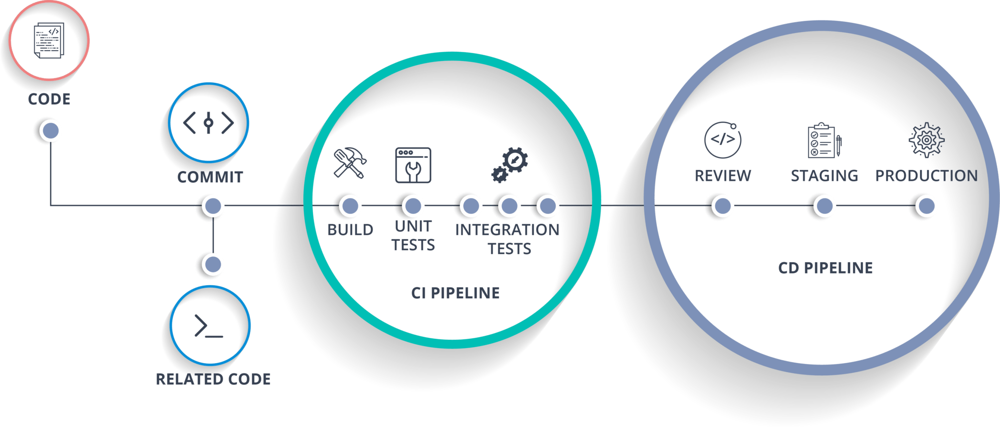

# CI / CD

> CI / CD（ Continuous Integration / Continuous Deployment ）是一种通过在应用开发阶段引入自动化来加快应用交付的方法。CI / CD 主要由持续集成、持续交付和持续部署三部分构成，由于持续交付和持续部署只存在发布阶段是否自动化的区别，因此本文中，CI/CD 主要指持续集成及持续部署。

## 前言

传统模式中，前端负责制作静态页面，后端负责将静态页面嵌入进 PHP、JSP、ASP 等模板引擎中并提供 Web 服务，集成及部署时，动态资源和静态资源全部耦合在一起，前后端项目部署在同一物理机器上。

云服务时代，前端提供单页面应用（ SPA ），后端通过 Web 服务提供 HTTP API，集成及部署时，前后端项目分离部署，再通过 Docker 分发到相应的云端机器上。

## 工作流



如上图所示：

- 持续集成（CI）是在源代码变更后自动检测、拉取、构建并进行单元测试及集成测试的过程。


- 持续部署（CD）是在持续集成的基础上，以自动化方式，频繁而且持续性的，将应用部署到生产环境的过程。


## 核心概念

:::tip 提示
  以下概念均以 NodeJS 做演示说明，分为工作流、配置及触发器三大部分。
:::

- **Workflow**

  - Task

    **单个任务的描述**

    通常为单行命令，如下：

    ```bash
    yarn install
    ```

  - Step

    **需要触发的任务集合**

    通常为单(多)行命令的集合，并依次执行，而且只要单个命令失败，剩余的命令将不再执行，如下：

    ```yaml
    # 以 circleci 为例
    steps:
      - run:
        name: install
        command: |
          node -v
          yarn -v
          yarn install
    ```

  - Job

    **需要触发的步骤集合**

    通常为单(多)个步骤的集合，并依次执行，而且只要单个步骤失败，剩余的步骤将不再执行，如下：

    ```yaml
    # 以 circleci 为例
    version: 2
    jobs:
      build:
        working_directory: ~/repo
        docker:
          - image: circleci/node:latest
        steps:
          - checkout
          - run:
              name: install
              command: |
                node -v
                yarn -v
                yarn install
    ```

  - Pipline

    **需要触发的工作集合**

    通常为单(多)个工作的集合，并依次执行，而且只要单个工作失败，剩余的工作将不再执行，如下：

    ```yaml
    # 在 circleci 中， Pipline 即为其 Workflow
    version: 2
    jobs:
      build:
        docker:
          - image: circleci/node:latest
        steps:
          - checkout
          - run:
              name: install
              command: |
                node -v
                yarn -v
                yarn install
          - run:
              name: build
              command: |
                yarn build
      test:
        docker:
          - image: circleci/node:latest
        steps:
          - checkout
          - run:
              name: test
              command: |
                yarn test

    workflows:
      version: 2
      main-workflow:
        jobs:
          - build:
          - test:
              requires:  # test will not run until the `build` job is completed.
                - build
    ```
- **Setting**

  - Environment Variables

    环境变量为开发者在配置中定义的变量，可以在执行命令时获取对应的值，一般分为公共变量和私有变量两种，公共变量一般直接暴露在 <code>yaml</code> 文件中或存储于同级目录下的<code>.env</code> 文件中，私有变量一般在仓库配置项中进行配置，通常用于私密性信息的存储，并且只对该仓库生效。

    ```yaml
    # 以 .travis.yml 为例
    # GH_TOKEN 为存储在仓库配置项中的环境变量，如下图所示配置
    # GH_REF 为存储在 .travis.yml 中的环境变量
    language: node_js
    node_js: stable
    install:
      - yarn install
    script:
      - yarn build
    after_script:
      - git add A
      - git commit -m "deploy"
      - git push -f "https://${GH_TOKEN}@${GH_REF}" master:gh-pages
    env:
      global:
        - GH_REF: github.com/Damo/demo.git
    ```

    

  - Encrypted Secrets

    加密信息一般用于保障信息的传递过程，CI / CD 构建发布过程中，通常需要一些敏感信息，如 Github 及 Gitlab 的 Personal access tokens，DB 的用户名及密码，Git 仓库的 SSH Keys 等。

    在加密过程中，我们可以利用 CI 平台自身的加密工具来进行加密，比如利用 travis encrypt 命令加密 Slack 信息，如下：

    ```bash
    # slackDomain:k4RhBu6TpTLBdQ1hPTKMSglB#web-notification 为需要加密信息
    travis encrypt "slackdomain:k4RhBu6TpTLBdQ1hPTKMSglB#web-notification" --pro
    ```

    可以利用第三方加密工具来进行加密，比如利用 ssh-keygen 命令生成 SSH keys，如下：

    ```bash
    # 一路回车即可生成
    # 生成后，查询公钥 cat id_rsa.pub
    # 生成后，查询私钥 cat id_rsa
    ssh-keygen
    ```

    当加密信息过多时，也可以采用 [Vault](https://www.vaultproject.io/) 来进行管理。

- Trigger

  - Webhook Push  

    推送是最常用的 CI / CD 触发器，通常与 Webhook 结合使用。

    通俗来讲，Webhook 是让一个网站（订阅者）订阅另一个网站（发布者）特定事件的方法，以 Github 为例，通常 CI / CD 服务器会订阅 Github Rep Webhook，当源代码分支触发 push 或 pull request 操作时，Github Rep Webhook 就会通过 HTTP Service 通知 CI / CD 服务器进行构建操作。

  - Poll SCM（ Software Configuration Management ）

    定时轮询 Git SCM 或 Webhook ，一旦源代码变动，则启动构建。

  - Build Periodically

    不论源代码是否有变动，定期启动构建，通常来说，一般不采用这种构建方式。

## 工具链

常用的 CI 工具如下：

- [Travis CI](https://travis-ci.com/)

  基于 Ruby 开发，只适用于 Github 仓库，对开源项目免费使用

- [Circle CI](https://circleci.com/)

  基于 Clojure 开发，适用于 Github 及 Bitbucket 仓库，仅提供一个 Linux容器免费使用

- [Jenkins CI](https://jenkins.io/)

  基于 Java 开发，适用于所有 Git 仓库，项目开源，插件丰富，生态完善

- [Drone CI](https://drone.io/)

  基于 Go 开发，适用于所有 Git 仓库，项目开源，原生容器支持，体积轻巧，构建速度快

- [Gitlab CI](https://docs.gitlab.com/ee/ci/)

  基于 Ruby 开发，只适用于 Gitlab 仓库，社区版本免费使用

## 参考链接

- [如何理解持续集成、持续交付、持续部署？](https://www.zhihu.com/question/23444990)

- [The Product Managers’ Guide to Continuous Delivery and DevOps](https://www.mindtheproduct.com/2016/02/what-the-hell-are-ci-cd-and-devops-a-cheatsheet-for-the-rest-of-us/)

- [Using Workflows to Schedule Jobs](https://circleci.com/docs/2.0/workflows/?mkt_tok=eyJpIjoiWm1VMU16Z3pNak5qWVdJeCIsInQiOiJqNmlWMXYzZmVJUGVMdWo4MXU1aWwzK1wvc2ZoNUl4YmJxTFwvbGVLaEF0cFwvS1dYaGN0YWRWNW1VUEhYMGdmSStYTXo2cGgxY3ZFc1U1R0pTZ3l3U2hVZlFrK3d2NzFHSDl0WTU5ak1XejYxcFI5N1BLbk1TdERhcVpOSGhIV2NqWSJ9)

- [Webhook - Wikipedia](https://en.wikipedia.org/wiki/Webhook)

- [Webhooks | GitHub Developer Guide](https://developer.github.com/webhooks/)