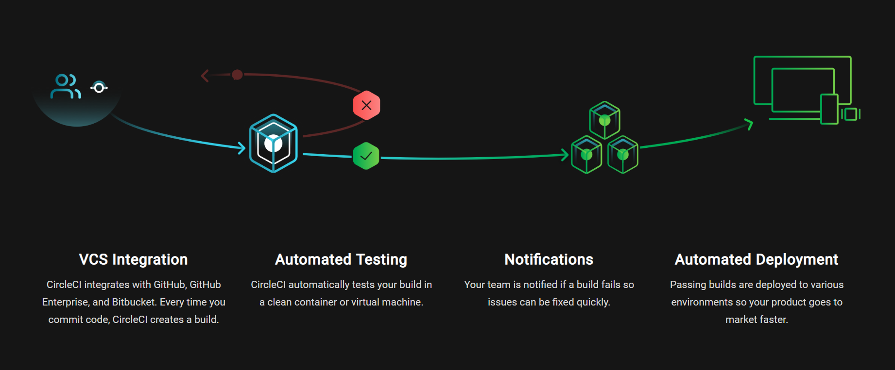
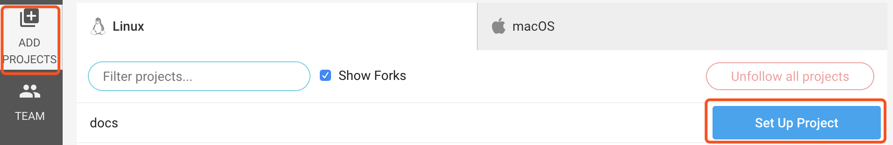
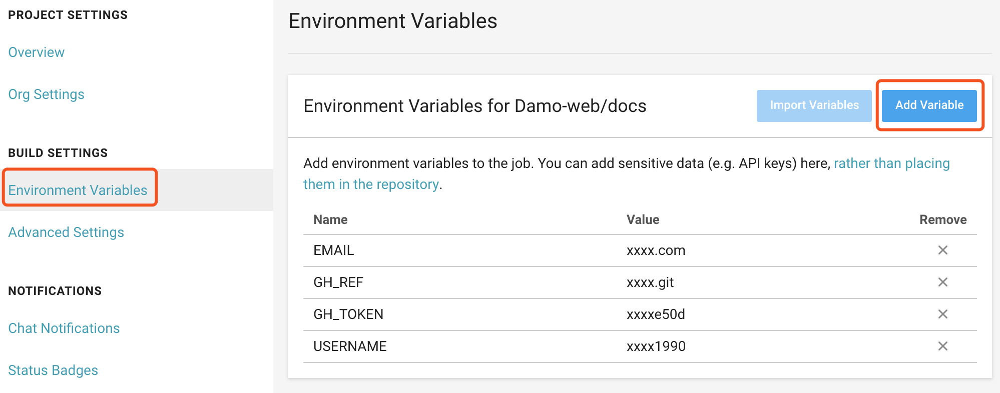
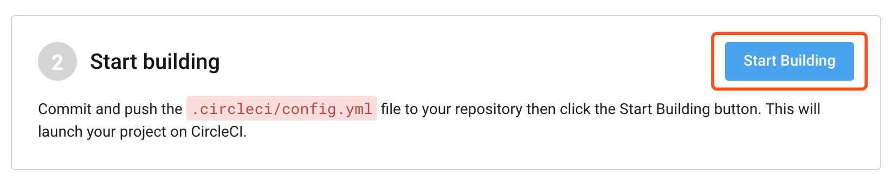
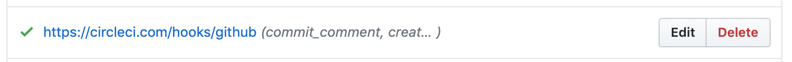
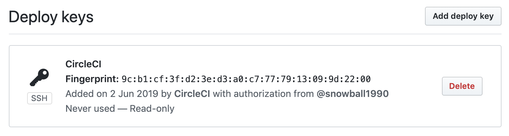
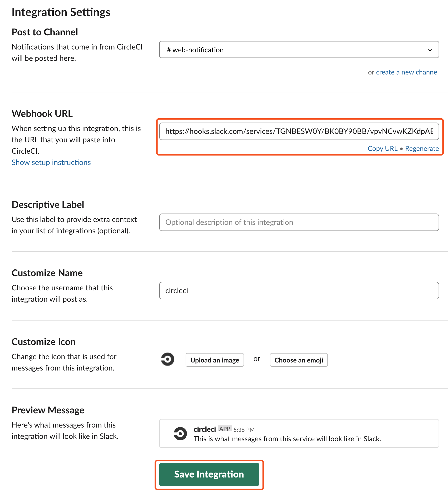
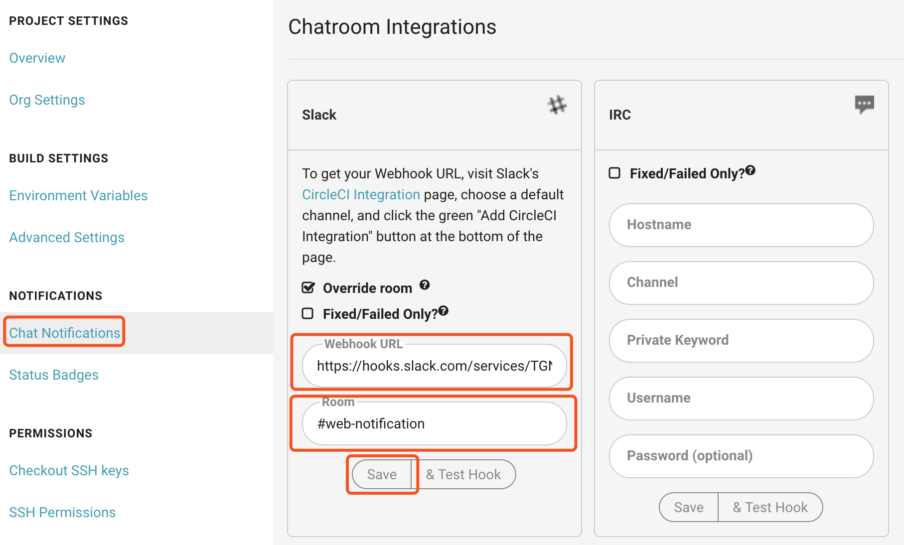

# Circle CI

> 本篇目为 Circle CI 搭建指南，以静态博客为例，覆盖构建、发布及通知流程。

## 前言

Circle CI 是一个用 Clojure 语言开发的基于容器运行的持续集成应用，适用于 Github 及 Bitbucket 仓库，并提供一个 Linux 容器免费使用，因其配置简单，工作流强大，便于集成测试及部署，成为 Github 当下最受欢迎的 CI / CD 工具（ React、Vue 及 Angular 官方都在使用其作为自动化构建工具）。

## 说明

[Circle CI](https://circleci.com/) 是容器化的 CI / CD 工具，使用前需要了解 [Docker](https://damo-web.github.io/docs/server/docker.html) 前置知识，通过简单配置根目录下 <code>.circleci/config.yml</code>文件即可运行 CI / CD 服务。

## 流程图



## 安装

可以通过 [circleci | signup](https://circleci.com/signup/) 或 [github | marketplace](https://github.com/marketplace/circleci)来进行授权安装。

## 配置

1. 授权完成后进入 [circleci | dashboard](https://circleci.com/dashboard)，选择对应的组织

2. 激活仓库

   

3. 添加构建运行时的私密信息
  
   

   USERNAME 为 Github 用户名，EMAIL 为 Github 注册邮件，GH_REF 为 Github 仓库，GH_TOKEN 为 Github Token 

   关于 Github Token 即 Github Personal Access Token，具体生成步骤可参阅： [Github | creating-a-personal-access-token](https://help.github.com/en/articles/creating-a-personal-access-token-for-the-command-line#creating-a-token)

4. 仓库根目录下配置 <code>.circleci/config.yml</code>文件

      ```yaml
        # 版本号，这里推荐使用版本2，版本1已不再维护
        version: 2
        jobs:
          build:
            working_directory: ~/repo
            docker:
              - image: circleci/node:latest
            steps:
              # checkout source code
              - checkout
              - run:
                  name: install
                  command: |
                    yarn cache clean
                    yarn install
              - run:
                  name: build
                  command: |
                    yarn build
              - run:
                  name: deploy
                  command: |
                    git init
                    git config user.name ${USERNAME}
                    git config user.email ${EMAIL}
                    git add -A
                    git commit -m "deploy"
                    git push -f https://${GH_TOKEN}@${GH_REF} master:gh-pages
        # 定义 workflows
        workflows:
          version: 2
          main:
            jobs:
              - build:
                  # 过滤器，只有 master 分支才执行
                  filters:
                    branches:
                      only: master
                      ignore:
                        - gh-pages
      ```

      :::tip 提示
      倘若仓库中采用了多个 CI 工具，其他 CI 工具的 commit 会触发 Circle CI 服务中 gh-pages 分支的构建操作，此时可以在 gh-pages 分支内追加 <code>.circleci/config.yml</code>文件并配置不构建来阻止，也可以在 git commit 中追加 <code>[ci skip]</code> 或 <code>[skip ci]</code>来避免
      :::

5. 构建项目

    

    点击构建时，Circle CI 会利用 Github 授权，创建 <code>Webhooks</code> 及 <code>Deploy keys</code>，如下：

    

    

    其中，Webhooks 用于监测事件向 Circle CI 服务器通信；Deploy keys 用于 Github 仓库授权，用于查看及推送

6. 配置 Slack 通知
   
   首先，在 Slack 网站 App Directory 页面，搜索 Circle CI 并获取 Webhook URL：

   

   其次，在项目中配置 Webhook URL：

   

## 参考链接

- [CircleCI](https://circleci.com/docs/)

- [Easy-Peasy CI/CD with CircleCI](https://medium.com/static-void-academy/easy-peasy-ci-cd-w-circleci-282bc85ddcf5)

- [Skipping a Build](https://circleci.com/docs/2.0/skip-build/)

- [commit message to skip ci](https://discuss.circleci.com/t/adding-circle-skip-to-commit-message-to-skip/2778)

- [使用 CircleCI 2.0 Workflows 挑戰三倍速](https://medium.com/@evenchange4/%E4%BD%BF%E7%94%A8-circleci-2-0-workflows-%E6%8C%91%E6%88%B0%E4%B8%89%E5%80%8D%E9%80%9F-9691e54b0ef0)

- [使用 CircleCI 自动部署博客](https://halu.lu/post/auto-deploy-with-circleci/)

- [CircleCI 实践 gh-pages 部署](https://hddhyq.github.io/2019/01/31/CircleCI%E5%AE%9E%E8%B7%B5gh-pages%E9%83%A8%E7%BD%B2/)


   

   