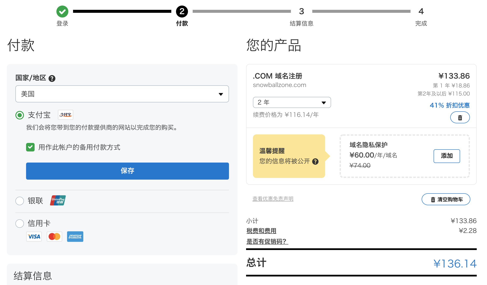
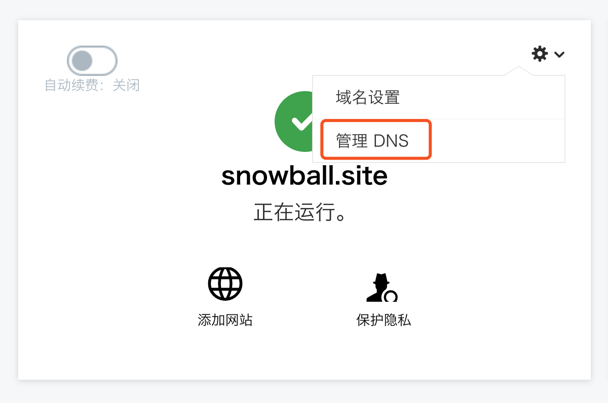
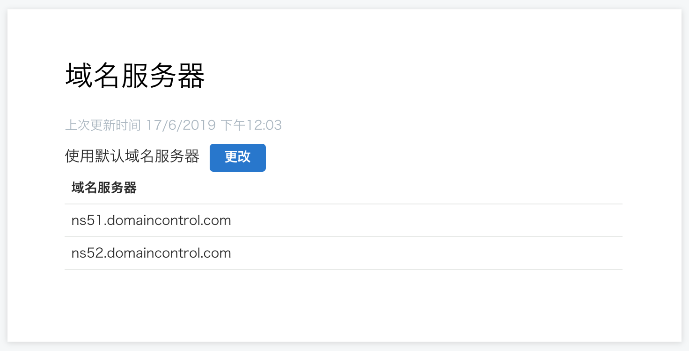
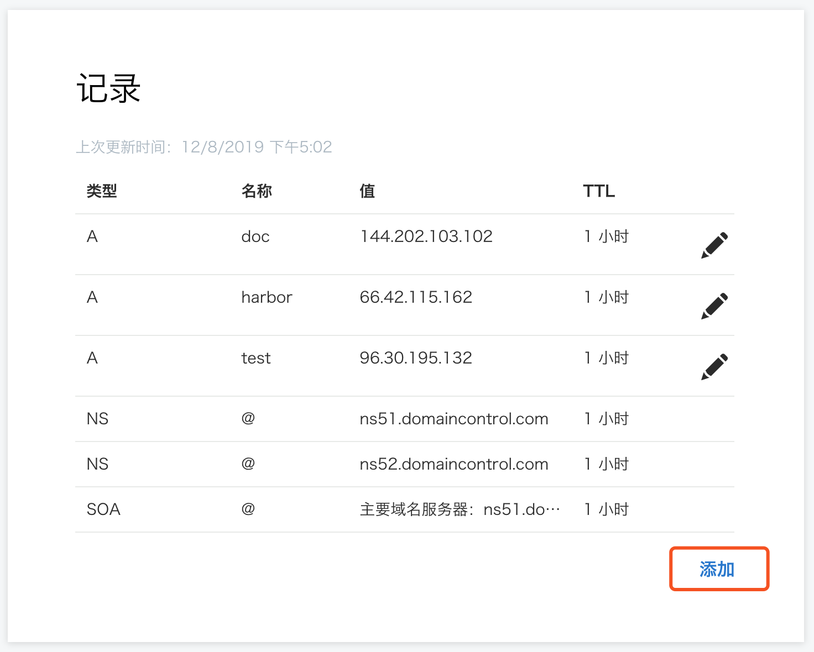
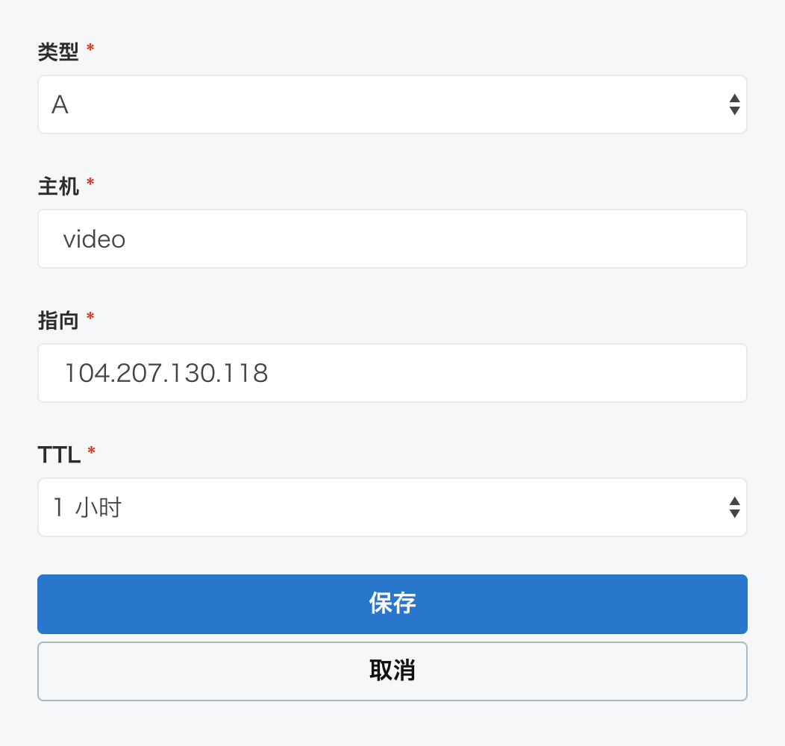

# Domain

> 域名是由一串用点分隔的字符组成的互联网上某一台计算机或计算机组的名称，用于在数据传输时标识计算机的电子方位。

## 前言

网站通常不会给用户仅提供 IP 地址来访问，常规 IPv4 地址示例为 144.202.103.102 ，要记忆它十分困难，但记住 doc.snowball.site 等域名会容易很多。只需记住语义化的域名，而不需要记住一长串难记的数字，会让网站的可访问性提升。

## 域名构成

域名的核心是域名系统 ( Domain Name System，简称 DNS )，域名系统中的任何名称都是域名。

域名主要分为根域名（ root domain ）、顶级域名（ top-level domain，简称 TLD ）和子域名（ sub-level domain ）三大部分。根域名，通常省略，例如 <code>www.google.com.root</code> ，常简写为 <code>www.google.com.</code> ；顶级域名，也可称为一级域名，通常为了表明该域名使用目的（ 例如 .com 、.net 、.org 及 .cn 等 ）；子域名包含除了根域名及顶级域名外的域名部分，一级一级往下，可分为二级域名、三级域名等，用以细分域名及提供多元服务。

网络链接通常构成如下：

如上所示，顶级域名即为 <code>.com</code> ，二级域名为 <code>google.com</code>，三级域名为 <code>www.google.com</code>。

当购买域名时，其实是购买一个二级域名( second-level domain，缩写为 SLD )的使用权限（ 例如 snowball.site ），可以基于此域名来扩展三级域名及四级域名。

## 域名注册

在上文中，我们概览了域名基础知识及层级结构，那我们如何购买域名（ 注册域名 ）呢？

域名的注册由域名注册商来提供，常见的域名注册商有 [Godaddy](https://sg.godaddy.com/zh)、[NameSilo](https://www.namesilo.com/)、[Name](https://www.name.com/zh-cn/)、[万网](https://wanwang.aliyun.com/domain/)、[新网](http://www.xinnet.com/)等。需要注意的是，阿里云采用**万网**来注册域名，腾讯云采用**新网**来注册域名。

至于如何选择域名注册商，还是要看建站的实际需求。倘若仅仅是个人站点，只关注国内可访问性，为避免备案的烦恼，可以选用国外的域名注册商；倘若是商业性的国内网站，可以选用国内的域名注册商。总之，域名注册商的选择还是看网站具体用途。

下面以 Godaddy 为例，演示域名注册的大致流程：

- 访问 [Godaddy](https://sg.godaddy.com/zh) 官网，注册个人账号

- 在 Godaddy 官网中搜索相应域名，添加域名进入购物车，如下：

  

- 进入购物车页面，完成域名购买：
  
  

## 域名解析

完成域名购买后，就拥有了域名的使用权。倘若需要将域名应用到网站，需要进行域名解析。

域名解析通俗点来讲，就是利用域名服务器将域名指向特定 IP 地址，而这一指向过程需要在域名服务商添加域名解析记录来完成。

以 Godaddy 为例，步骤如下：

- 在[域名管理器](https://dcc.godaddy.com/manage/?ci=)页面，点击域名设置项进入 **DNS 管理** 页面

  

- 查看域名服务器，如需变更可进行修改
  
  

- 添加域名解析记录

  

  

在云服务器( 104.207.130.118 )部署完应用，并且域名服务器解析完成后，便可以通过域名( video.snwoball.site )直接访问应用。

## 域名记录

在添加域名时，会遇到多种类型选择，说明如下：

- A 记录：将域名指向一个 IPv4 地址

- CNAME 记录：将域名指向一个域名

- MX 记录：建立电子邮箱服务，将指向邮件服务器地址

- TXT 记录：可任意填写，可为空

- AAAA 记录：将域名指向一个 IPv6 地址

- CAA 记录：

  CAA（Certification Authority Authorization，即证书颁发机构授权）用于防止域名证书劫持

- SOA记录：用于在众多 NS 记录中标志主服务器

- NS 记录：域名解析服务器记录

- SRV 记录：添加服务记录服务器服务记录
  

## 参考链接

- [顶级域名 一级域名 二级域名 三级域名什么区别?](https://www.zhihu.com/question/29998374)
 