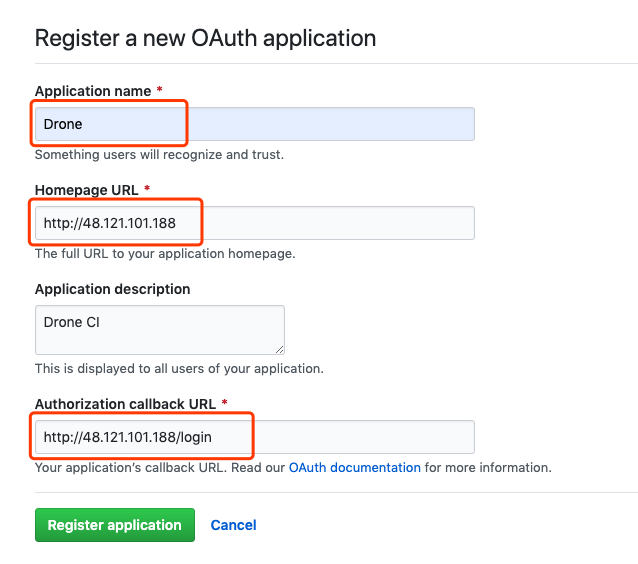
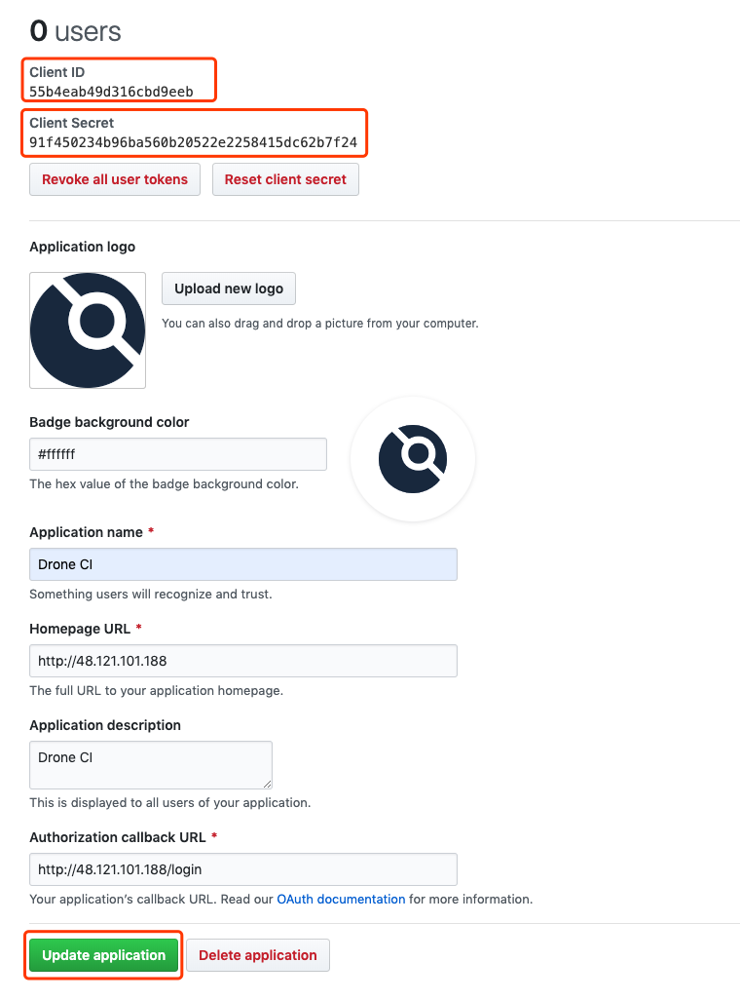

# Drone CI

> 本篇目为 Drone CI 搭建指南，以静态博客为例，覆盖构建、发布及通知流程。

## 前言

Drone 是一个用 Go 语言开发的基于容器运行的开源持续集成软件，因其易于安装，配置简单，体积轻巧，成为当下最受欢迎的开源 CI / CD 工具。

## 说明

[Drone](https://drone.io/) 是容器化的 CI / CD 工具，使用前需要了解  [Docker](https://damo-web.github.io/docs/server/docker.html) 前置知识，通过简单配置 <code>.drone.yml</code> 文件即可运行 CI / CD 服务。

## 安装

本篇以阿里云 CentOS 系统为例，演示了 Drone 整个安装过程。

1. 安装 Docker

   ```bash
   # Install required packages
   $ sudo yum install -y yum-utils device-mapper-persistent-data lvm2
   # Set up the stable repository
   $ sudo yum-config-manager --add-repo https://download.docker.com/linux/centos/docker-ce.repo
   # Install docker-ce
   $ sudo yum install docker-ce
   # Start Docker
   $ sudo systemctl start docker
   ```

2. 安装 Docker Compose

   因 Drone 由 drone-ui 、drone-agent 和 drone-server 三个服务组合，每个服务都是独立的容器，此时需要 Docker Compose 来编排多容器应用。

   ```bash
   # Download the current stable release of Docker Compose
   $ sudo curl -L "https://github.com/docker/compose/releases/download/1.24.0/docker-compose-$(uname -s)-$(uname -m)" -o /usr/local/bin/docker-compose
   # Apply executable permissions
   $ sudo chmod +x /usr/local/bin/docker-compose
   # Link your path
   $ sudo ln -s /usr/local/bin/docker-compose /usr/bin/docker-compose
   ```
3. 配置 Github OAuth Apps

    - 注册 Github OAuth Apps 可参阅：[building-oauth-apps](https://developer.github.com/apps/building-oauth-apps/creating-an-oauth-app/)，如下图所示：

    

    - 查看 Client ID 及 Client Secret 并更新应用信息

    
    

4. 新建 CI 项目，编写<code>docker-compose.yml</code>文件

    - 新建 drone-ci 文件及 docker-compose.yml

    ```bash
    # 新建 drone-ci 文件夹
    $ mkdir drone-ci
    # 新建 docker-compose.yml
    $ cd drone-ci/
    $ touch docker-compose.yml
    ```
    - 配置 .env 环境变量
    ```bash
    # 采用 key=value 格式
    # DRONE_HOST 为域名或 IP 地址
    DRONE_HOST=48.121.101.188
    # GITHUB_USERNAME 为 Github 用户名
    GITHUB_USERNAME=damo
    # GITHUB_CLIENT_ID 为 Github OAuth Apps Client ID
    GITHUB_CLIENT_ID=55b4eab49d316cbd9eeb
    # GITHUB_CLIENT_SECRET 为 Github OAuth Apps Client Secret
    GITHUB_CLIENT_SECRET=91f450234b96ba560b20522e2258415dc62b7f24
    # RPC_SECRET 为 drone-agent 与 drone-server 通信秘钥
    # 可通过 openssl rand -hex(base64) NUMBER 来生成
    # 下面的 RPC_SECRET 即通过 openssl rand -hex 20 生成
    RPC_SECRET=fe44fb33a1263d0ea437d666b6e53049725587ad
    ```

    - 配置 docker-compose.yml
    ```yaml
    version: "3.7"
    services:
      nginx:
        image: nginx:alpine
        container_name: drone_nginx
        ports:
          - "80:8090"
        restart: always
        networks:
          - dronenet
      drone-server:
        image: drone/drone:latest
        container_name: dronetest_server
        networks:
          - dronenet
        volumes:
          - ./db:/var/lib/drone/:rw
          - /var/run/docker.sock:/var/run/docker.sock:rw
        restart: always
        environment:
          - DRONE_DEBUG=true
          - DRONE_GITHUB_SERVER=https://github.com
          - DRONE_GITHUB_CLIENT_ID=${GITHUB_CLIENT_ID}
          - DRONE_GITHUB_CLIENT_SECRET=${GITHUB_CLIENT_SECRET}
          - DRONE_RUNNER_CAPACITY=2
          - DRONE_RPC_SECRET=${RPC_SECRET}
          - DRONE_SERVER_PROTO=http
          - DRONE_SERVER_HOST=${DRONE_HOST}
          - DRONE_USER_CREATE=username:${GITHUB_USERNAME},admin:true
      drone-agent:
        image: drone/agent:latest
        container_name: dronetest_agent
        restart: always
        networks:
          - dronenet
        depends_on:
          - drone-server
        volumes:
          - /var/run/docker.sock:/var/run/docker.sock:rw
        environment:
          - DRONE_RPC_SERVER=http://drone_server
          - DRONE_RPC_SECRET=${RPC_SECRET}
          - DRONE_DEBUG=true
    networks:
      dronenet:
    ```


   