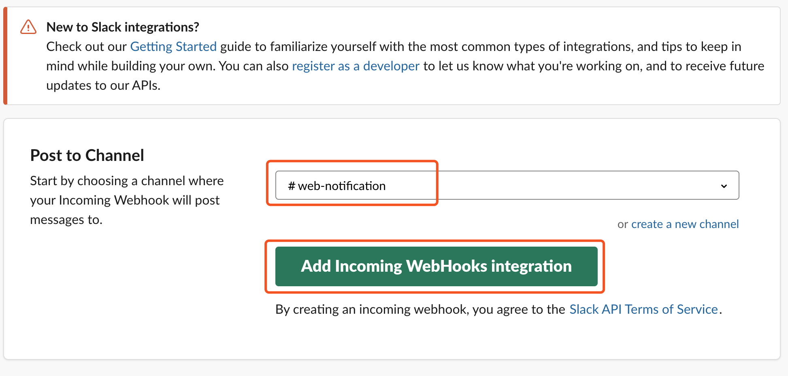
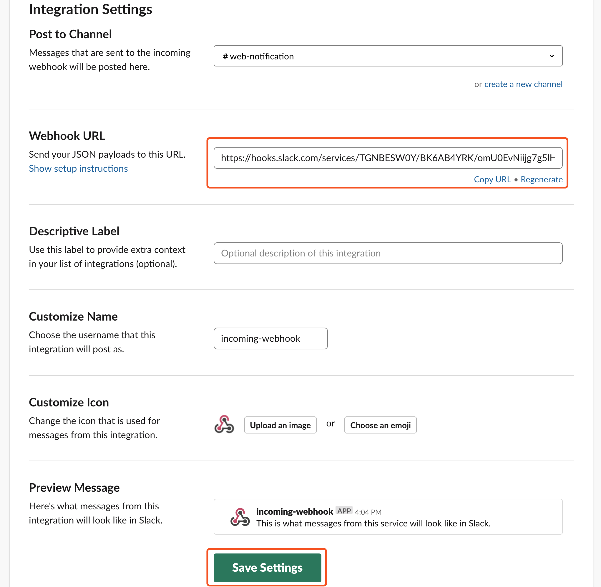

# Drone CI

> 本篇目为 Drone CI 搭建指南，以静态博客为例，覆盖构建、发布及通知流程。

## 前言

Drone 是一个用 Go 语言开发的基于容器运行的开源持续集成软件，因其易于安装，配置简单，体积轻巧，成为当下最受欢迎的开源 CI / CD 工具。

## 说明

[Drone](https://drone.io/) 是容器化的 CI / CD 工具，使用前需要了解  [Docker](https://damo-web.github.io/docs/server/docker.html) 前置知识，通过简单配置 <code>.drone.yml</code> 文件即可运行 CI / CD 服务。

## 安装

本篇以阿里云 CentOS 系统为例，演示了 Drone 整个安装过程。

1. 安装 Docker

   ```bash
   # Install required packages
   $ sudo yum install -y yum-utils device-mapper-persistent-data lvm2
   # Set up the stable repository
   $ sudo yum-config-manager --add-repo https://download.docker.com/linux/centos/docker-ce.repo
   # Install docker-ce
   $ sudo yum install docker-ce
   # Start Docker
   $ sudo systemctl start docker
   ```

2. 安装 Docker Compose

   因 Drone 由 drone-ui 、drone-agent 和 drone-server 三个服务组合，每个服务都是独立的容器，此时需要 Docker Compose 来编排多容器应用。

   ```bash
   # Download the current stable release of Docker Compose
   $ sudo curl -L "https://github.com/docker/compose/releases/download/1.24.0/docker-compose-$(uname -s)-$(uname -m)" -o /usr/local/bin/docker-compose
   # Apply executable permissions
   $ sudo chmod +x /usr/local/bin/docker-compose
   # Link your path
   $ sudo ln -s /usr/local/bin/docker-compose /usr/bin/docker-compose
   ```
3. 配置 Github OAuth Apps

    - 注册 Github OAuth Apps 可参阅：[building-oauth-apps](https://developer.github.com/apps/building-oauth-apps/creating-an-oauth-app/)，如下图所示：

    

    - 查看 Client ID 及 Client Secret 并更新应用信息

    


4. 新建 CI 项目，编写<code>docker-compose.yml</code>文件

    - 新建 drone-ci 文件、docker-compose.yml 及 .env

    ```bash
    # 新建 drone-ci 文件夹
    $ mkdir drone-ci
    # 新建 docker-compose.yml
    $ cd drone-ci/
    # .env 用于存储环境变量
    $ touch .env
    # docker-compose.yml 会读取当前目录下的 .env 并注入环境变量
    $ touch docker-compose.yml
    ```
    - 配置 .env 环境变量
    ```bash
    # 采用 key=value 格式
    # DRONE_HOST 为域名或 IP 地址
    # 48.121.101.188 为示例 IP 地址
    DRONE_HOST=48.121.101.188
    # GITHUB_USERNAME 为 Github 用户名
    GITHUB_USERNAME=damo
    # GITHUB_CLIENT_ID 为 Github OAuth Apps Client ID
    GITHUB_CLIENT_ID=55b4eab49d316cbd9eeb
    # GITHUB_CLIENT_SECRET 为 Github OAuth Apps Client Secret
    GITHUB_CLIENT_SECRET=91f450234b96ba560b20522e2258415dc62b7f24
    # RPC_SECRET 为 drone-agent 与 drone-server 通信秘钥
    # 可通过 openssl rand -hex(base64) NUMBER 来生成
    # 下面的 RPC_SECRET 即通过 openssl rand -hex 20 生成
    RPC_SECRET=fe44fb33a1263d0ea437d666b6e53049725587ad
    ```

    - 配置 docker-compose.yml
    ```yaml
    version: "3.7"
    services:
      nginx:
        image: nginx:alpine
        container_name: drone_nginx
        ports:
          - "80:8090"
        restart: always
        networks:
          - dronenet
      drone-server:
        image: drone/drone:latest
        container_name: dronetest_server
        networks:
          - dronenet
        volumes:
          - ./db:/var/lib/drone/:rw
          - /var/run/docker.sock:/var/run/docker.sock:rw
        restart: always
        environment:
          - DRONE_DEBUG=true
          - DRONE_GITHUB_SERVER=https://github.com
          - DRONE_GITHUB_CLIENT_ID=${GITHUB_CLIENT_ID}
          - DRONE_GITHUB_CLIENT_SECRET=${GITHUB_CLIENT_SECRET}
          - DRONE_RUNNER_CAPACITY=2
          - DRONE_RPC_SECRET=${RPC_SECRET}
          - DRONE_SERVER_PROTO=http
          - DRONE_SERVER_HOST=${DRONE_HOST}
          - DRONE_USER_CREATE=username:${GITHUB_USERNAME},admin:true
      drone-agent:
        image: drone/agent:latest
        container_name: dronetest_agent
        restart: always
        networks:
          - dronenet
        depends_on:
          - drone-server
        volumes:
          - /var/run/docker.sock:/var/run/docker.sock:rw
        environment:
          - DRONE_RPC_SERVER=http://drone_server
          - DRONE_RPC_SECRET=${RPC_SECRET}
          - DRONE_DEBUG=true
    networks:
      dronenet:
    ```
5. 运行容器，启动 Drone CI 服务

    ```bash
    # 运行容器
    $ docker-compose up -d
    Creating network "drone-ci_dronenet" with the default driver
    Creating drone_nginx      ... done
    Creating dronetest_server ... done
    Creating dronetest_agent  ... done
    # 查看运行容器
    $ docker-compose ps
          Name               Command          State              Ports            
      ------------------------------------------------------------------------------
      drone_nginx        nginx -g daemon off;   Up      80/tcp, 0.0.0.0:80->8090/tcp
      dronetest_agent    /bin/drone-agent       Up                                  
      dronetest_server   /bin/drone-server      Up      443/tcp, 80/tcp    
    
    ```

6. 修改 nginx 配置文件

    ```bash
    # 进入 nginx 容器
    $ docker-compose exec nginx ash
    # 添加 nginx 配置文件
    $ vi /etc/nginx/conf.d/drone.conf
    server {
      listen       8090;
      server_name  48.121.101.188;
      location / {
        proxy_pass http://dronetest_server;
        proxy_set_header   Host             $host;
        proxy_set_header   X-Real-IP        $remote_addr;
        proxy_set_header   X-Forwarded-For  $proxy_add_x_forwarded_for;
      }
    }
    # 重启 nginx 
    $ nginx -s reload
    ```

7. 在浏览器访问 http://48.121.101.188，并进行仓库授权，即完成 Drone CI 的搭建
   
## 配置

1. 浏览器访问 Drone CI 服务，点击<code>SYNC</code>按钮同步授权仓库信息

  :::tip 提示
  除了本地部署服务以外，官方同时提供了 [Drone CI 云服务](https://cloud.drone.io/)
  :::

2. 选择需要激活 Drone CI 服务的仓库，如下：

   

   到 Github 对应激活仓库下，查看 Webhook 是否激活

   

3. 添加构建运行时的私密信息

   

    USERNAME 为 Github 用户名，EMAIL 为 Github 注册邮件，GH_REF 为 Github 仓库，GH_TOKEN 为 Github Token 

    关于 Github Token 即 Github Personal Access Token，具体生成步骤可参阅： [Github | creating-a-personal-access-token](https://help.github.com/en/articles/creating-a-personal-access-token-for-the-command-line#creating-a-token)

4. 在当前项目根目录下配置 <code>.drone.yml</code> 构建文件

    ```yaml
    ---
    kind: pipeline
    name: drone

    steps:
      - name: install
        image: node
        commands:
          - yarn install
      - name: build
        image: node
        commands:
          - yarn build
      - name: deploy
        commands:
          - cd ./dist
          - ls
          - git init
          - git config user.name $${USERNAME}
          - git config user.email $${EMAIL}
          - git add -A
          - git commit -m "[skip ci] deploy"
          - git push -f https://$${GH_TOKEN}@$${GH_REF} master:gh-pages
        environment:
          USERNAME:
            from_secret: USERNAME
          EMAIL:
            from_secret: EMAIL
          GH_REF:
            from_secret: GH_REF
          GH_TOKEN:
            from_secret: GH_TOKE

    trigger:
      branch:
        - master
      event:
        - push
    ```

    至此，Drone 已可以通过源代码 push 事件实现自动化部署静态博客。

5. 配置 Slack 通知
   
   因 Slack 网站 App Directory 页面，无官方的 Drone CI 应用提供，这里利用 Incoming WebHooks 应用来实现通知功能。
   
   
   
   添加 Incoming WebHooks 后获取 WebHook URL，如下图

   
   
   返至 Drone CI 服务仓库私密信息配置，追加如下信息：

   

   当前项目根目录下 <code>.drone.yml</code> 构建文件，新增如下高亮代码：

   ```yaml{33-47}
    ---
    kind: pipeline
    name: drone

    steps:
      - name: install
        image: node
        commands:
          - yarn install
      - name: build
        image: node
        commands:
          - yarn build
      - name: deploy
        commands:
          - cd ./dist
          - ls
          - git init
          - git config user.name $${USERNAME}
          - git config user.email $${EMAIL}
          - git add -A
          - git commit -m "[skip ci] deploy"
          - git push -f https://$${GH_TOKEN}@$${GH_REF} master:gh-pages
        environment:
          USERNAME:
            from_secret: USERNAME
          EMAIL:
            from_secret: EMAIL
          GH_REF:
            from_secret: GH_REF
          GH_TOKEN:
            from_secret: GH_TOKE
      - name: slack
        image: plugins/slack
        settings:
          webhook:
            from_secret: SLACK_WEB_HOOK
          channel: web-notification
          template: >
            {{#success build.status}}
            Repo `{{repo.name}}`build (<{{build.link}}|#{{build.number}}>) for commit(<{{build.link}}|{{truncate build.commit 7}}>) 
            on branch `{{build.branch}}` by `{{build.author}}`
            Execution time: *{{since job.started}}*
            Message: *The build {{build.status}}*
            {{else}}
              build {{build.number}} failed. Fix me please.
            {{/success}} 

    trigger:
      branch:
        - master
      event:
        - push
    ```

## 参考链接

- [Drone Docs](https://docs.drone.io/)

- [Drone | User Guide](https://docs.drone.io/user-guide/)

- [Drone Plugins](http://plugins.drone.io/)

- [Drone Reference](https://docs.drone.io/reference/)

- [Drone CI For Github](https://juejin.im/post/5c81f54c5188257e826a9dc7)

- [Setting up simple, self-hosted & fast CI/CD solution with Drone](https://dev.to/krusenas/setting-up-simple-self-hosted--fast-cicd-solution-with-drone-for-homelab-or-office-1fnd)

- [Host your own CI/CD server with Drone](https://angristan.xyz/host-your-own-ci-cd-server-with-drone/)

- [Drone.io: first impressions](https://medium.com/@stepanvrany/drone-io-first-impressions-43d9338cd7e5)

- [用 Drone 打造 CI/CD flow](https://medium.com/asiayo-engineering/%E7%94%A8-drone-%E6%89%93%E9%80%A0-ci-cd-flow-36b9d14c7620)