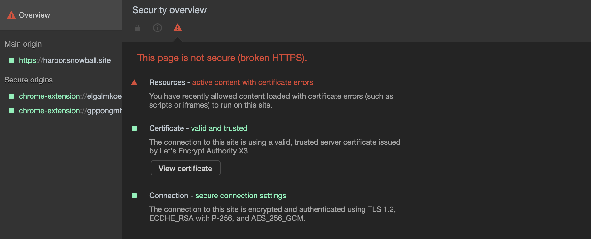

# Harbor

> Harbor 是 VMware 公司开源的企业级的 Docker Registry 管理项目，可用于公私有镜像的存储和管理。作为一个企业级私有 Registry 服务器，Harbor 提供了更好的性能和安全，并提升用户使用 Registry 构建和运行环境传输镜像的效率。

## 前言

Docker 官方提供 Docker Hub 来管理开源镜像，但在现实工作中，需要存储诸多企业内部镜像，当然可以通过购买 Docker Hub 上私有镜像来解决，也可以自建 Harbor 来管理企业内部镜像。

本篇目仅为 Harbor 搭建指引，基于 CentOS7 系统的云服务器为 1CPU 及 2G内存。

## 环境

因 Harbor 基于 Docker ，需要在镜像服务器配置相应的环境。以 CentOS7 系统为例，配置如下：

1. 安装 Docker

   ```bash
   # Install required packages
   $ sudo yum install -y yum-utils device-mapper-persistent-data lvm2
   # Set up the stable repository
   $ sudo yum-config-manager --add-repo https://download.docker.com/linux/centos/docker-ce.repo
   # Install docker-ce
   $ sudo yum install docker-ce
   # Enable docker
   $ sudo systemctl enable docker
   # Start Docker
   $ sudo systemctl start docker
   ```

2. 安装 Docker Compose

   因 Drone 由 drone-ui 、drone-agent 和 drone-server 三个服务组合，每个服务都是独立的容器，此时需要 Docker Compose 来编排多容器应用。

   ```bash
   # Download the current stable release of Docker Compose
   $ sudo curl -L "https://github.com/docker/compose/releases/download/1.24.0/docker-compose-$(uname -s)-$(uname -m)" -o /usr/local/bin/docker-compose
   # Apply executable permissions
   $ sudo chmod +x /usr/local/bin/docker-compose
   # Link your path
   $ sudo ln -s /usr/local/bin/docker-compose /usr/bin/docker-compose
   ```

## 安装包

从 Harbor Github 仓库 [Releases](https://github.com/goharbor/harbor/releases) 下载对应版本的安装包，本文以最新 V1.8.1 版本为例：

```bash
# 安装 harbor 离线安装包
$ wget https://storage.googleapis.com/harbor-releases/release-1.8.0/harbor-offline-installer-v1.8.1.tgz
# 解压 harbor 离线安装包
$ tar xvf harbor-offline-installer-v1.8.1.tgz
```

## 配置

1. 进入解压后的 <code>harbor</code> 文件夹

```bash
$ cd harbor
$ ls
common  docker-compose.yml  harbor.v1.8.1.tar.gz  harbor.yml  install.sh  LICENSE  prepare
```

2. 配置 SSL

倘若不配置 HTTPS ，需要在 docker login harbor.snowball.site 时添加 --insecure-registry 选项至 Docker daemon 并重启相关服务

```bash
$ mkdir cert && cd cert
$ openssl req -sha256 -x509 -days 365 -nodes -newkey rsa:4096 -keyout  harbor.snowball.site.key -out harbor.snowball.site.crt
```

3. 修改 <code>harbor.yml</code> 配置文件

```yaml
# 修改 hostname，变更为自己服务器域名或地址
hostname: harbor.snowball.site
# 开启 https
# cert 和 key 需要自己生成
https:
   port: 443
   certificate: /root/cert/harbor.snowball.site.crt
   private_key: /root/cert/harbor.snowball.site.key
# 修改 harbor 初始化时 admin 密码
harbor_admin_password: harbor0618
```

4. 在当前目录下启动 Harbor 服务

```bash
# 执行安装 shell 脚本
$ ./install.sh

# 出现如下成功提示即可在浏览器访问 Harbor 服务
...
✔ ----Harbor has been installed and started successfully.----

Now you should be able to visit the admin portal at https://harbor.snowball.site. 
For more details, please visit https://github.com/goharbor/harbor .
```

## 注意事项

- 未配置 SSL 证书

  倘若 Harbor 服务器未配置相应的 SSL 证书，而 Harbor 只能提供 http 服务，云服务器需要进行配置才能拉取及推送镜像。

  在云服务器 CentOS7 系统文件 <code>/etc/docker/daemon.json</code> 中增加配置项（ 倘若文件夹不存在则新建 ）：

  ```json
  {
    "insecure-registries" : [
      "harbor.snowball.site"
    ]
  }
  ```
  重启 Docker 服务：

  ```bash
  # 以 root 权限运行
  $ systemctl daemon-reload
  $ systemctl restart docker
  ```

  在本地 Mac OS 系统 Daemon Advanced 中需要进行如下配置：

  

  配置完成后，需要点击下方的 Apply & Restart 按钮来使其生效。

- SSL 不被信任

  自签发的证书不会被 Chrome 等浏览器识别，此时可以采用 Let's Encrypt 生成免费的、可被浏览器信任的证书。

  常用的 Let's Encrypt 生成工具主要有 [acme.sh](https://github.com/Neilpang/acme.sh) 及 [certbot](https://github.com/certbot/certbot) 两种。

  - acme.sh

  安装 acme.sh ，如下：

  ```bash
  # 此命令做了如下两件事
  # 把 acme.sh 安装到你的 home 目录下，即 ~/.acme.sh/
  # 创建 一个 bash 的 alias, 方便你的使用: alias acme.sh=~/.acme.sh/acme.sh
  # 自动为你创建 cronjob, 每天 0:00 点自动检测所有的证书, 如果快过期了, 需要更新, 则会自动更新证书
  $ curl  https://get.acme.sh | sh
  ```

  生成 SSL 证书时需要注意，CentOS7 默认防火墙 firewalld 关闭了 http 服务，需要进行开启：

  ```bash
  # 开启防护墙 http 服务并重启
  $ firewall-cmd --zone=public --permanent --add-service=http
  $ firewall-cmd --reload
  # 查看防护墙所有服务
  $ firewall-cmd --list-service
  ```
  生成 SSL 证书：

  ```bash
  # 生成证书需安装 socat
  $ cd ~/.acme.sh/
  $ yum install socat
  $ sh acme.sh  --issue -d harbor.snowball.site  --standalone
  # 执行结果如下即表示成功
  [2019年 06月 22日 星期六 11:04:39 UTC] Standalone mode.
  [2019年 06月 22日 星期六 11:04:40 UTC] Single domain='harbor.snowball.site'
  [2019年 06月 22日 星期六 11:04:40 UTC] Getting domain auth token for each domain
  [2019年 06月 22日 星期六 11:04:40 UTC] Getting webroot for domain='harbor.snowball.site'
  [2019年 06月 22日 星期六 11:04:40 UTC] Verifying: harbor.snowball.site
  [2019年 06月 22日 星期六 11:04:40 UTC] Standalone mode server
  [2019年 06月 22日 星期六 11:04:44 UTC] Success
  [2019年 06月 22日 星期六 11:04:44 UTC] Verify finished, start to sign.
  [2019年 06月 22日 星期六 11:04:44 UTC] Lets finalize the order, Le_OrderFinalize: https://acme-v02.api.letsencrypt.org/acme/finalize/59771251/599803099
  [2019年 06月 22日 星期六 11:04:46 UTC] Download cert, Le_LinkCert: https://acme-v02.api.letsencrypt.org/acme/cert/03b0de0dcb959ed07587c8356c8764eb1464
  [2019年 06月 22日 星期六 11:04:46 UTC] Cert success.
  ...
  [2019年 06月 22日 星期六 11:04:46 UTC] Your cert is in  /root/.acme.sh/harbor.snowball.site/harbor.snowball.site.cer 
  [2019年 06月 22日 星期六 11:04:46 UTC] Your cert key is in  /root/.acme.sh/harbor.snowball.site/harbor.snowball.site.key 
  [2019年 06月 22日 星期六 11:04:46 UTC] The intermediate CA cert is in  /root/.acme.sh/harbor.snowball.site/ca.cer 
  [2019年 06月 22日 星期六 11:04:46 UTC] And the full chain certs is there:  /root/.acme.sh/harbor.snowball.site/fullchain.cer 
  ```

  尽量不要索引安装目录下的证书，复制证书至系统文件夹：

  ```bash
  # 打开 /opt/ 文件夹并新建 certs 文件夹
  $ cd /opt/ && mkdir -p certs
  # 使用 --installcert 命令指定目标文件夹位置
  $ cd ~/.acme.sh/
  $ sh acme.sh  --installcert  -d  harbor.snowball.site \
        --key-file /opt/certs/harbor.snowball.site.key \
        --fullchain-file /opt/certs/fullchain.cer
  ```

  修改 <code>harbor.yml</code> 配置文件：

  ```yaml
  https:
   port: 443
   certificate: /opt/certs/fullchain.cer
   private_key: /opt/certs/harbor.snowball.site.key
  ```
  重启 Harbor 服务：

  ```bash
  $ cd ~/harbor
  $ ./install.sh
  ```

  - certbot

  拉取 certbot 至本地:

  ```bash
  $ yum install git
  $ git clone https://github.com/certbot/certbot
  ```

  生成 SSL 证书：

  ```bash
  $ cd certbot
  $ ./letsencrypt-auto certonly -d harbor.snowball.site
  # 执行结果如下即表示成功
  IMPORTANT NOTES:
  - Congratulations! Your certificate and chain have been saved at:
    /etc/letsencrypt/live/harbor.snowball.site/fullchain.pem
    Your key file has been saved at:
    /etc/letsencrypt/live/harbor.snowball.site/privkey.pem
    Your cert will expire on 2019-09-20. To obtain a new or tweaked
    version of this certificate in the future, simply run
    letsencrypt-auto again. To non-interactively renew *all* of your
    certificates, run "letsencrypt-auto renew"
  - If you like Certbot, please consider supporting our work by:

    Donating to ISRG / Let's Encrypt:   https://letsencrypt.org/donate
    Donating to EFF:                    https://eff.org/donate-le
  ```

  修改 <code>harbor.yml</code> 配置文件：
  ```yaml
  https:
   port: 443
   certificate: /etc/letsencrypt/live/harbor.snowball.site/fullchain.pem
   private_key: /etc/letsencrypt/live/harbor.snowball.site/privkey.pem
  ```
  重启 Harbor 服务：

  ```bash
  $ cd ~/harbor
  $ ./install.sh
  ```

  certbot 并不支持证书自动续期的功能，需要手动添加，通过 <code>crontab -e</code> 命令进入编辑，设置如下：

  ```bash
  SHELL=/bin/bash
  PATH=/sbin:/bin:/usr/sbin:/usr/bin

  0 0 1 */2 * certbot renew --quiet --force-renewal
  ```

- 利用 Let's Encrypt 签发证书替换自签发证书后，SSL 证书认证成功依旧报错

  

  从错误描述来看，与之前容许非安全模式下运行该网站有关，但多次强刷新依旧无效，此时需要清空该网站缓存，并重启浏览器使其生效：

  
  
  重启浏览器之后，打开网站，SSL 完全生效，结果如下：

  

## 参考链接

- [How to Install Harbor on CentOS 7](https://www.vultr.com/docs/how-to-install-harbor-on-centos-7)

- [Docker镜像仓库Harbor之搭建及配置](https://blog.csdn.net/aixiaoyang168/article/details/73549898)

- [acme.sh docs](https://github.com/Neilpang/acme.sh/wiki/%E8%AF%B4%E6%98%8E)

- [Let's Encrypt证书自动更新](https://blog.csdn.net/shasharoman/article/details/80915222)

- [Chrome “Active content with certificate errors”](https://stackoverflow.com/questions/44145936/chrome-active-content-with-certificate-errors)