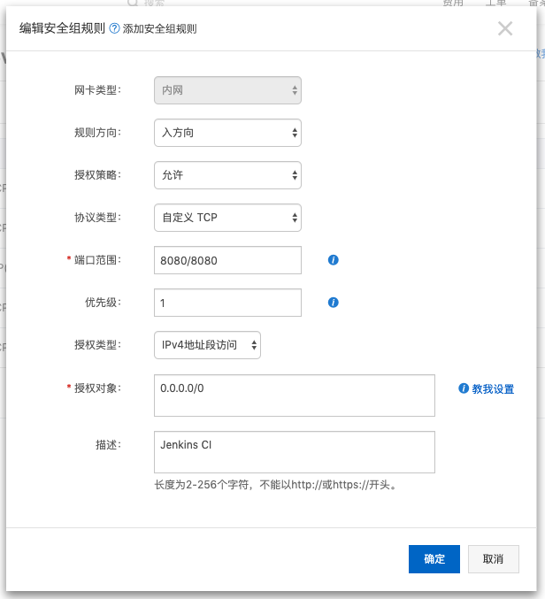
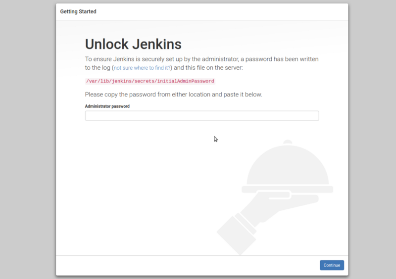
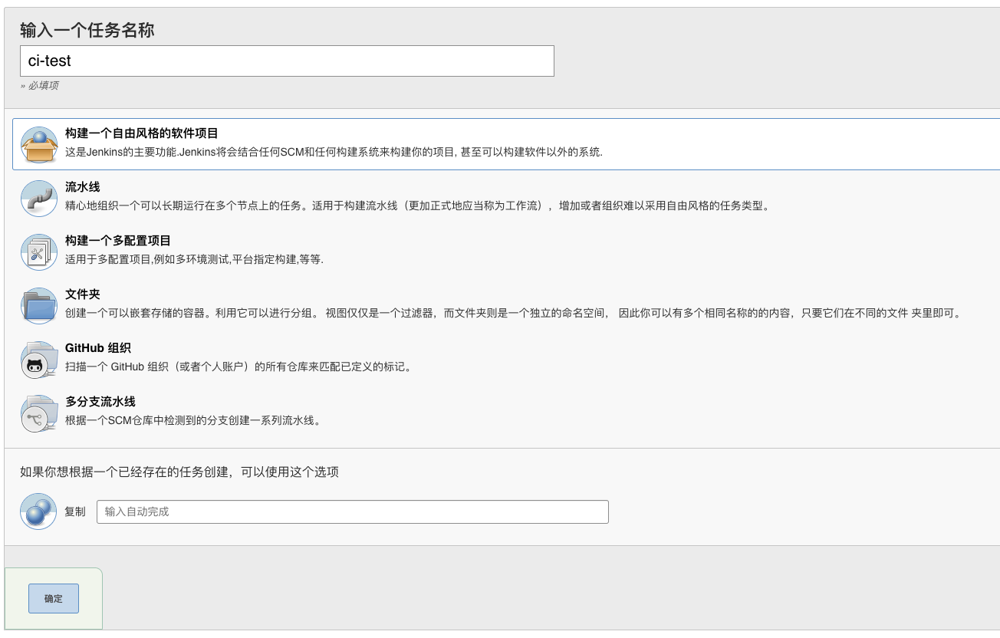
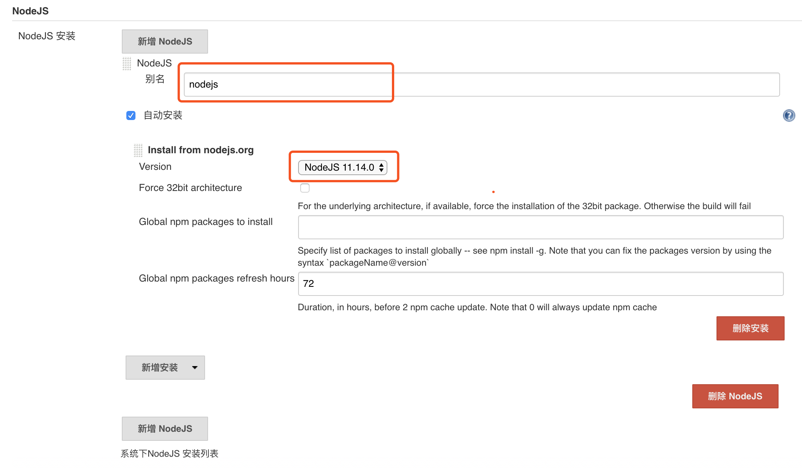
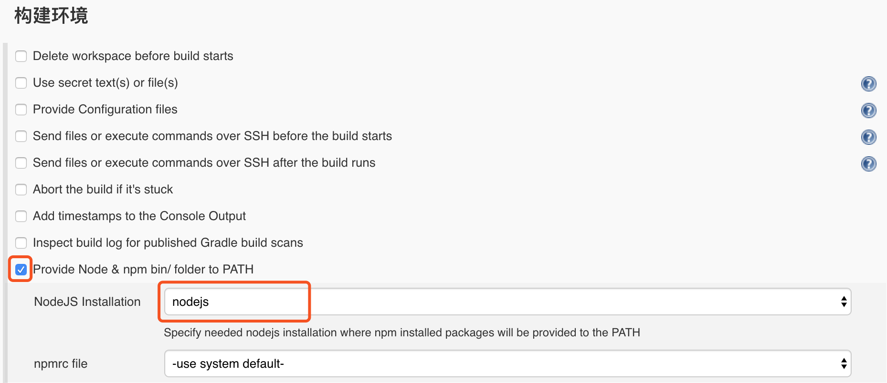

# Jenkins CI

> 本篇目为 Jenkins CI 搭建指南，以静态博客为例，覆盖构建、发布及通知流程。

## 前言

Jenkins 无疑是当下最广泛使用的开源 CI 工具，其丰富的插件系统、权限系统为企业的持续集成提供了可靠的拓展性和丰富的定制性。

## 说明

[Jenkins](https://jenkins.io/download/) 部署方式有多种，推荐采用 Docker 或 Linux 环境来进行安装，不推荐 Mac OS 直接安装（ 修改默认配置繁琐 ）。

## 安装

本篇以阿里云 CentOS 系统为例，演示了 Jenkins 整个安装过程。

关于阿里云的使用可参阅：[阿里云ECS使用指南](https://damo-web.github.io/docs/server/)

Jenkins 依赖 Java 和 Git ，如果系统未自带，执行下述命令：

```bash
# 安装 git
sudo yum install git
# 安装 java
sudo yum install java
```

Jenkins 安装所需命令：

```bash

sudo wget -O /etc/yum.repos.d/jenkins.repo http://pkg.jenkins-ci.org/redhat-stable/jenkins.repo

sudo rpm --import https://jenkins-ci.org/redhat/jenkins-ci.org.key

sudo yum install jenkins

```

启动 Jenkins：

```bash
sudo service jenkins start
# 显示如下状态即是启动成功，打开浏览器，输入阿里云服务器公网地址的 8080 端口
# 需要在阿里云平台安全组规则中把端口暴露出来，才可以访问云服务器对应端口
Starting jenkins (via systemctl):                          [  OK  ]
```


## 配置

:::tip 提示

为了避免权限所引发的问题，以下命令建议均以 root 权限进行运行。

:::

1. 配置云服务器安全组规则

    可按如下顺序进入安全组：

    > 实例列表 => 更多 => 网络和安全组 => 安全组配置 => 配置规则 => 添加安全组规则

    

2. 配置 Jenkins 管理员账号

    浏览器访问 Jenkins 地址 http://ali-server-ip:8080，出现如下页面：

    

    执行如下命令，把初始的管理员密码复制进去，并安装推荐插件，创建管理员账户后，就可以进入 Jenkins 首页

    ```bash
    cat /var/lib/jenkins/secrets/initialAdminPassword
    ```

3. 配置 Jenkins 任务
    
    点击 Jenkins 首页面板中新建任务即可建立项目任务

    

4. 配置前端项目构建插件

    构建前端项目需要配置 Node 环境，代码也需要从 Github 拉取并发布，因此需要在插件管理中安装 	<code>NodeJS Plugin</code> 、 <code>	GitHub Integration Plugin</code>、<code>Publish Over SSH</code>三个插件。

    可按如下顺序安装插件：

    > 系统管理 => 插件管理 => 可选插件 => 过滤 => 勾选插件 => 直接安装

    

5. 配置 Node 环境

   首先需要配置 Node 版本及别名：

   > 系统管理 => 全局工具配置 => NodeJS => NodeJS安装

   

   其次，在任务面板中进入项目配置页，配置如下：
   
   

6. 配置 Github 服务


7. 配置 SSH 秘钥


8. 配置 Git 仓库


9. 配置 Shell 命令


10. 配置 Slack 通知


