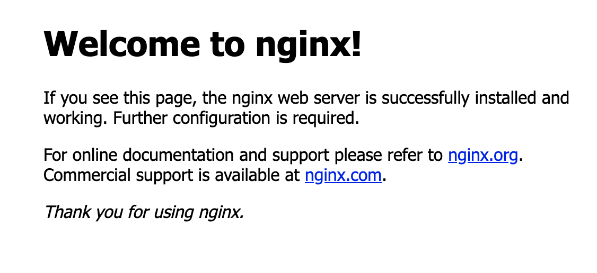
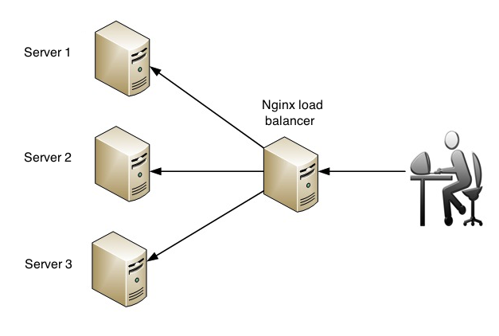

# Nginx

> Nginx 是一个开源的、高性能的 HTTP 服务器和 反向代理服务器，以其高性能、高稳定性、功能丰富、配置简单和资源消耗低等诸多特点而为人所知。

## 前言

本篇目为前端服务相关的 nginx 使用指南。

## 安装指南

1. 查看 CentOS 版本号

  ```bash
  $ cat /etc/redhat-release
  CentOS Linux release 7.6.1810 (Core)
  ```

2. Nginx 不在 CentOS 默认的 yum 源中，拉取官网的 yum 源到本地：
  
  ```bash
  $ rpm -ivh http://nginx.org/packages/centos/7/noarch/RPMS/nginx-release-centos-7-0.el7.ngx.noarch.rpm
  ```

3. 安装 Nginx
   
  ```bash
  $ yum install nginx
  ```
  
4. 启动 Nginx 服务

  ```bash
  # 设置 nginx 开机启动并启动nginx 服务
  $ systemctl enable nginx
  $ systemctl start nginx

  # 停止 nginx 服务
  $ systemctl stop nginx
  # 重启 nginx 服务
  $ systemctl restart nginx
  # 当配置变更后，重新加载 nginx 服务
  $ systemctl reload nginx
  ```
5. CentOS 防火墙 firewalld 默认关闭 http 及 https 服务，需要开启对用的防火墙端口

  ```bash
  # 国内阿里云等服务器倘若无法访问，需配置对应的安全组规则
  # 开启 http 服务
  $ firewall-cmd --zone=public --permanent --add-service=http
  # 开启 https 服务
  $ firewall-cmd --permanent --zone=public --add-service=https
  # 重启服务
  $ firewall-cmd --reload

  # 查看已运行服务
  $ firewall-cmd --list-service
  ```

6. 在浏览器中访问服务器地址，如下图所示，即表示 nginx 已启动

   

 
## 静态资源服务器

前后端分离后，前端以静态资源的形式提供 Web 服务，而静态资源往往不直接提供 Web 服务，通常借助于 nginx 来提供。

最简单的静态资源服务器莫过于上方刚安装完 nginx 的欢迎页面。

在单页面应用（ SPA ）中，构建时通过 build 生成 dist 静态资源目录，分发时再把 dist 目录下静态资源复制至 nginx 网站根目录 <code>/usr/share/nginx/html</code> 下。

以本文档为例，流程如下：

1. 通过 <code>yarn build</code> 生成 dist 静态资源目录，并将其复制至 <code>/usr/share/nginx/html</code> 

```bash
# 复制当前路径下 dist 所有文件
$ cp -R dist/ /usr/share/nginx/html
```

2. 因本文档部署至 github pages 下，已设置 docs 路径，需变更 dist 文件夹名称至 docs 才能正常访问

```bash 
# 进入 /usr/share/nginx/html
$ cd /usr/share/nginx/html
# 变更文件夹名称
$ mv dist docs
```

3. 在浏览器中访问 http://144.202.103.102/docs/ ，便可浏览静态资源服务


:::tip 小贴士

倘若未配置路径，直接将 dist 文件夹的所有文件复制至 <code>/usr/share/nginx/html</code> ，浏览器直接访问 http://144.202.103.102/ 即可

:::

## HTTP 服务器

回顾下 Drone CI 容器化的过程，其实前端静态资源是通过运行 Docker 容器来提供 Web 服务的。示例中，分发 Web 服务器的 3080
端口提供 Web 服务，倘若不想通过端口号来访问该 Web 服务，需要在此 Web 服务器上配置 Nginx 来提供 HTTP 服务。

当然不仅限于 Docker 容器运行的应用，基于服务器渲染（ SSR ）的应用也是同样如此。

在 Nginx 配置文件中简单配置下 proxy_pass 即可实现，如下：

```bash
# /etc/nginx/conf.d/default.conf
server {
    listen       80;
    # 配置服务器信息，IP 地址或域名
    server_name  144.202.103.102;

    location / {
        # 代理本地 3080 端口上的应用
        proxy_pass http://144.202.103.102:3080;
        root   /usr/share/nginx/html;
        index  index.html index.htm;
    }

    error_page   500 502 503 504  /50x.html;
    location = /50x.html {
        root   /usr/share/nginx/html;
    }
}
```

配置完成后，重启 nginx 服务器，浏览器中可用 http://144.202.103.102/docs/ 取代原有 http://144.202.103.102:3080/docs/ 来进行访问。


## 负载均衡

当网站流量增大，并发增高时，仅靠一台 Web 服务器来提供服务，其实并不稳定，云服务器一旦宕机，整个网站服务就不可用了。针对这一现象，组建 Web 服务器集群，利用负载均衡技术在 Web 服务器集群间进行业务均衡，可有效改善网站服务突发不可用的状况。直白点来讲，就是将网站服务分发至多个 Web 服务器，并将客户端众多请求合理分配至相应的 Web 服务器。



```bash


```


## 跨域处理

## 性能优化

## 参考链接

- [CentOS 7 下 yum 安装和配置 Nginx](https://qizhanming.com/blog/2018/08/06/how-to-install-nginx-on-centos-7)

- [前端开发者必备的Nginx知识](https://zhuanlan.zhihu.com/p/68948620)

