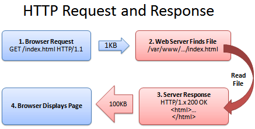

# Nginx

> Nginx 是一个开源的、高性能的 HTTP 服务器和 反向代理服务器，以其高性能、高稳定性、功能丰富、配置简单和资源消耗低等诸多特点而为人所知。

## 前言

本篇目为前端服务相关的 nginx 使用指南。

## 安装指南

1. 查看 CentOS 版本号

  ```bash
  $ cat /etc/redhat-release
  CentOS Linux release 7.6.1810 (Core)
  ```

2. Nginx 不在 CentOS 默认的 yum 源中，拉取官网的 yum 源到本地：
  
  ```bash
  $ rpm -ivh http://nginx.org/packages/centos/7/noarch/RPMS/nginx-release-centos-7-0.el7.ngx.noarch.rpm
  ```

3. 安装 Nginx
   
  ```bash
  $ yum install nginx
  ```
  
4. 启动 Nginx 服务

  ```bash
  # 设置 nginx 开机启动并启动nginx 服务
  $ systemctl enable nginx
  $ systemctl start nginx

  # 停止 nginx 服务
  $ systemctl stop nginx
  # 重启 nginx 服务
  $ systemctl restart nginx
  # 当配置变更后，重新加载 nginx 服务
  $ systemctl reload nginx
  ```
5. CentOS 防火墙 firewalld 默认关闭 http 及 https 服务，需要开启对用的防火墙端口

  ```bash
  # 国内阿里云等服务器倘若无法访问，需配置对应的安全组规则
  # 开启 http 服务
  $ firewall-cmd --zone=public --permanent --add-service=http
  # 开启 https 服务
  $ firewall-cmd --permanent --zone=public --add-service=https
  # 重启服务
  $ firewall-cmd --reload

  # 查看已运行服务
  $ firewall-cmd --list-service
  ```

6. 在浏览器中访问服务器地址，如下图所示，即表示 nginx 已启动

   

 
## 静态资源服务器

前后端分离后，前端以静态资源的形式提供 Web 服务，而静态资源往往不直接提供 Web 服务，通常借助于 nginx 来提供。

最简单的静态资源服务器莫过于上方刚安装完 nginx 的欢迎页面。

在单页面应用（ SPA ）中，构建时通过 build 生成 dist 静态资源目录，分发时再把 dist 目录下静态资源复制至 nginx 网站根目录 <code>/usr/share/nginx/html</code> 下。

以本文档为例，流程如下：

1. 通过 <code>yarn build</code> 生成 dist 静态资源目录，并将其复制至 <code>/usr/share/nginx/html</code> 

```bash
# 复制当前路径下 dist 所有文件
$ cp -R dist/ /usr/share/nginx/html
```

2. 因本文档部署至 github pages 下，已设置 docs 路径，需变更 dist 文件夹名称至 docs 才能正常访问

```bash 
# 进入 /usr/share/nginx/html
$ cd /usr/share/nginx/html
# 变更文件夹名称
$ mv dist docs
```

3. 在浏览器中访问 http://144.202.103.102/docs/ ，便可浏览静态资源服务


:::tip 小贴士

倘若未配置路径，直接将 dist 文件夹的所有文件复制至 <code>/usr/share/nginx/html</code> ，浏览器直接访问 http://144.202.103.102/ 即可

:::

## HTTP 服务器

回顾下 Drone CI 容器化的过程，其实前端静态资源是通过运行 Docker 容器来提供 Web 服务的。示例中，分发 Web 服务器的 3080
端口提供 Web 服务，倘若不想通过端口号来访问该 Web 服务，需要在此 Web 服务器上配置 Nginx 来提供 HTTP 服务。

当然不仅限于 Docker 容器运行的应用，基于服务器渲染（ SSR ）的应用也是同样如此。

在 Nginx 配置文件中简单配置下 proxy_pass 即可实现，如下：

```bash
# /etc/nginx/conf.d/default.conf
server {
    listen       80;
    # 配置服务器信息，IP 地址或域名
    server_name  144.202.103.102;

    location / {
        # 代理本地 3080 端口上的应用
        proxy_pass http://144.202.103.102:3080;
        # proxy_set_header 用以改变 http 的请求头
        # 请求的主机名
        proxy_set_header   Host             $host;
        # 请求的真实IP
        proxy_set_header   X-Real-IP        $remote_addr;
        # 请求的来源
        proxy_set_header   X-Forwarded-For  $proxy_add_x_forwarded_for;
        root   /usr/share/nginx/html;
        index  index.html index.htm;
    }

    error_page   500 502 503 504  /50x.html;
    location = /50x.html {
        root   /usr/share/nginx/html;
    }
}
```

配置完成后，重启 nginx 服务器，浏览器中可用 http://144.202.103.102/docs/ 取代原有 http://144.202.103.102:3080/docs/ 来进行访问。


## 负载均衡

当网站流量增大，并发增高时，仅靠一台 Web 服务器来提供服务，其实并不稳定，云服务器一旦宕机，整个网站服务就不可用了。针对这一现象，组建 Web 服务器集群，利用负载均衡技术在 Web 服务器集群间进行业务均衡，可有效改善网站服务突发不可用的状况。直白点来讲，就是将网站服务分发至多个 Web 服务器，并将客户端众多请求合理分配至相应的 Web 服务器。


假设如今有两台服务器，一台负载均衡服务器，一台普通 Web 服务器，而负载均衡服务器上也运行与普通 Web 服务器同样的 Web 应用，在负载均衡服务器安装 nginx ，<code>/etc/nginx/conf.d/default.conf</code> 文件配置如下：

```bash
# 定义负载均衡服务器集群
upstream balanceServer {
    server 45.77.119.141:3080;
    server localhost:3080;
}
server {
    listen       80;
    server_name doc.snowball.site;

    location / {
        proxy_pass http://balanceServer;
    }

    #error_page  404              /404.html;

    # redirect server error pages to the static page /50x.html
    #
    error_page   500 502 503 504  /50x.html;
    location = /50x.html {
        root   /usr/share/nginx/html;
    }
}
```

配置完成后，重启 nginx 服务。

负载均衡服务器上修改文件 <code>/usr/share/nginx/html/index.html</code> 中欢迎文字，如下：


普通 Web 服务器上修改文件 <code>/usr/share/nginx/html/index.html</code> 中欢迎文字，如下：


访问 http://doc.snowball.site 刷新页面时会轮替出现如下两种情况，即表示一个极简版的 nginx 负载均衡配置成功：


当然，nginx 的负载均衡并不仅限于此，它还提供丰富的配置项，支持轮询策略（ 默认 ）、最小连接数策略、最快响应时间策略以及客户端IP地址绑定策略，这里不加赘述，详细可参阅：[Using nginx as HTTP load balancer](https://docs.nginx.com/nginx/admin-guide/load-balancer/http-load-balancer/)

## 跨域处理

Nginx 是非常优秀的反向代理服务器，可以用它来解决浏览器跨域问题。

假设前端域名为 fe.snowball.site ，后端域名为 api.snowball.site，根据浏览器同源策略，前端访问后端 HTTP 服务时会触发跨域问题，当然解决办法有很多，可以让后端服务器进行处理，可以利用 Webpack 中 proxy 属性来配置等，其实也可以利用 nginx 来解决。


```bash
# 接口域名用 fe.snowball.site 代替 api.snowball.site
# 如下配置代理，即可完成跨域
server {
    listen       80;
    server_name  fe.snowball.site;
    location / {
        root   /usr/share/nginx/html;
        index  index.html index.htm;
    }
    # 匹配到 fe.snowball.site/api 请求时代理至 api.snowball.site/v1
    location ^~ /api/ {
        proxy_pass api.snowball.site/v1;
    }
}
```

## 网站安全

当网站以 HTTP 运行时，可能会被网络运营商劫持，在网站中植入广告代码，这种攻击方式称作为中间人攻击（ Man In The Middle Attack，可简称 MITM ），示意图如下：


因 HTTP 是明文传输，网络运营商可以随意篡改网站信息，但倘若网站升级为 HTTPS ，采用加密传输，运营商就不能截获及篡改网站信息。

Nginx 可以通过简单的配置，将网站升级为 HTTPS ，步骤如下：

1. CentOS7 防火墙开启 https 服务

  生成 SSL 证书时需要注意，CentOS7 默认防火墙 firewalld 关闭了 https 服务，需要进行开启：

  ```bash
  # 开启防护墙 http 服务并重启
  $ firewall-cmd --zone=public --permanent --add-service=https
  $ firewall-cmd --reload
  # 查看防护墙所有服务
  $ firewall-cmd --list-service
  ```

2. 利用 Let's Encrypt 生成工具 [acme.sh](https://github.com/Neilpang/acme.sh) 来签发证书

    - 安装 acme.sh ，如下：

    ```bash
    # 生成证书需安装 socat
    $ yum install socat
    # 此命令做了如下两件事
    # 把 acme.sh 安装到你的 home 目录下，即 ~/.acme.sh/
    # 创建 一个 bash 的 alias, 方便你的使用: alias acme.sh=~/.acme.sh/acme.sh
    # 自动为你创建 cronjob, 每天 0:00 点自动检测所有的证书, 如果快过期了, 需要更新, 则会自动更新证书
    $ curl  https://get.acme.sh | sh
    ```

    - 生成 SSL 证书：

    ```bash
    $ cd ~/.acme.sh/
    $ sh acme.sh  --issue -d doc.snowball.site  --standalone
    ```

    - 复制证书至系统文件夹：

    ```bash
    # 打开 /opt/ 文件夹并新建 certs 文件夹
    $ cd /opt/ && mkdir -p certs
    # 使用 --installcert 命令指定目标文件夹位置
    $ cd ~/.acme.sh/
    $ sh acme.sh  --installcert  -d  doc.snowball.site \
          --key-file /opt/certs/doc.snowball.site.key \
          --fullchain-file /opt/certs/fullchain.cer
    ```
3. 变更 nginx 配置文件

    ```bash
    # 基础配置
    server {
      listen       80;
      # https 配置
      listen       443 ssl;
      server_name  doc.snowball.site;
      # 证书
      ssl_certificate  /opt/certs/fullchain.cer;
      # 私钥
      ssl_certificate_key  /opt/certs/doc.snowball.site.key;
      # SSL 协议
      ssl_protocols  TLSv1 TLSv1.1 TLSv1.2;
      # 定义算法
      ssl_ciphers  HIGH:!aNULL:!MD5;

      location / {
          root   /usr/share/nginx/html;
        index  index.html index.htm;
      }
    }
    ```

3. 重启 nginx ，访问 https://doc.snowball.site/docs/ 即可生效


## 性能优化

- gzip

  gizp 是一个用于文件压缩及解压缩的应用程序，倘若不引入 gizp ，正常的 HTTP 请求流程如下：

  

  但其实存在一个问题，当单个文件过大时（ 在大型项目中会出现多个单文件过大 ），而且在 HTTP/1.1 时代，TCP 的连接数有限，若先前请求没响应完成，后续请求会被阻塞，导致整体传输速度会很慢，流量也会比较大，网站速度自然不需多说。

  为解决 HTTP 文件传输过慢的问题，引入了 gizp ，HTTP 请求流程如下：

  

  需要说明一点，gzip 的实现需要依赖浏览器和服务器两方面的支持：浏览器发送请求时，会在头信息中携带 <code>Accept-Encoding: gzip, deflate</code> ，告知服务器它可以接受压缩文件；服务器响应请求时，会在头信息中携带<code>Content-Encoding: gzip</code>，告知浏览器它需要处理压缩文件。示例如下：

  

  浏览器请求时头信息中默认携带 <code>Accept-Encoding: gzip, deflate</code>，因此在需要在服务器响应时，在其头信息中携带<code>Content-Encoding: gzip</code>即可，相应 nginx 配置如下：
    
  ```bash
  server {
    # 开启 gzip 压缩
    gzip on;
    # 设置 gzip 所需的 http 协议最低版本号，默认值为 HTTP/1.1
    gzip_http_version 1.1;
    # 设置压缩级别（1-9），值越大表示压缩率越高，同时消耗cpu资源也越多，建议设置在 5 左右
    gzip_comp_level 6;
    # 设置压缩的最小字节数，小文件可以不必压缩
    gzip_min_length 1024;
    # 设置缓存用于存储 gzip 压缩后的数据流，原始数据大小以 8k 为单位的 16 倍申请内存
    gzip_buffers 16 8k;
    # 反向代理时才启用，通常根据代理服务器 header 头信息进行压缩项配置，any 表示无条件启用压缩
    gzip_proxied any;
    # 设置压缩文件的类型，默认为 text/html ，如需压缩其他类型文件需要进行开启才生效
    gzip_types 
      text/plain
      text/css
      text/js
      text/xml
      text/javascript
      application/javascript
      application/json
      application/xml
      application/pdf 
      # 倘若图片已压缩优化过，则不必开启 gzip
      image/gif
      image/jpeg
      image/png
      image/svg+xml;
    #配置 gzip 禁用规则，此处表示ie6及以下不启用gzip（ 因为 IE 低版本不支持 gzip ）
    gzip_disable "MSIE [1-6]\.";
  }
  ```
  配置完成后，重启 nginx 即可生效。

  生效后需要进行简单的认证，通常有两种方式：

    - 命令行

    依次验证所需压缩文件是否都开启了 gzip：

    ```bash
    $ curl -H "Accept-Encoding: gzip" -I http://doc.snowball.site/docs/assets/js/2.2ae119df.js
    # 验证 js 文件 Content-Encoding: gzip 是否生效
    HTTP/1.1 200 OK
    Server: nginx/1.16.0
    Date: Fri, 28 Jun 2019 09:15:48 GMT
    Content-Type: application/javascript
    Last-Modified: Tue, 25 Jun 2019 10:55:15 GMT
    Connection: keep-alive
    ETag: W/"5d11fd93-b550"
    Content-Encoding: gzip

    $ curl -H "Accept-Encoding: gzip" -I http://doc.snowball.site/docs/assets/css/0.styles.7836021c.css
    # 验证 css 文件 Content-Encoding: gzip 是否生效
    HTTP/1.1 200 OK
    Server: nginx/1.16.0
    Date: Fri, 28 Jun 2019 09:15:22 GMT
    Content-Type: text/css
    Last-Modified: Tue, 25 Jun 2019 10:55:15 GMT
    Connection: keep-alive
    ETag: W/"5d11fd93-60a7"
    Content-Encoding: gzip

    # 倘若未生效则结果如下
    # HTTP/1.1 200 OK
    # Server: nginx/1.16.0
    # Date: Fri, 28 Jun 2019 09:15:31 GMT
    # Content-Type: text/css ( application/javascript )
    # Content-Length: 20814
    # Last-Modified: Tue, 25 Jun 2019 10:55:15 GMT
    # Connection: keep-alive
    # ETag: "5d11fd93-514e"
    # Accept-Ranges: bytes
    ```
    - 浏览器

    查看对应请求文件中返回头信息中是否携带 <code>Content-Encoding: gzip</code>：

    

    验证完 gzip 可通过浏览器面板查看压缩率，下图中 14.1 KB 表示实际传输文件大小，45.3 KB 表示源文件大小，计算比例可知文件压缩了 70% 左右。

    


- http/2

  在 http/1.1 时代，TCP 的连接数有限，若先前请求没响应完成，后续请求会被阻塞，为解决这一问题需要采用合并请求策略。

  而 http/2 最大的优点是多路复用，即对同一域名的服务器仅需建立一次 TCP 连接，就可以加载多个资源。除此之外，使用二进制帧传输及 http 头部压缩也是其亮点。概括来说，http/2 解决了 http/1.1 时代的痛点。

  使用 HTTP/2 时，必须使用 SSL/TLS 加密，有关 HTTPS 配置信息可见上方网站安全部分。
  
  Nginx 相关配置如下：

  ```bash
    # nginx
    # 在 https 基础上追加 http/2 即可
    server {
      listen       80;
      # http/2 配置
      listen       443 ssl http2;
      server_name  doc.snowball.site;
      ssl_certificate  /opt/certs/fullchain.cer;
      ssl_certificate_key  /opt/certs/doc.snowball.site.key;
      ssl_protocols  TLSv1 TLSv1.1 TLSv1.2;
      ssl_ciphers  HIGH:!aNULL:!MD5;

      location / {
          root   /usr/share/nginx/html;
        index  index.html index.htm;
      }
    }
  ```

  配置完成后，重启 nginx 服务器，通过浏览器面板查看请求，倘若 Protocol 栏目下显示 h2 ，则表示网站 http/2 已经生效：

  


## 参考链接

- [CentOS 7 下 yum 安装和配置 Nginx](https://qizhanming.com/blog/2018/08/06/how-to-install-nginx-on-centos-7)

- [前端开发者必备的Nginx知识](https://zhuanlan.zhihu.com/p/68948620)

- [Web前端必备-Nginx知识汇总](https://zhuanlan.zhihu.com/p/62264210)

- [How To Optimize Your Site With GZIP Compression](https://betterexplained.com/articles/how-to-optimize-your-site-with-gzip-compression/)

- [https连接的前几毫秒发生了什么](https://www.rrfed.com/2017/02/03/https/)

- [为什么要把网站升级到HTTPS](https://www.rrfed.com/2017/09/03/upgrade-to-https/)

- [Nginx 配置 HTTPS 服务器](https://aotu.io/notes/2016/08/16/nginx-https/index.html)

- [HTTP/2 Now Fully Supported in NGINX Plus](https://www.nginx.com/blog/http2-r7/)

- [怎样把网站升级到http/2](https://zhuanlan.zhihu.com/p/29609078)

- [HTTP2 详解](https://blog.wangriyu.wang/2018/05-HTTP2.html)

