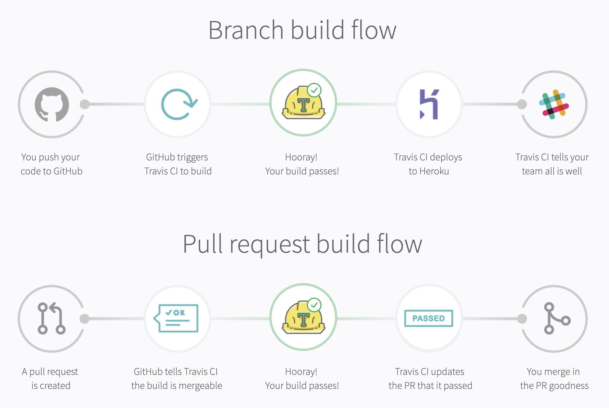
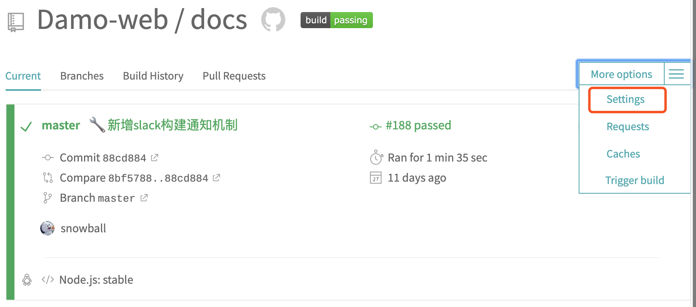
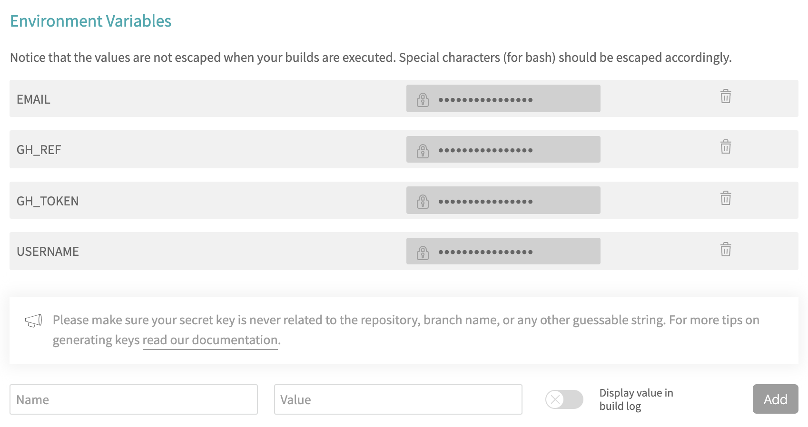
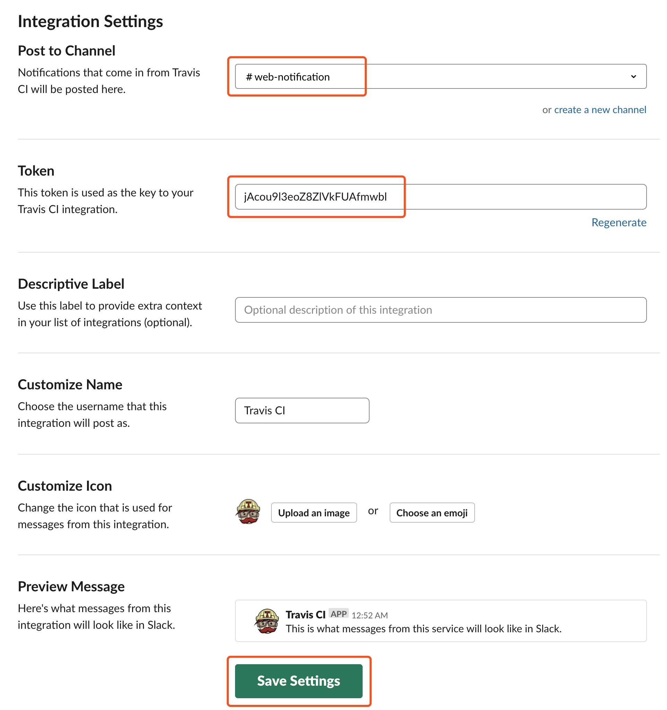

# Travis CI

> 本篇目为 Travis CI 搭建指南，以静态博客为例，覆盖构建、发布及通知流程。

## 前言

Travis 是一个用 Ruby 语言开发的开源持续集成软件，仅适用于 Github，对于开源项目免费使用，其配置文件极其简单，语言支持度更广，是 Github 当下最成熟的 CI / CD 工具。

## 说明

[Travis CI](https://travis-ci.org/) 是容器化的 CI / CD 工具，通过简单配置根目录下 <code>.travis.yml</code>文件即可运行 CI / CD 服务。

## 流程图



## 安装

可以通过 [travis-ci | signup](https://travis-ci.org/) 或 [github | marketplace](https://github.com/marketplace/travis-ci)来进行授权安装。

## 配置

1. 授权组织及仓库后后进入 [travis-ci | dashboard](https://travis-ci.com/)

2. 添加构建运行时的私密信息

   - 打开 Travis CI 仓库配置项：

    

   - 添加所需环境变量：
    
    

    USERNAME 为 Github 用户名，EMAIL 为 Github 注册邮件，GH_REF 为 Github 仓库，GH_TOKEN 为 Github Token 

    关于 Github Token 即 Github Personal Access Token，具体生成步骤可参阅： [Github | creating-a-personal-access-token](https://help.github.com/en/articles/creating-a-personal-access-token-for-the-command-line#creating-a-token)

3. 仓库根目录下配置 <code>.travis.yml</code>文件

    ```yaml
    language: node_js
    node_js: stable

    cache:
      directories:
        - node_modules

    install:
      - yarn install
    before_script: 
    script:
      - yarn build
    after_script:
      - cd ./dist
      - ls
      - git init
      - git config user.name "${USERNAME}"
      - git config user.email "${EMAIL}"
      - git add -A
      - git commit -m "[skip ci] deploy"
      - git push -f "https://${GH_TOKEN}@${GH_REF}" master:gh-pages

    branches:
      only:
        - master  
    ```

4. 构建项目

   按上述步骤或者参阅[travis-ci | getting_started](https://travis-ci.com/getting_started)，向仓库监测分支推送代码即可触发构建

5. 配置 Slack 通知

   首先，在 Slack 网站 App Directory 页面，搜索 Travis CI 并获取 Token：

   
   
   Travis CI 提供命令行来进行加密隐私信息，在使用其命令之前，需要在终端安装并登录：

   ```bash
   # 安装 travis 
   $ gem install travis
   # 所用域名为 https://travis-ci.com/ 需要加下 --pro 
   $ travis login --pro
   We need your GitHub login to identify you.
   This information will not be sent to Travis CI, only to api.github.com.
   The password will not be displayed.

   Try running with --github-token or --auto if you don't want to enter your password anyway.
   # 输入 Github 用户名及密码即可完成登录
   ```
   
   利用 travis encrypt 生成 Slack secure：

   ```bash
   # 进入当前项目根目录，并确保 .travis.yml 文件存在
   # 修饰符 --pro 必须加上，不然加密信息 travis 无法解析
   # 修饰符 --add 会自动添加至 .travis.yml 文件
   # 修饰符 -r 用于指定组织（个人）下的仓库，当仓库变动时，需要重新生成
   $ travis encrypt "your-slack-workspace:0GSmTxDjyN0W0zxt2SkQWuTM#web-notification" --pro --add notifications.slack.rooms -r Damo-web/docs
   ```

   查看<code>.travis.yml</code>文件，并追加 Slack 通知信息：

   ```yaml{22-34}
    language: node_js
    node_js: stable

    cache:
      directories:
        - node_modules

    install:
      - yarn install
    before_script: 
    script:
      - yarn build
    after_script:
      - cd ./dist
      - ls
      - git init
      - git config user.name "${USERNAME}"
      - git config user.email "${EMAIL}"
      - git add -A
      - git commit -m "[skip ci] deploy"
      - git push -f "https://${GH_TOKEN}@${GH_REF}" master:gh-pages
    # 新增 Slack 通知配置信息
    notifications:
      slack:
        rooms:
          secure: eRBiyqpC+kBolvUuGHQJ1btBGzvr+vs5KJjMdRI3QJe8gbAekHrJDq3MwtIMZrVfmPXwVlZbRgK2e3dyQz+9Iidd5fRs3BIK65Hvcxxr2SpT8umgwOxhkysCpO6lGLYsneqVYro639kUz4xzo3Q4qED89N3prF1t7lKvHZ1kYfU7Nx4EkYk8R7xqDirB3cZKCveLQVjOz9hPCPU7YadB0VySCvosR+KNzSfHFleaJ/eoo4C+ozGPeY/45SZIFWBWnSnk4gIAkkDGusv+19AIDo6hds2FdoCkxmFyyk5fw91LI6Sss8vjtRMC4vFnSMWcWNudsbHa2bQl7EozX/sYQ9DBKrzS5pbiApgKGX4ngScnuppdUxq9f4pP+OiU4qjNjboQt2CLlo0Vc+Fy8NmpE+eriXw+gt8FyJImU+/tcpB0ANOqPUCKrlzrIybGIM3emIbsezKQL5LM92P+uILI5zVSWXgDanSabPGMF4hKTNaVdcMZgLZ8AMhKOc2x5+YMQ9kbt9UwQlXPe673aX6/nSxLonhxAJMhyjMyy8jjoFGQfEeFm9hlA3pUi1RR62lZajmp3c7S/6gJ3OxaJ/4kOiTgedOZJQiZkysFUnM3/SDsdD+MXcXgEY/hVbStUj2vzBzGlyDQGJoDsy8EfYlvt6qw83uy9bHjHFLvyPk0pJ0=
        on_success: always
        on_failure: always
        template:
        - Repo `%{repository_slug}`build (<%{build_url}|#%{build_number}>) for commit
          (<%{compare_url}|%{commit}>)
        - on branch `%{branch}` by `%{author}`.
        - 'Execution time: *%{duration}*'
        - 'Message: *%{message}*'

    branches:
      only:
        - master  
    ```

    至此构建完成时，便会发送构建相关信息通知到 Slack 对应的频道。

## 参考链接

- [Encryption keys](https://docs.travis-ci.com/user/encryption-keys/)

- [not logged in, please run travis login --pro](https://github.com/travis-ci/travis-ci/issues/6146)

- [Continuous Integration. CircleCI vs Travis CI vs Jenkins](https://hackernoon.com/continuous-integration-circleci-vs-travis-ci-vs-jenkins-41a1c2bd95f5?source=search_post---------0)

- [Testing your Vue app with Jest and Travis CI](https://medium.com/javascript-in-plain-english/add-test-coverage-to-vue-js-app-with-jest-travis-ci-and-coveralls-d10d118125c2)

- [Free CICD and Web hosting integration. Travis-ci + Github.page](https://hackernoon.com/ci-cd-continuous-integration-tools-delivery-react-web-travis-github-example-tutorial-javascript-vue-db8afe9f9a81)