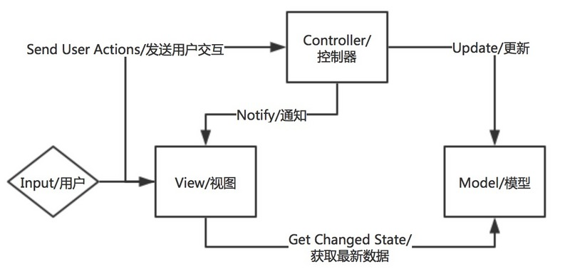
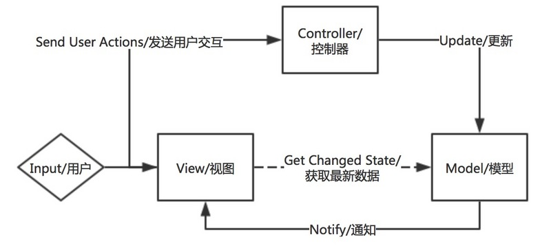
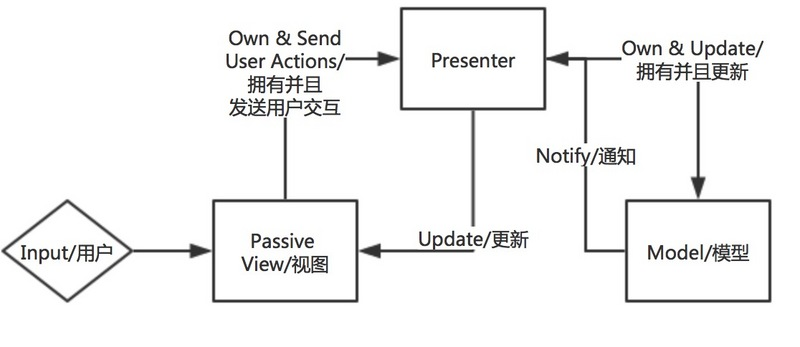

# MVVM模式

> MVVM 是前端一种非常流行的开发模式，利用 MVVM 模式可以使我们的代码更专注于处理业务逻辑而不是过多关注 DOM 操作。目前著名的 MVVM 框架有 Vue 、Angular 、Knockout 等，各有优势，但是实现的思想大致上是相同的：数据绑定及视图刷新。


## 演化之路

1. MVC(Model-View-Controller):

    -  View(视图层)

    -  Controller(业务逻辑层)

    -  Model(数据层)

    流程：

    - 用户交互进行输入

    - Controller将用户输入转化为Model所需要进行的更改

    - Model中的更改结束之后，Controller通知View进行更新以表现出当前Model的状态

  

   与观察者模式结合流程(会造成View和Model的强耦合)：

   - 用户交互进行输入

   - Controller将用户输入转化为Model所需要进行的更改

   - View作为Observer会监听Model中的更新，一旦有更新事件发出，View会自动触发更新以展示最新的Model状态

  

2. MVP(Model-View-Presenter)：

    -  View(视图层)

    -  Controller(视图与数据的中间层)

    -  Model(数据层)

    流程(View与Model解耦)：

    - 用户交互进行输入

    - View将用户输入转化为发送给Presenter

    - Presenter控制Model的更新

    - Model将更新之后的值返回给Presenter

    - Presenter将更新之后的模型返回给View

  

3. MVVM(Model-View-ViewModel)：

    -  View(视图层)

    -  ViewModel(视图与数据的中间层)

    -  Model(数据层)

    流程(View的无状态和数据绑定)：

    - 用户交互进行输入

    - View将数据直接传送给ViewModel，ViewModel保存这些状态数据

    - 在有需要的情况下，ViewModel会将数据传送给Model

    - Model在更新完成之后通知ViewModel

    - ViewModel从Model中获取最新的模型，并且更新自己的数据状态

    - View根据最新的ViewModel的数据进行重新渲染

  

## MVC、MVP和 MVVM 的总结

此类模型都包含如下三个方面：

- Model:负责业务逻辑相关的数据与实现对数据的操作

- View:负责将数据渲染展示给用户，并且响应用户输入

- Controller/Presenter/ViewModel:往往作为Model与View之间的中间件，接收View传来的用户事件并且传递给Model，同时利用从Model传来的最新模型控制更新View

演化缘由：

&emsp;&emsp;MVC模式在一些小型项目或者简单的界面上仍旧有极大的可用性，但是在现代富客户端开发中导致职责分割不明确、功能模块重用性、View的组合性较差。作为继任者MVP模式分割了View与Model之间的直接关联，MVP模式中也将更多的ViewLogic转移到Presenter中进行实现，从而保证了View的可测试性。而最年轻的MVVM将ViewLogic与View剥离开来，保证了View的无状态性、可重用性、可组合性以及可测试性。

演化核心：

&emsp;&emsp;随着View层日趋复杂，有必要将ViewLogic与View的分离，使开发者只需关注业务逻辑本身，而不需要过多考虑DOM操作及数据视图同步问题。

## MVVM 模式的框架实现

1.Vue框架


VM(ViewModel)主要实现了两件事：

- M 到 V 的映射(Data Binding):

  - VM初始化时可通过模板引擎实现，不同框架有不同的实现方式，简单原理如下：

  ```javascript

      // template
      var template = '<p>{{ text }}</p>';
      // data
      var data = {
        text: 'This is demo'
      };
      // magic process
      modelToView(template, data); // '<p>This is demo</p>'

  ```

  - 当Model发生变化时，Vue的实现方式是对数据（Model）进行劫持，数据会触发劫持时绑定的方法，对视图进行更新。具体来说，当把一个普通 Javascript 对象传给 Vue 实例来作为它的 data 选项时，Vue 将遍历它的属性，用 Object.defineProperty 将它们转为 getter/setter。当数据发生变化时，Observer 中的 setter 方法被触发，setter 会立即调用Dep.notify()，Dep订阅器开始遍历所有的订阅者，并调用订阅者的 update 方法，订阅者收到通知后对视图进行相应的更新。

- V 到 M 的事件监听 (DOM Listeners)

  View 到 Model 主要在于解析模板指令，将模板中的属性替换成数据，并将每个指令对应的节点绑定listener函数，添加监听节点的订阅者，一旦节点属性有变动，收到通知，更新model


总体来说，Model到View需要模板引擎来实现，同样View到Model需要解析器来实现，而当View及Model改变时要触发相应的Model及View改变，这需要引入发布-订阅模式和观察者模式来实现。整体流程图如下：


2.Angular框架

&emsp;&emsp;Angular框架的MVVM实现原理与Vue基本一致，在数据绑定上有所不同，Vue采用Object.defineProperty来进行数据劫持，而Angular采用脏检查机制，具体实现如下：
Angular 在 scope 模型上设置了一个 监听队列，用来监听数据变化并更新 view 。每次绑定一个数据到 view 上时，就会往 $watch 队列里插入一条 $watch，用来检测它监视的 model 里是否有变化。当浏览器接收到可以被 angular context 处理的事件时(即UI事件，ajax请求或者 timeout 延迟事件)，$digest 循环就会触发，遍历所有的 $watch，最后更新 dom。

## 参考链接

- MVVM：

  https://zhuanlan.zhihu.com/p/26799645

  https://www.zhihu.com/question/36929146

  https://segmentfault.com/a/1190000004847657#articleHeader8

- Vue双向绑定:

  https://segmentfault.com/a/1190000006599500

  https://github.com/DDFE/DDFE-blog/issues/7

- Angluar双向绑定：

  http://www.ituring.com.cn/article/39865

  https://github.com/xufei/blog/issues/10

- API of the DefineProperty

  https://developer.mozilla.org/zh-CN/docs/Web/JavaScript/Reference/Global_Objects/Object/defineProperty