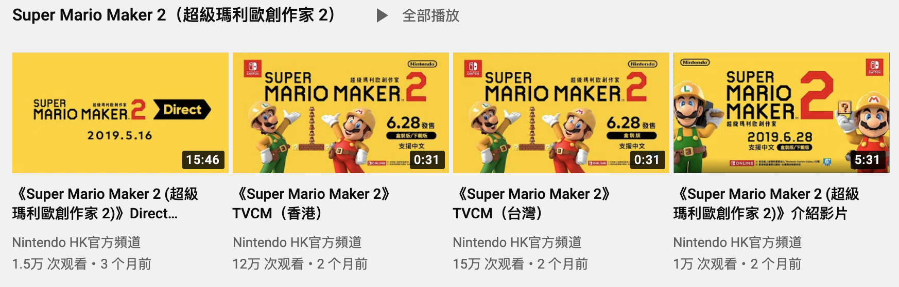
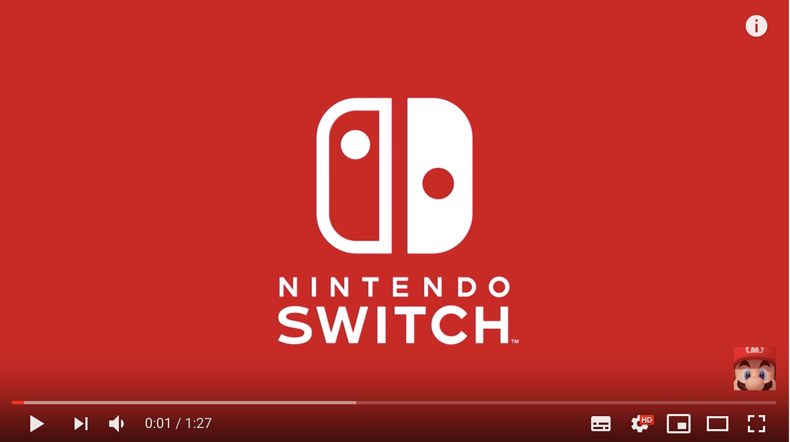
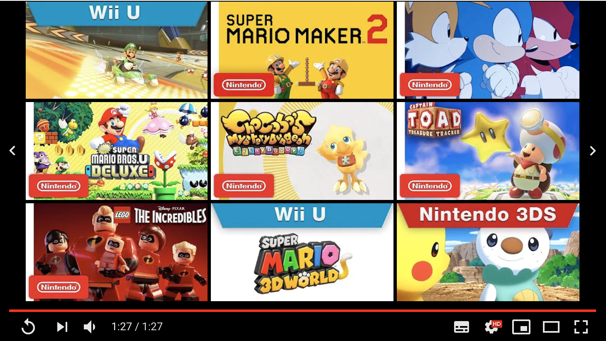

# 视频播放器

> 在 HTML5 video 元素出现之前，网页端的视频播放是通过浏览器  Adobe Flash 插件来进行完成的。因其在网页播放中的存在诸多问题， Flash 将于2020 年底停止更新，目前主流视频平台的视频播放器已经切换至 HTML5 版本。

## 前言

HTML5 播放器主要由 HTML video 元素、媒体源扩展（ Media Source Extensions，可简称 MSE ）及 Buffer 进制操作（ ArrayBuffer、TypeArray 及 DataView ）三个部分组成。其中，HTML video 元素用于视频播放的交互，MSE 用于音视频流的注入，Buffer用于视频格式的转换。

## Video

HTML5 video 元素是视频播放器的交互核心，完整的视频播放器由播放前、播放中及播放后三个维度构成：

- **播放前（ Pre Play ）**

  视频播放前的展示，主要包含视频信息、海报或预览等功能。

  以单视频的 YouTube 嵌入播放器为例，点击播放按钮时视频开始播放，播放器头部展示了视频的信息数据，并提供加入播放列表及视频分享的功能，具体如下：

  

  以多视频的 YouTube 视频缩略图为例，当点击该视频缩略图时会跳转至播放页，当鼠标移入时可观看其预览视频，除此之外，还具有展示视频的信息数据、加入播放列表及视频分享功能，细节如下：

  

  视频播放前，HTML5 video 元素提供了以下属性：

  - poster 

    用于设置视频的海报，即视频未播放并且处于正在下载状态下的缩略图。若未设置该属性，当视频第一帧可用时，会将视频第一帧作为海报。**当视频资源路径出错或其视频格式均不受支持下，海报可以作为候补资源充当视频封面图片**。
  
  - preload
    
    用于视频开始播放前的预下载设置。当属性值设置为 metadata 时，表明即使用户不需要打开视频，但依旧会获取视频的元数据（视频尺寸、时长等信息，统称为 metadata ）。当属性值设置为 auto 时，浏览器将会缓存该视频，中途无需缓冲加载。当属性值设置为 none 时，表明该视频不进行预加载。**需要注意，移动端出于节省视频流量的考虑，会忽略该属性**。

  - autoplay

    用于自动下载及播放网页上的视频。**需要注意，在移动端该属性不起作用，必须有网页交互行为才可以播放视频**。

  - controls

    用于控制是否显示默认视频控件（ 各浏览器端实现存在差异，通常包含播放、暂停、音量、全屏、画中画等功能 ）。

  - loop

    用于设置视频是否进行循环播放。

  :::tip 小贴士
  [The Video Embed element](https://developer.mozilla.org/en-US/docs/Web/HTML/Element/video#Attributes)
  :::

- **播放中（ Video Playback ）**

  视频内容播放过程中的控制操作，主要包含播放/暂停控制、音量控制、全屏控制等反馈操作。

  以 YouTube 播放器为例，其播放器下方播放控制区域包含播放/暂停键、音量键、播放时间/时长、全屏键、播放进度及跳转等基础功能，同时也衍生出切换下一个视频、音量调节、播放速度设置、字幕显示/隐藏、画质切换、画中画模式、剧场模式等增强功能，如下：

  

  针对不同视频业务，播放中的控制操作也会有所变动。直播业务下，播放进度及跳转基础功能几乎是不可用的（ YouTube 直播中支持回退跳转操作 ），但会附加视频源刷新、弹幕显示/隐藏、礼物系统、聊天室等功能；短视频业务下，简化了视频的播放操作度，但侧重了分享、评论、点赞等社交功能。

  视频播放时，HTML5 video 元素提供了以下属性：

  - 

  - 

  - 

- **播放后（ Post Play ）**

  视频播放后的交互，主要包含停止播放、下集跳转或相关视频推荐等辅助功能。

  以 YouTube 播放器为例，当视频播放完成后，若未设置自动播放功能，会弹出播放列表选择框，同时播放按钮置为重播按钮，如下：

  

## MSE

## Buffer

## 参考链接

- [The Video Embed element](https://developer.mozilla.org/en-US/docs/Web/HTML/Element/video)

- [Using video and audio](https://developers.google.com/web/fundamentals/media/video)

- [Modernizing the Web Playback UI](https://medium.com/netflix-techblog/modernizing-the-web-playback-ui-1ad2f184a5a0)

- [Media Source Extensions](https://developers.google.com/web/fundamentals/media/mse/basics)

- [Web 直播流的解析](https://zhuanlan.zhihu.com/p/26390382)

- [全面进阶 H5 直播](https://zhuanlan.zhihu.com/p/26123053)

- [不再碎片化学习，快速掌握 H5 直播技术](https://zhuanlan.zhihu.com/p/29794002)

- [花椒 Web 端多路音频流播放器研发](https://zhuanlan.zhihu.com/p/80923152)

- [flv.js](https://github.com/Bilibili/flv.js/)

- [chimee-player](https://github.com/Chimeejs/chimee)

- [DPlayer](https://github.com/MoePlayer/DPlayer)

- [griffith](https://github.com/zhihu/griffith)

- [FLV.JS 代码解读--demux部分](https://zhuanlan.zhihu.com/p/24429290)

- [从JPG到AVI，这篇视频编码的最强入门科普，你值得拥有！](https://zhuanlan.zhihu.com/p/44878961)

