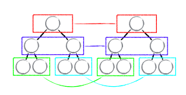
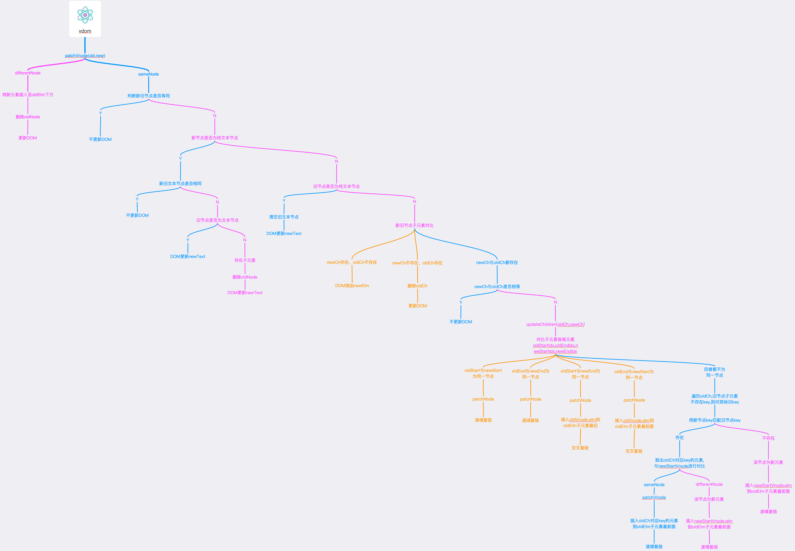
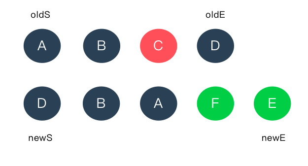
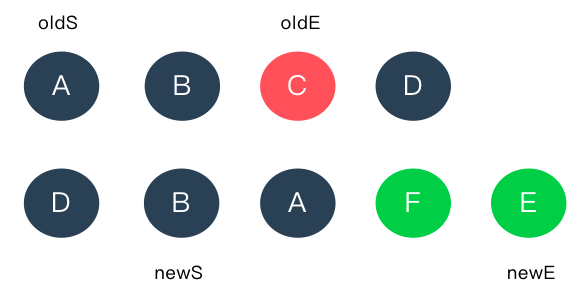
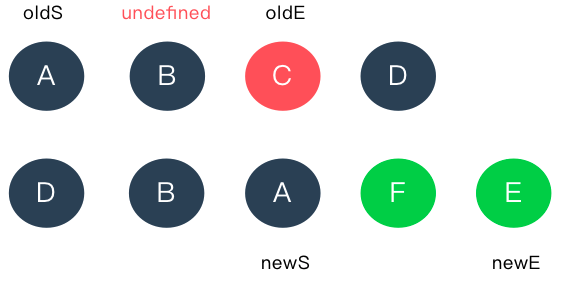
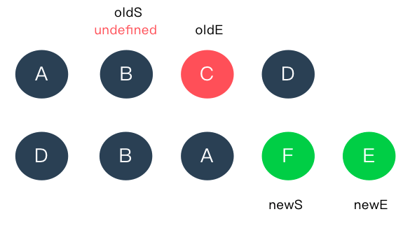
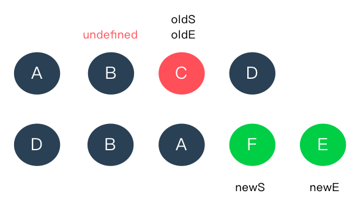
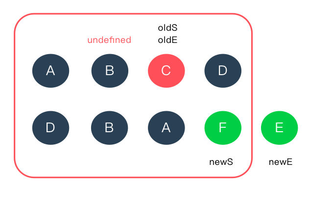

# Virtual DOM

> 在现代web前端框架中，虚拟DOM是一个不可避免谈论的话题。初识虚拟DOM，会对它非常好奇，但大部分人可能只停留在框架使用层面，对其diff过程不太清楚。本栏目旨在实现类mpVue类的跨端平台简易版本，会持续进行文档记录。而首当其冲，需要去了解Vue2.0+版本背后，虚拟DOM的运行机制及原理。

当翻阅Vue的源码，在其[github](https://github.com/vuejs/vue)上dev分支vue/src/core/vdom/patch.js目录下，注明了Vue有关虚拟DOM的diff算法是借鉴[Snabbdom](https://github.com/snabbdom/snabbdom)这个开源库来实现的。
下述文档会就Snabbdom的diff算法进行源码层面的分析和解读。

```javascript
/**
 * Virtual DOM patching algorithm based on Snabbdom by
 * Simon Friis Vindum (@paldepind)
 * Licensed under the MIT License
 * https://github.com/paldepind/snabbdom/blob/master/LICENSE
 *
 * modified by Evan You (@yyx990803)
 *
 * Not type-checking this because this file is perf-critical and the cost
 * of making flow understand it is not worth it.
 */
```

## 简介

虚拟DOM本质是真实DOM抽象化，实质是用 JS 对象的方式来模拟真实的 DOM及节点。大体如下：


## Diff算法

虚拟DOM其实就是模拟真实的 DOM 的 JS 对象，但仅有DOM抽象化模型，无法解决Web UI操作更新DOM后所引发页面渲染问题。为了解决页面操作引发更新DOM的问题，**还需要对前后两次DOM节点变化进行对比，计算出虚拟DOM中真正变化的部分，并针对该部分进行真实 DOM 操作**，而非一更新DOM全部重新渲染页面。而上述这个比对并更新DOM的过程，就是虚拟DOM中的Diff算法。

将一棵树转换成另一棵树的最小操作次数，**传统Diff算法是通过循环递归对节点进行依次对比，算法复杂度达到 O(n^3)**，其中 n 是树中节点的总数。传统Diff算法，论性能及效率，在前端渲染层是难以接受的。

React 通过以下的约定，实现了**算法复杂度从O(n^3)降到O(n)**，保证了UI渲染的性能:

**1. 不同类型的节点将生成不同的DOM Tree**

**2. 对于同一层级的一组子节点，它们可以通过唯一 Key 进行区分**

**3. DOM 节点跨层级的操作特别少，可以忽略，即使出现，删除旧节点新建DOM节点即可**



## Diff源码

Snabbdom关于虚拟DOM及Diff算法与React其实是类似的。下文以Snabbdom为例，从代码层面剖析了构建虚拟DOM 及 Diff的过程：

- DOM抽象化模型vnode

```javascript
  /**
 * 虚拟DOM生成函数
 * @param {selector}                元素选择器
 * @param {data}                    元素标签属性及key
 * @param {children}                元素子元素
 * @param {text}                    元素纯文本节点                    
 * @param {elm}                     元素真实dom（render时）
 */

  const VNode = (selector, data, children, text, elm) => {
    const key = data === undefined ? undefined : data.key;
    return {
      selector,
      data,
      children,
      elm,
      text,
      key
    }
  }
```

:::tip
值得注意的是，Snabbdom约定了text与children不可并存，作为区分文本节点和非文本节点的标志,当text与children共存时，忽略text属性
:::

- 新旧节点patch

```javascript
  function patch(oldVnode,vnode){
    let elm,parent;

    //若oldVnode为 真实Element
    //则转化oldVnode为空节点
    if(!isVnode(oldVnode)){
      oldVnode = emptyNodeAt(oldVnode);
    }

    //对比新旧节点
    if(sameVnode(oldVnode, vnode)){
      //新旧节点为相同节点(selector和key相同)则patch
      patchVnode(oldVnode, vnode);
    }else{
      //获取新旧节点及父级
      elm = oldVnode.elm;
      parent = api.parentNode(elm);
      createElm(vnode);

      //倘若父级节点存在
      //在父级节点下旧节点后插入新节点
      //删除旧节点
      if (parent !== null) {
        api.insertBefore(parent, vnode.elm, api.nextSibling(elm));
        removeVnodes(parent, [oldVnode], 0, 0);
      }
    }

    return vnode;
  }
```

- 新旧节点patchVnode

```javascript code-contain
  //patch node
  function patchVnode(oldVnode, vnode, insertedVnodeQueue) {
    let i, hook;
    const elm = vnode.elm = oldVnode.elm;
    let oldCh = oldVnode.children,ch = vnode.children;

    //若data.hook.prepatch存在，则执行prepatch hook
    if (Validator.isDef(i = vnode.data) && Validator.isDef(hook = i.hook) && Validator.isDef(i = hook.prepatch)) {
      i(oldVnode, vnode);
    }
    
    //新旧节点完全相同
    if (oldVnode === vnode) {
      return
    };
    
    //触发update hook
    if (Validator.isDef(vnode.data)) {
      for (i = 0; i < cbs.update.length; ++i){
        cbs.update[i](oldVnode, vnode);
      }
      i = vnode.data;
      if (Validator.isDef(i = i.hook) && Validator.isDef(i = i.update)){
        i(oldVnode, vnode);
      }
    }

    if (Validator.isUndef(vnode.text)) {
      //新节点非文本节点
      if (Validator.isDef(oldCh) && Validator.isDef(ch)) {
        //新旧节点都含有子元素
        //则更新子元素
        if (oldCh !== ch) {
          updateChildren(elm, oldCh, ch, insertedVnodeQueue);
        }
      } else if (Validator.isDef(ch)) {
        //新节点有子元素，旧节点无子元素
        if (Validator.isDef(oldVnode.text)){
          api.setTextContent(elm, '');
        } 
        addVnodes(elm, null, ch, 0, ch.length - 1, insertedVnodeQueue);
      } else if (Validator.isDef(oldCh)) {
        //新节点无子元素，旧节点有子元素
        removeVnodes(elm, oldCh, 0, oldCh.length - 1);
      } else if (Validator.isDef(oldVnode.text)) {
        //旧节点为文本节点
        api.setTextContent(elm, '');
      }
    } else if (oldVnode.text !== vnode.text) {
      //新节点为文本节点
      if (Validator.isDef(oldCh)) {
        removeVnodes(elm, oldCh, 0, oldCh.length - 1);
      }
      api.setTextContent(elm, vnode.text);
    }

    //若data.hook.postpatch存在，则执行postpatch hook
    if (Validator.isDef(hook) && isDef(i = hook.postpatch)) {
      i(oldVnode, vnode);
    }
  }
```

  - 新旧节点updateChildren

```javascript code-contain

function updateChildren(parentElm, oldCh, newCh, insertedVnodeQueue) {
    //获取 oldCh, newCh 首尾index
    let oldStartIdx = 0,oldEndIdx = oldCh.length - 1;
    let newStartIdx = 0,newEndIdx = newCh.length - 1;

    //获取 oldCh, newCh 首尾node
    let oldStartVnode = oldCh[0],oldEndVnode = oldCh[oldEndIdx];
    let newStartVnode = newCh[0],newEndVnode = newCh[newEndIdx];

    let oldKeyToIdx,idxInOld,elmToMove,before;

    while (oldStartIdx <= oldEndIdx && newStartIdx <= newEndIdx) {
      //确保oldStartVnode,oldEndVnode,newStartVnode,newEndVnode存在
      if (oldStartVnode == null) {
        // Vnode might have been moved
        oldStartVnode = oldCh[++oldStartIdx]; 
      } else if (oldEndVnode == null) {
        oldEndVnode = oldCh[--oldEndIdx];
      } else if (newStartVnode == null) {
        newStartVnode = newCh[++newStartIdx];
      } else if (newEndVnode == null) {
        newEndVnode = newCh[--newEndIdx];
      } 
      //当oldStartVnode与newStartVnode属于同一节点
      //或者oldEndVnode与newEndVnode属于同一节点
      //Vnode 往中间偏移
      else if (sameVnode(oldStartVnode, newStartVnode)) {
        patchVnode(oldStartVnode, newStartVnode, insertedVnodeQueue);
        oldStartVnode = oldCh[++oldStartIdx];
        newStartVnode = newCh[++newStartIdx];
      } else if (sameVnode(oldEndVnode, newEndVnode)) {
        patchVnode(oldEndVnode, newEndVnode, insertedVnodeQueue);
        oldEndVnode = oldCh[--oldEndIdx];
        newEndVnode = newCh[--newEndIdx];
      } 
      //当oldStartVnode与newEndVnode属于同一节点
      //Vnode 往右偏移
      else if (sameVnode(oldStartVnode, newEndVnode)) { 
        patchVnode(oldStartVnode, newEndVnode, insertedVnodeQueue);
        api.insertBefore(parentElm, oldStartVnode.elm, api.nextSibling(oldEndVnode.elm));
        oldStartVnode = oldCh[++oldStartIdx];
        newEndVnode = newCh[--newEndIdx];
      } 
      //当oldEndVnode与newStartVnode属于同一节点
      //Vnode 往左偏移
      else if (sameVnode(oldEndVnode, newStartVnode)) { 
        patchVnode(oldEndVnode, newStartVnode, insertedVnodeQueue);
        api.insertBefore(parentElm, oldEndVnode.elm, oldStartVnode.elm);
        oldEndVnode = oldCh[--oldEndIdx];
        newStartVnode = newCh[++newStartIdx];
      } 
      //当oldStartVnode,oldEndVnode,newStartVnode,newEndVnode都是不同的节点
      else {
        //oldKeyToIdx不存在，则oldCh追加key
        if (Validator.isUndef(oldKeyToIdx)) {
          oldKeyToIdx = createKeyToOldIdx(oldCh, oldStartIdx, oldEndIdx);
        }
        //通过newStartVnode的key去获取idxInOld
        idxInOld = oldKeyToIdx[newStartVnode.key];
        //判断idxInOld是否存在
        if (Validator.isUndef(idxInOld)) { 
          //若idxInOld不存在，则为新元素
          //创建新元素，并插入到旧节点之前
          api.insertBefore(parentElm, createElm(newStartVnode, insertedVnodeQueue), oldStartVnode.elm);
          newStartVnode = newCh[++newStartIdx];
        } else {
          //若idxInOld存在，则oldCh有相同 key 的 vnode
          elmToMove = oldCh[idxInOld];
          //判断新旧node selector是否相同
          if (elmToMove.selector !== newStartVnode.selector) {
            //若selector不同，则新建dom
            api.insertBefore(parentElm, createElm(newStartVnode, insertedVnodeQueue), oldStartVnode.elm);
          } else {
            //若selector相同,key也相同
            patchVnode(elmToMove, newStartVnode, insertedVnodeQueue);
            // 将当前 oldCh[idxInOld] 置空，等下次循环到这个下标的时候直接跳过
            oldCh[idxInOld] = undefined;
            api.insertBefore(parentElm, elmToMove.elm, oldStartVnode.elm);
          }
          newStartVnode = newCh[++newStartIdx];
        }
      }
    }

    //处理异常情况，oldCh或newCh还有待处理子项
    if (oldStartIdx <= oldEndIdx || newStartIdx <= newEndIdx) {
      if (oldStartIdx > oldEndIdx) {
        //追加newCh
        before = newCh[newEndIdx+1] == null ? null : newCh[newEndIdx+1].elm;
        addVnodes(parentElm, before, newCh, newStartIdx, newEndIdx, insertedVnodeQueue);
      } else {
        //删除oldCh
        removeVnodes(parentElm, oldCh, oldStartIdx, oldEndIdx);
      }
    }
  }

```

## Diff逻辑图



## UpdateChildren流程图

因UpdateChildren的逻辑流程较复杂，举个例子来演绎下流程。

假定旧节点oldNode=[A,B,C,D],
新节点newNode=[D,B,A,F,E]，oldS、oldE分别代表oldNode首尾项，
newS、newE分别代表newNode首尾项，以节点名（即A,B,C等）为key，整个UpdateChildren的流程如下：

1. oldE与newS为同一节点，newS往右偏移，oldE往左偏移



2. 都不为同一节点，取newS所在的B节点到oldCh中匹配，匹配到同一节点，清空oldCh中B节点，newS往右偏移



3. newS与oldS为同一节点，newS往右偏移，oldS往右偏移



4. oldS中B节点为undefined，oldS往右偏移



5. 都不为同一节点，取newS所在的F节点到oldCh中匹配，匹配不到，则为新节点，追加新节点



6. oldS大于oldE，updateChildren遍历完，但newCh中还有节点，追加新节点




## 总论

- 元素设置key的必要性

  倘若元素不设置key，oldS、oldE、newS、newE会进行两两对比，若都不相同，则插入新元素newStartNode.elm，newS往右偏移，再进行对比；

  倘若元素设置key，oldS、oldE、newS、newE同样会进行两两对比，若都不相同，则会用**newS的key去查找oldCh中匹配的节点，如果能匹配到，则进行dom移动，否则，则作为新元素插入，因此可以更加高效利用DOM**。

- 虚拟DOM并不比操作真实DOM快

  可以参阅知乎话题 [网上都说操作真实 DOM 慢，但测试结果却比 React 更快，为什么？](https://www.zhihu.com/question/31809713/answer/53780674)

  综合来说，虚拟DOM的优势并不是在性能层面，但虚拟DOM的性能也不差，具体需要看渲染场景

- 虚拟DOM解决的前端痛点：**性能均衡、工程效率及平台化**

  在复杂的界面环境下，DOM的操作成本非常高，会频繁触发DOM Reflow 和 Repaint，而虚拟DOM的出现，使得在**真实DOM与Model操作之间建立一道缓冲带**成为可能。翻阅Snabbdom源码，也能看出，虚拟DOM及Diff过程，实质也在操作真实DOM，但通过Diff算法明显**提升了DOM的复用效率**。综合来看，其在**DOM大小更新场景下都能取得极佳的平衡点**。
  
  恰恰是虚拟DOM的引入，声明式的前端开发才开始登上舞台。相比命令式的前端开发，声明式**不再需要处理ViewModel，只需关注Model层**即可，极大简化了WebAPP的复杂度，提升了开发效率。

  虚拟DOM的出现，完成了**Model至View的映射，即UI = Vm（data）**，也打开了函数式的 UI 编程的大门（React）。既然是Model至View的映射，**通过编译工具，能极大提升跨平台性**，使得跨IOS、Android及小程序成为可能（weex、reactNative及mpVue）。

## 参考链接

- [snabbdom](https://github.com/snabbdom/snabbdom)

- [React Reconciliation](https://reactjs.org/docs/reconciliation.html)

- [snabbdom 源码阅读分析](https://juejin.im/post/5b9200865188255c672e8cfd)

- [React 源码剖析系列 － 不可思议的 react diff](https://zhuanlan.zhihu.com/p/20346379)

- [网上都说操作真实 DOM 慢，但测试结果却比 React 更快，为什么？](https://www.zhihu.com/question/31809713/answer/53780674)

## 附录

个人源码分析版本地址：
[vdom](https://github.com/Damo-web/vdom)

<style>
  .code-contain {
    max-height: 700px;
    overflow: auto;
  }
</style>