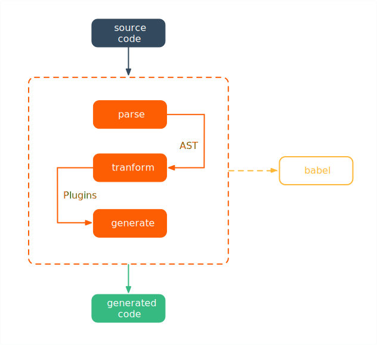

# Babel

> Babel 是 JavaScript 编译器，更确切地说是源码到源码的编译器，通常也叫做“转换编译器（transpiler）”。 意思是说你为 Babel 提供一些 JavaScript 代码，Babel 更改这些代码，然后返回给你新生成的代码。

## Workflow

Babel 的工作步骤分为**解析**、**转换** 及 **生成** 三个阶段，其流程如下图所示：



- **解析阶段**

  **Babel 接受源码并输出 AST**。这一阶段分为两个步骤： [词法解析（Lexical analysis）](https://en.wikipedia.org/wiki/Lexical_analysis)与[语法解析（Syntactic Analysis）](https://en.wikipedia.org/wiki/Parsing)。

  示例源码如下：

  ```javascript
  function add(num) {
    return num + 1;
  }
  ```

  - **词法分析**

  词法分析把字符串形式的代码转换为 令牌（tokens） 流。

  ```javascript
  // 词法分析主要记录 type、value、start、end、loc 这五个属性值
  // ====================================================
  // type指代节点的类型，为包含一组属性的对象
  // ====================================================
  // value指代该节点的值，包含符号、空格、字幕、数字等
  // ====================================================
  // start、end指代该节点在原始代码中的位置，仅为数字
  // ====================================================
  // loc（line of code）指代该节点的行号，该对象示例如下：
  // start: {line: 1,column: 0},end: {line: 3,column: 1}
  // ====================================================

  tokens:[
    ...
    { type: { ... }, value: 'num', start: 0, end: 3, loc: { ... } },
    { type: { ... }, value: '+', start: 4, end: 5, loc: { ... } },
    { type: { ... }, value: '1', start: 6, end: 7, loc: { ... } },
    ...
  ]
  ```

  - **语法分析**

  语法分析把令牌流转换成 AST 。词法分析后的令牌流，信息表述性较差，需要借助语法对其进行加工组装（ program ），以使生成的 AST 易于操作。

  ```javascript
  // body数组下包含生成的 AST 的细节信息
  program: {
    type: "Program",
    start: 0,
    end: 39,
    loc: {
      start: {
        line: 1,
        column: 0
      },
      end: {
        line: 3,
        column: 1
      }
    },
    sourceType: "module",
    body: [...]
  } 
  ```
  
- **转换阶段**

  **Babel 接收 AST 并对其进行遍历，在此过程中对节点进行添加、更新及移除等操作**。 这是 Babel 或是其他编译器中最复杂的过程，同时也是插件将要介入工作的部分。

  这一阶段将在 Plugin 部分做详细说明，示例 AST 如下：

  ```javascript
  // tokens 需要在 babylon6 或 babylon 下才会生成
  // babylon7 下只生成对应的 program 用于 AST 操作
  // 具体细节可在 https://astexplorer.net/ 进行体验
  {
    "type": "File",
    "start": 0,
    "end": 39,
    "loc": {...},
    "program": {
      "type": "Program",
      "start": 0,
      "end": 39,
      "loc": {...},
      "sourceType": "module",
      "body": [...],
      "directives": [...]
    },
    "comments": [...],
    "tokens": [
      {
        "type": {...},
        "value": "function",
        "start": 0,
        "end": 8,
        "loc": {...}
      }
      ...
    ]
  }
  ```

- **生成阶段**

  **Babel 把原始或转换后的 AST 构建为字符串形式的代码，并创建源码映射（source maps）**。

  这一阶段主要操作是遍历 AST 并解析后拼接成对应字符串，最终生成目标代码。

## Packages

  针对 Babel 上述流程，Babel 官方提供一系列的包来处理编译的各阶段。
  
  Babel 的核心包如下：

  - [@babel/core](https://github.com/babel/babel/tree/master/packages/babel-core) 是 Babel 的编译核心，其包含 @babel/parser、@babel/traverse、@babel/generator 三个部分。

  - [@babel/parser](https://github.com/babel/babel/tree/master/packages/babel-parser) 是 Babel 的解析器，起源于 [Acorn](https://github.com/acornjs/acorn) ，继承于 [Babylon](https://github.com/babel/babylon)。

  - [@babel/traverse](https://github.com/babel/babel/tree/master/packages/babel-traverse) 是 Babel 的转换器。

  - [@babel/generator](https://github.com/babel/babel/tree/master/packages/babel-generator) 是 Babel 的生成器。


  详细信息可参阅：[@babel/packages](https://github.com/babel/babel/tree/master/packages)

## Config

  在 Babel6 之后，默认的 ES6 to ES5 转换被移除，需要配置 plugins 及 presets 来完成相应的转换，否则，只会返回源码。

  安装完 Babel ，通常可通过配置 .babelrc 文件来使其生效，基本配置代码如下：

  ```javascript
  // Babel6 下的配置
  {
    "presets": [
      ["env", {
        "targets": {
          "browsers": ["last 2 versions", "safari >= 7"]
        },
        "debug": false
      }], 
      "stage-0"
    ],
    "plugins": [
      ["transform-runtime", {
        "helpers": false,     // 关闭 Babel 内联的 helper 函数，使用 @babel/runtime 替代
        "polyfill": false,    // Babel7 已移除
        "regenerator": true   // 使用 generators/async 时索引 @babel/runtime/regenerator
      }],
      "transform-remove-console"
    ]
  }

  // Babel7 下的配置
  {
    "presets": [
      ["@babel/preset-env", {
        "targets": {
          'browsers': [
            'Android >= 4',
            'iOS >= 10'
          ]
        }
      }]
    ],
    "plugins": [
      ["@babel/plugin-transform-runtime", {
        // 默认为 false，索引 @babel/runtime
        // "corejs": 2 时，索引 @babel/runtime-corejs2
        "corejs": false,    
        "helpers": false,
        "regenerator": true   
      }]
    ]
  }
  
  ```

  关于上面的配置，需要注意：

  1. @babel/preset-env 是一个智能预设，它允许你使用最新的 JavaScript（ ES6+ ），而无需关注目标环境（浏览器/node版本）下所需的语法转换。

  2. stage-x 和 es2015（ES6）、es2016（ES7）等插件的功能类似，用于转换 TC39提案阶段的 JavaScript 代码至 ES5。事实上，stage-x 正是按照 JavaScript 的提案阶段来进行区分，其包含 0、1、2、3、4 五个阶段，并且 x 数字越大，阶段越靠后，越能被标准采纳。需要注意，stage-x 之间存在依赖关系，stage-0 包含 stage-1，stage-1 包含 stage-2，以此类推。

  ::: tip 提示
  stage-4 预设是不存在的，因为它已被标准正式采纳。在 Babel7 版本，yearly presets（ preset-es2015 | preset-es2016 | preset-es2017 ）及 stage-x 已被废弃并不推荐使用，关于为何 Babel 废弃相关插件可参阅：[Removing Babel's Stage Presets](https://babeljs.io/blog/2018/07/27/removing-babels-stage-presets)
  :::

  3. @babel/plugin-transform-runtime 具有两种功能：

     - 对 Babel 转化后的代码，进行再次转化，与 @babel/polyfill 一样，解决不兼容的全局 api 。与 @babel/polyfill 不同的是，它不更改全局对象，只通过追加辅助函数（ helper ）来做兼容处理。

     - 倘若每次的兼容处理都添加辅助函数，会造成很多冗余重复代码。该插件通过索引@babel/runtime 或 @babel/runtime-corejs2 来重复使用辅助函数，提高代码的复用率。
  
  ::: tip 提示
  请确保 @babel/runtime 或 @babel/runtime-corejs2 已安装在 package.json 的  dependencies 中，否则会出现模块索引报错。
  :::

  4. plugins 与 presets 同时存在时，遵循下述执行顺序：

     - plugins 优先于 presets 进行编译

     - presets 按照其数组倒序执行编译

     - plugins 按照其数组正序执行编译

  5. 可以大致这么概括 @babel/preset-env 与 @babel/plugin-transform-runtime 在 Babel 中的作用：

     - @babel/preset-env 主要承担新旧 JavaScript 语法的转换工作

     - @babel/plugin-transform-runtime 主要承担最新 JavaScript 语法的兼容工作

## Polyfill

关于不同环境（ node/brower ）下，JavaScript 语法的兼容是一个普遍存在的问题，针对这一问题，目前大致存在以下三种解决方案：

- 全局引入

  Babel 提供了 @babel/polyfill 库通过改变全局来兼容 es2015 所有方法。但这种方法必须全部引入才能使用，同时会污染全局环境，而且包的体积略大（当然可以采用 CDN 来解决），并不是最佳的解决方法。

  ```javascript
  //输入
  import "@babel/polyfill";

  //输出
  import "core-js/modules/es7.string.pad-start";
  import "core-js/modules/es7.string.pad-end";
  ...
  ```

- 按需引用

  Babel 提供了 @babel/preset-env 和 @babel/plugin-transform-runtime 组合使用来达到按需兼容的效果。基本配置代码如下：

  ```javascript
  // 基于 Babel7
  {
    "presets": [
      ["@babel/preset-env", {
        "targets": {
          'browsers': [
            'Android >= 4',
            'iOS >= 10'
          ]
        }
        // useBuiltIns 为false时，不进行 profill 
        "useBuiltIns": 'usage' 
      }]
    ],
    "plugins": [
      ["@babel/plugin-transform-runtime", {
        "corejs": false,    
        "helpers": false,
        "regenerator": true   
      }]
    ]
  }
  
  ```
  执行代码如下：

  ```javascript
  //输入
  var a = new Promise();
  
  //输出
  import "core-js/modules/es6.promise";
  var a = new Promise();
  ```

  但 useBuiltIns 下 usage 属性依旧处于实验阶段，需要待其稳定。当其稳定后，无疑为最佳实践方案。

- 服务化提供

  [polyfill.io](https://polyfill.io/v3/) 提供一条思路，针对浏览器来提供不同的 polyfill 方案。具体实现即是页面引入[https://cdn.polyfill.io/v2/polyfill.js](https://cdn.polyfill.io/v2/polyfill.js)，服务器会判断浏览器 UA 返回不同的 polyfill 文件。

  当然，这种服务化提供也存在问题，国内的浏览器环境相当复杂，polyfill 覆盖率是个问题。

## Plugins

- Visitors

- Paths


## Reference

- [babeljs.io](https://babeljs.io/docs/en)

- [Babel 用户手册](https://github.com/jamiebuilds/babel-handbook/blob/master/translations/zh-Hans/user-handbook.md)

- [Babel 插件手册](https://github.com/jamiebuilds/babel-handbook/blob/master/translations/zh-Hans/plugin-handbook.md)

- [21 分钟精通前端 Polyfill 方案](https://zhuanlan.zhihu.com/p/27777995)

- [了解 Babel 6 & 7 生态](https://github.com/creeperyang/blog/issues/25)

