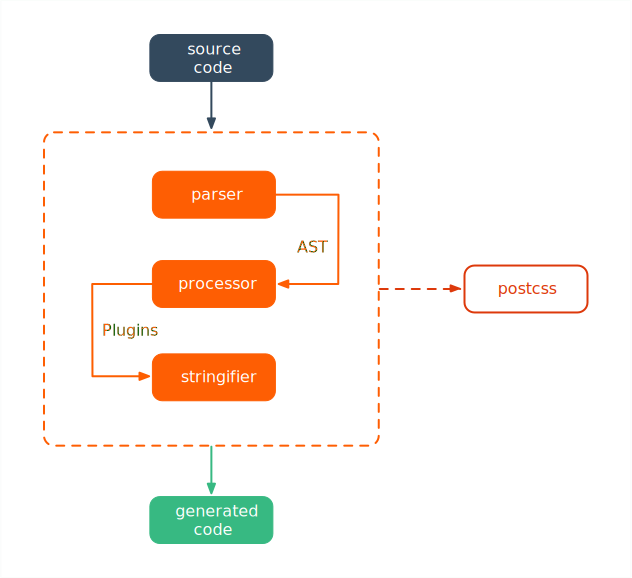

# PostCSS

> PostCSS 是一个允许使用 JS 插件转换样式的工具。 这些插件可以检查（lint） CSS，支持 CSS Variables 和 Mixins， 编译尚未被浏览器广泛支持的先进的 CSS 语法，内联图片，以及其它很多优秀的功能。

## Workflow

PostCSS 的工作步骤分为**解析**、**转换** 及 **生成** 三个阶段，其流程如下图所示：



- **解析**

  **PostCSS 接受源码并输出 AST**。这一阶段分为两个步骤： [词法解析（Lexical analysis）](https://en.wikipedia.org/wiki/Lexical_analysis)与[语法解析（Syntactic Analysis）](https://en.wikipedia.org/wiki/Parsing)。

  示例源码如下：

  ```css
  .home {
    display: flex;
  }
  ```

  - **词法分析**

  词法分析把字符串形式的代码转换为 令牌（tokens） 流。

  ```javascript
  // Tokenizer逐行解析css代码
  tokens:[
    [ 'word', '.home', 1, 1, 1, 5 ],
    [ 'space', ' ' ],
    [ '{', '{', 1, 7 ],
    [ 'space', ' ' ],
    [ 'word', 'display', 2, 3, 2, 9 ],
    [ ':', ':', 2, 10 ],
    [ 'space', ' ' ],
    [ 'word', 'flex', 2, 12, 2, 15 ],
    [ ';', ';', 2, 16 ],
    [ 'space', ' ' ],
    [ '}', '}', 3, 1 ]
  ]
  ```

  - **语法分析**

  语法分析把令牌流转换成 AST 。词法分析后的令牌流，信息表述性较差，需要借助语法对其进行加工组装（ root ），以使生成的 AST 易于操作。

  ```javascript
  // nodes数组下包含生成的 AST 的细节信息
  root: {
    type: "root",
    raws:{
      after: "",
      semicolon: false
    },
    source: {
      input:{
        css: ".home {\n  display: flex;\n}\n",
        file: "path/to/demo.css",
        hasBOM: false
      },
      start: {
        line: 1,
        column: 1
      } 
    },
    nodes: [...]
  }  
  ```

- **转换**

  **PostCSS 接收 AST 并对其进行遍历，在此过程中对节点进行添加、更新及移除等操作，此转换通常借助插件来进行**。

  这一阶段将在 Plugin 部分做详细说明，示例 AST 如下：

  ```javascript
  // 具体细节可在 https://astexplorer.net/ 选择对应css解析器进行体验
  root: {
    type: "root",
    raws:{
      after: "",
      semicolon: false
    },
    source: {
      input:{
        css: ".home {\n  display: flex;\n}\n",
        file: "path/to/demo.css",
        hasBOM: false
      },
      start: {
        line: 1,
        column: 1
      } 
    },
    nodes: [
      {
        type: "rule",
        raws: {...},
        nodes: [...],
        source: {...},
        selector: ".home"
      }
    ]
  }  
  ```

- **生成**

  **PostCSS 把原始或转换后的 AST 构建为字符串形式的代码**。

  这一阶段主要操作是遍历 AST 并解析后拼接成对应字符串，最终生成目标代码。

## Autoprefixer

Autoprefixer 插件是最常用的 PostCSS 插件，主要用于 CSS 的 profill。

## Plugin


## Reference