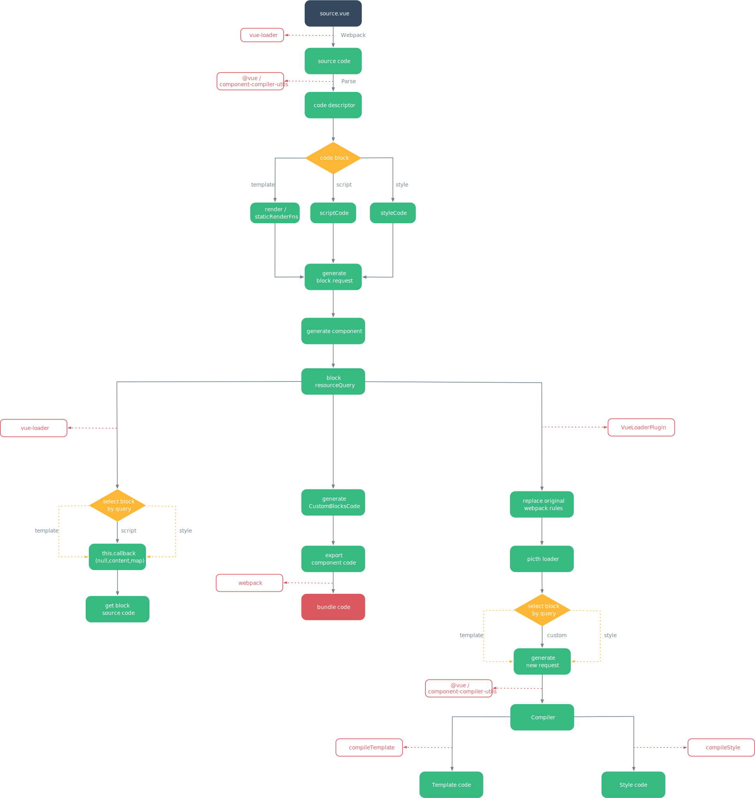

# Vue Loader

> Vue Loader 是一个 webpack 的 loader，它允许以一种名为单文件组件 (SFCs)的格式撰写 Vue 组件。本文将探究 .vue 文件中template、script、style及自定义块是如何解析为 Vue 组件对象，并在浏览器端运行。

## Webpack

众所周知，现代前端工程化离不开webpack，从本质上来说，**webpack 是一个现代 JavaScript 应用程序的静态模块打包器**。


.vue 文件的解析及运行同样离不开webpack，下面将从vue-loader的loader与plugin两个方面来解析vue单文件组件系统的实现过程。

::: tip
需要值得注意的是，**本文档基于webpack4.0+版本来解读vue-loader**。webpack4.0+版本基于原有版本进行大幅度升级，原有webpack拆分为webpack、webpack-dev-server、webpack-cli三个npm包，配置层面也更加倾向于零配置，当然loader与plugin的api层面也有变化
:::

## Loader

首先，webpack的loader到底是什么？

[官方文档](https://webpack.docschina.org/api/loaders/)中这么进行解读的：**所谓 loader 只是一个导出为函数的 JavaScript 模块**。

下面我们来看一下最简单的loader实现：

1. 配置package.json
```json
  "scripts": {
    "serve": "webpack-dev-server --config example/webpack.config.js --inline --hot"
  }
```


2. 配置webpack.config.js

```javascript
const path = require('path')

module.exports = {
  mode: 'development',
  entry: path.resolve(__dirname, './main.damo'),
  output: {
    path: path.resolve(__dirname, 'dist'),
    filename: 'bundle.js',
    publicPath: '/dist/'
  },
  devServer: {
    contentBase: __dirname
  },
  module: {
    rules:[
      {
        test: /\.damo$/,
        loader: 'test-loader'
      }
    ]
  },
  resolveLoader: {
    alias: {
      'test-loader': require.resolve('../lib')
    }
  }
}

```

3. 配置loader

```javascript

module.exports = function (source) {
  let code = `
    let style = document.createElement("style");
    style.innerText = ${JSON.stringify(source)};
    document.head.appendChild(style);
  `
  return code;
}

```

从上述案例中可以看出，loader 接受 source 并返回 code 。而source 便是 .damo 文件中字符串化的代码，code 是对 source 加工处理后的字符串。为此，大致上可以认为，loader 接受 String 并返回 String。

vue-loader 也是类似的机制，不同于简单的loader，它利用 VueLoaderPlugin 插件解析了 .vue 文件中的template 、style 、script 三个模块，并把各模块解析后的代码利用 vue 组件生成函数构建为组件导出，从来实现了在浏览器端运行 .vue 文件的功能。代码如下：

```javascript
  //templateImport、scriptImport、stylesCode分别为 .vue 文件中各模块导出的js代码

    let code = `
  ${templateImport}
  ${scriptImport}
  ${stylesCode}

  /* normalize component */
  import normalizer from ${stringifyRequest(`!${componentNormalizerPath}`)}
  var component = normalizer(
    script,
    render,
    staticRenderFns,
    ${hasFunctional ? `true` : `false`},
    ${/injectStyles/.test(stylesCode) ? `injectStyles` : `null`},
    ${hasScoped ? JSON.stringify(id) : `null`},
    ${isServer ? JSON.stringify(hash(request)) : `null`}
    ${isShadow ? `,true` : ``}
  )
    `.trim() + `\n`

  code += `\nexport default component.exports`

```

::: tip 
vue-loader 的 loader 模块并没有实现解析 .vue 文件中的template 、style 、script 三个模块的功能，解析过程是通过其 plugin模块 来实现的
:::

## Plugin

[官方文档](https://webpack.docschina.org/api/plugins/)中这么进行解读的：**插件是 webpack 生态系统的重要组成部分，为社区用户提供了一种强大方式来直接触及 webpack 的编译过程。插件能够钩入到在每个编译中触发的所有关键事件。**

下面演示了一个简单 plugin 引入的大致过程：

1. 配置webpack.config.js

```javascript

const TestLoaderPlugin = require('../lib/plugin')

module.exports = {
  // ... 这里是其他配置 ...
  plugins:[
    new TestLoaderPlugin(
      ()=>{
        console.log('run')
      },
      ()=>{
        console.log('failed')
      }
    )
  ]
}

```

2. 配置plugin

```javascript

class TestLoaderPlugin {
  constructor(doneCb,failCb){
    this.doneCb = doneCb;
    this.failCb = failCb;
  }
  //webpack 初次加载完此插件后执行，只会在 webpack 启动的时候被执行一次
  apply(compiler){
    compiler.hooks.done.tap('TestLoaderPlugin', (compiler) => {
      this.doneCb();
    });  
    compiler.hooks.failed.tap('TestLoaderPlugin', (compiler) => {
      this.failCb();
    }); 
  }
}

module.exports = TestLoaderPlugin

```

倘若开发一个简单loader，并不需要引入 plugin。当需要解析特定结构下的单文件时，因 loader 不能触及 webpack 编译过程的特性，plugin 将不可或缺。

通常来说，plugin 是 webpack 的核心功能，用于解决 loader 无法实现的事，包括但不限于 改写 loader 解析的 rule 、触发 compiler 编译器相关的 hook 、 触发compilation 编译过程中的 hook等。

在 vue-loader 中， VueLoaderPlugin 插件主要承担了三项职责：

**1. 改写 webpack 中的 module.rule **

**2. 通过 pitch 函数拦截并转换 .vue 文件的 template、script、style 及 custom 模块的请求**

**3. 调用相应的模块编译器对各模块的请求进行编译**

代码如下：

```javascript code-contain
//@vue/component-compiler-utils  
//compileTemplate
const templateLoaderPath = require.resolve('./templateLoader')
//compileStyle
const stylePostLoaderPath = require.resolve('./stylePostLoader')
const isCSSLoader = l => /(\/|\\|@)css-loader/.test(l.path)

//pitch loader
module.exports.pitch = function (remainingRequest) {
  const options = loaderUtils.getOptions(this)
  const query = qs.parse(this.resourceQuery.slice(1))

  let loaders = this.loaders

  const genRequest = loaders => {

    const seen = new Map()
    const loaderStrings = []

    loaders.forEach(loader => {
      const identifier = typeof loader === 'string'
        ? loader
        : (loader.path + loader.query)
      const request = typeof loader === 'string' 
        ? loader 
        : loader.request
      if (!seen.has(identifier)) {
        seen.set(identifier, true)
        loaderStrings.push(request)
      }
    })

    return loaderUtils.stringifyRequest(this, '-!' + [
      ...loaderStrings,
      this.resourcePath + this.resourceQuery
    ].join('!'))
  }

  if (query.type === `style`) {
    const cssLoaderIndex = loaders.findIndex(isCSSLoader)
    if (cssLoaderIndex > -1) {
      const afterLoaders = loaders.slice(0, cssLoaderIndex + 1)
      const beforeLoaders = loaders.slice(cssLoaderIndex + 1)
      const request = genRequest([
        ...afterLoaders,
        stylePostLoaderPath,
        ...beforeLoaders
      ])

      return `
        import mod from ${request}; 
        export default mod; 
        export * from ${request}`
    }
  }

  if (query.type === `template`) {
    const path = require('path')
    const request = genRequest([
      templateLoaderPath + `??vue-loader-options`,
      ...loaders
    ])
    return `export * from ${request}`
  }

  if (query.type === `custom` &&
      loaders.length === 1 &&
      loaders[0].path === selfPath) {
    return ``
  }

  const request = genRequest(loaders)
  return `
    import mod from ${request}; 
    export default mod; 
    export * from ${request}`
}


//stylePostLoader
const qs = require('querystring')
const { compileStyle } = require('@vue/component-compiler-utils')

module.exports = function (source, inMap) {
  const query = qs.parse(this.resourceQuery.slice(1))
  const { code, map, errors } = compileStyle({
    source,
    filename: this.resourcePath,
    id: `data-v-${query.id}`,
    map: inMap,
    scoped: !!query.scoped,
    trim: true
  })

  if (errors.length) {
    this.callback(errors[0])
  } else {
    this.callback(null, code, map)
  }
}

//templateLoader类似，详情可查阅下方源码解析

```


## Flow

vue-loader的流程图大体如下：




## 附录

个人源码分析版本地址：
[damo-loader](https://github.com/Damo-web/damo-loader)

<style>
  .code-contain {
    max-height: 700px;
    overflow: auto;
  }
</style>