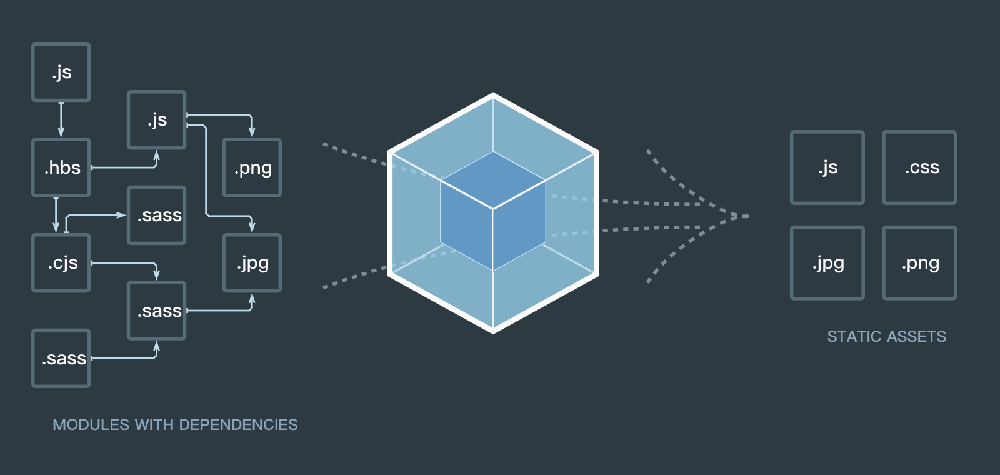

# Vue Loader

> Vue Loader 是一个 webpack 的 loader，它允许以一种名为单文件组件 (SFCs)的格式撰写 Vue 组件。本文将探究 .vue 文件中template、script、style及自定义块是如何解析为 Vue 组件对象，并在浏览器端运行。

## Webpack

众所周知，现代前端工程化离不开webpack，从本质上来说，**webpack 是一个现代 JavaScript 应用程序的静态模块打包器**。



.vue 文件的解析及运行同样离不开webpack，下面将从vue-loader的loader与plugin两个方面来解析Vue的单文件组件实现过程。

::: tip
需要值得注意的是，**本文档基于webpack4.0+版本来解读vue-loader**。webpack4.0+版本基于原有版本进行大幅度升级，原有webpack拆分为webpack、webpack-dev-server、webpack-cli三个npm包，配置层面也更加倾向于零配置，当然loader与plugin的api层面也发现些许变化
:::

## Loader

首先，webpack的loader到底是什么？**loader 其实只是导出javascript模块的函数**。

下面我们来看一下最简单的loader实现：

1. 配置package.json
```json
  "scripts": {
    "serve": "webpack-dev-server --config example/webpack.config.js --inline --hot"
  }
```


2. 配置webpack.config.js

```javascript
const path = require('path')

module.exports = {
  mode: 'development',
  entry: path.resolve(__dirname, './main.damo'),
  output: {
    path: path.resolve(__dirname, 'dist'),
    filename: 'bundle.js',
    publicPath: '/dist/'
  },
  devServer: {
    contentBase: __dirname
  },
  module: {
    rules:[
      {
        test: /\.damo$/,
        loader: 'test-loader'
      }
    ]
  },
  resolveLoader: {
    alias: {
      'test-loader': require.resolve('../lib')
    }
  }
}

```

3. 配置loader

```javascript

module.exports = function (source) {
  let code = `
    let style = document.createElement("style");
    style.innerText = ${JSON.stringify(source)};
    document.head.appendChild(style);
  `
  return code;
}

```

从上述案例可以看出，loader 接受 source 并返回 code 。而source 便是 .damo 文件中字符串化的代码，code 是对 source 加工处理后的字符串。为此，大致上可以认为，loader 接受 String 并返回 String。

vue-loader 其实也是同样的机制，相对于简单的loader，它实现了解析 .vue 文件中的template 、style 三个模块。
