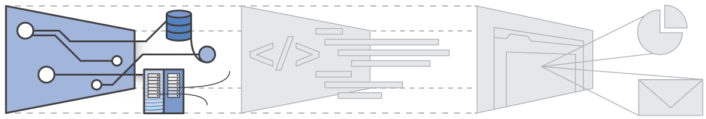
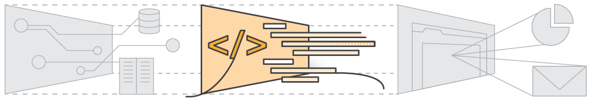
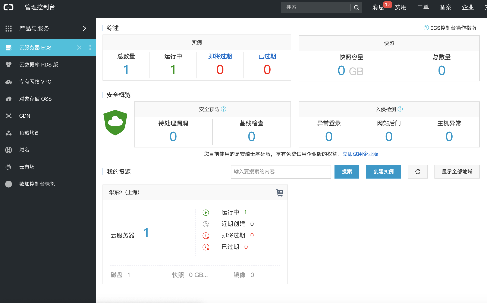
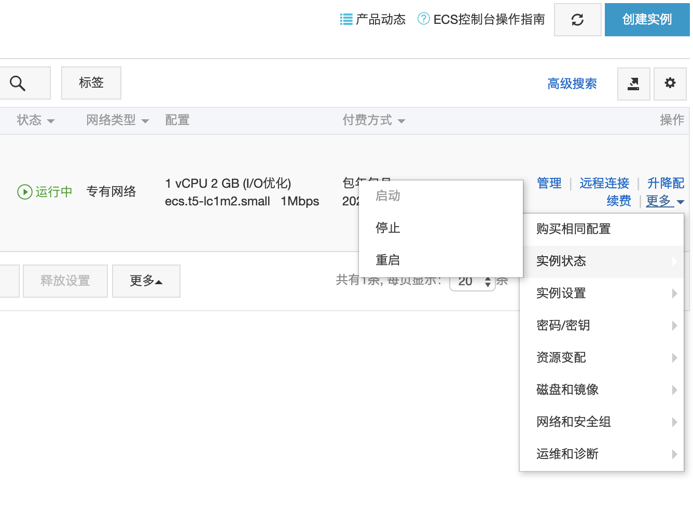
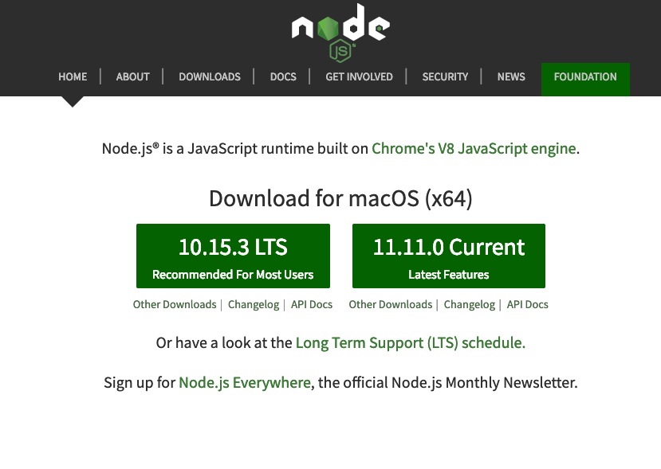

# 阿里云ECS
  
> 本文为阿里云ECS搭建指引，包含阿里云ECS实例启动、登录及node环境配置过程。

## 云服务

在阿里云ECS搭建之前，需要对云服务有个大致的了解。

云服务，通常指云计算服务，是一种基于互联网的计算方式，通过这种方式，共享的软硬件资源和信息可以按需求提供给计算机各种终端和其他设备，使用户能够方便、有效地共享和利用开放网络上的资源。

按服务模式，云服务主要分为三种：

1. 基础设施即服务（IaaS:Infrastructure-as-a-Service）：消费者使用“基础计算资源”，如处理能力、存储空间、网络组件或中间件。**消费者能掌控操作系统、存储空间、已部署的应用程序及网络组件（如防火墙、负载平衡器等），但并不掌控云基础架构**。例如：Amazon EC2（ Elastic Cloud ）、Amazon S3（ Simple Storage Service ）、Aliyun ECS（ Elastic Cloud Service ）、Aliyun OSS（ Object Storage Service）



2. 平台即服务（PaaS:Platform-as-a-Service）：消费者使用主机操作应用程序。**消费者掌控运作应用程序的环境（也拥有主机部分掌控权），但并不掌控操作系统、硬件或运作的网络基础架构**。平台通常是应用程序基础架构。例如：AWS RDS（Relational-Database-Service） 、AWS Elastic Beanstalk 、Google App Engine。



3. 软件即服务（SaaS:Software-as-a-Service）：**消费者使用应用程序，但并不掌控操作系统、硬件或运作的网络基础架构**。是一种服务观念的基础，软件服务供应商，以租赁的概念提供客户服务，而非购买，比较常见的模式是提供一组账号密码。例如：Google Gmail 、Google+ App 、Microsoft CRM。


以微信小程序开发为例，可做如下类比：

1. IaaS 服务于软件架构者，类似**微信服务器、开发者服务器等基础计算资源**

2. PaaS 服务于软件开发者，类似**微信公众平台、微信开发者工具等开发工具**

3. SaaS 服务于软件消费者，类似**腾讯视频、美团外卖等小程序**

随着云服务市场的开拓，Saas 与 Paas 的界限逐渐打破并融合，衍生出以下服务模式：

- Baas（Backend-as-a-Service）： 后端即服务，主要提供后端中间件服务，如数据库存储、消息队列、监控服务等。

- Industry Solutions： 行业解决方案，主要提供垂直领域的技术服务，如机器学习、区域链、短视频、直播、电商等。

## 阿里云ECS

阿里云ECS的搭建及登录，一般遵循下述步骤：

1. 注册阿里云账号，购买ECS实例后，可点击**云服务器 ECS**进入到管理页面。



2. 点击**我的资源**下的云服务器，可进入到**实例列表**页面，控制及配置相应的ECS实例



3. 启动ECS服务器之后，可通过命令行来连接阿里云服务器（以 Mac 为例）：

```shell
Last login: Fri Mar  8 14:52:01 on ttys008

# 连接ECS服务器公网IP地址（下方仅为示例IP）

bash-3.2# ssh 42.106.124.156

# 输入设置的ECS服务器密码（忘记密码可通过重置密码并重启实例来生效）

root@42.106.124.156's password: 

# 下方为阿里云服务器登录成功反馈

Last login: Sat Nov 10 15:10:20 2018 from 121.253.121.32

Welcome to Alibaba Cloud Elastic Compute Service !

# 登出阿里云服务器

[root@snowball ~]# exit
登出
Connection to 42.106.124.156 closed.

```


## Node 环境配置

Node 的环境配置方式有如下两种：

- 通过[ Node官网 ](https://nodejs.org/en/)安装 

 

::: tip  提示
从图中可看出，Node分为 LTS 和 Current 两个版本：LTS是 Long-Term-Support -Support 的简写，此版本会得到官方团队的长期维护；Current 是当前最新的版本，可体验Node的新特性。

通常来说，**LTS 版本更加稳定，适用于生产环境；Current 版本能够体验 Node 的新特性，但可能含有部分风险，适用于开发环境**。
:::

- 通过[ NVM（Node Version Manager）](https://github.com/creationix/nvm) 安装

官方 NVM 安装过程如下：

1. 安装并更新 nvm

```shell

curl -o- https://raw.githubusercontent.com/creationix/nvm/v0.34.0/install.sh | bash

```

2. 加入 nvm 至环境变量

```shell
# nvm安装后，截取如下信息，重开命令行执行

# Close and reopen your terminal to start using nvm or run the following to use it now:

# This loads nvm

export NVM_DIR="$HOME/.nvm"
[ -s "$NVM_DIR/nvm.sh" ] && \. "$NVM_DIR/nvm.sh"

# This loads nvm bash_completion

[ -s "$NVM_DIR/bash_completion" ] && \. "$NVM_DIR/bash_completion" 

```

3. 安装并默认 node 版本

```shell

#查看远端 node 列表并安装

nvm ls-remote

nvm install v11.0.0

# linux下不指定默认nodejs会导致系统重启后node及npm环境丢失
# 安装node后可以使用nvm alias指定默认nodejs版本

nvm alias default v11.0.0

default -> v11.11.0

# 查看nvm现使用的 node 版本

nvm current

```

4. 切换 node 版本


```shell

# 查看 nvm 的 node 列表

[root@snowball ~] nvm ls
       v10.13.0
->     v11.0.0
default -> v11.0.0
stable -> 11.0 (-> v11.0.0) (default)
unstable -> 11.0 (-> v11.0.0) (default)

# 使用特定的 node 版本

[root@snowball ~] nvm use v10.13.0

Now using node v10.13.0

```

5. 卸载 nvm

```shell

# 卸载nvm
# $NVM_DIR 通常为 ~/.nvm

sudo rm -rf $NVM_DIR ~/.npm ~/.bower

```

::: tip  提示
**因版本升级和切换的方便性，推荐使用 nvm 来安装 node**。需要注意的是，nvm需要指定默认的 node 版本号，不然阿里云服务器重启和登录时，会丢失 node 运行环境。
:::

## 参考链接

- [云计算](https://zh.wikipedia.org/wiki/%E9%9B%B2%E7%AB%AF%E9%81%8B%E7%AE%97)

- [什么是云计算？](https://aws.amazon.com/cn/what-is-cloud-computing/)

- [ ECS控制台操作指南 ](https://help.aliyun.com/document_detail/25429.html?spm=5176.2020520101.105.d25429.b3c94df5oJB49A)

- [Node.js Foundation Release Working Group](https://github.com/nodejs/Release)

- [Node Version Manager](https://github.com/creationix/nvm)

- [How to uninstall nvm](https://github.com/creationix/nvm/issues/298)


