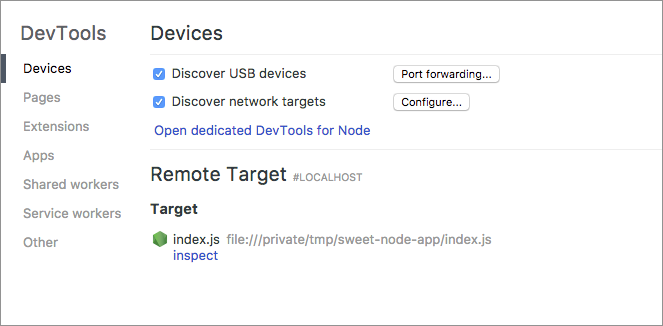

# Node Debug
  
> 众所周知，代码调试按照调试方式大致分为日志（Log）和断点（Breakpoint）两种： 日志是手动在代码中增加 Log 来获取到程序运行到该代码行时所需打印的对象；断点是在需要观察的点打上 Breakpoint 来获取到程序运行到该点时的所有上下文对象。下面篇目浅析下 Node.js 调试过程中的技巧。

## 日志

- **Console**

console 在开发 Web 应用时，是经常会运用到的打印日志函数，通用方法在此不再复述。

在打印大量日志时，需要对日志进一步区分，以达到快速定位所需信息的目的:


如上图所示，可以在console.log()加辅助标志符或颜色来进行区分。

```javascript
// 代码段大致如下
// \x1b[35m代表字体颜色，\x1b[0m代表重置文字颜色

console.log("\x1b[35m分隔符 ------------------------------\x1b[0m")

// ANSI Escape Code配置如下
Reset = "\x1b[0m"
Bright = "\x1b[1m"
Dim = "\x1b[2m"
Underscore = "\x1b[4m"
Blink = "\x1b[5m"
Reverse = "\x1b[7m"
Hidden = "\x1b[8m"

FgBlack = "\x1b[30m"                  BgBlack = "\x1b[40m"
FgRed = "\x1b[31m"                    BgRed = "\x1b[41m"
FgGreen = "\x1b[32m"                  BgGreen = "\x1b[42m"
FgYellow = "\x1b[33m"                 BgYellow = "\x1b[43m"
FgBlue = "\x1b[34m"                   BgBlue = "\x1b[44m"
FgMagenta = "\x1b[35m"                BgMagenta = "\x1b[45m"
FgCyan = "\x1b[36m"                   BgCyan = "\x1b[46m"
FgWhite = "\x1b[37m"                  BgWhite = "\x1b[47m"
```

需要注意的是，Node 端打印 Object 时，会出现如下问题： 

```javascript
// 代码如下
const OBJECT_EXAMPLE = {
  "a":1,
  "b":{
     "c":2,
     "d":{
        "e":3,
        "f":{
           "g":4,
           "h":{
              "i":5
           }
        }
     }
  }
}

console.log(OBJECT_EXAMPLE);

// 命令行执行结果如下
{ a: 1, b: { c: 2, d: { e: 3, f: [Object] } } }

// 出现如下问题，主因在于 log 本质是字符串化的过程，详情可参阅：
// https://github.com/nodejs/node/blob/master/lib/internal/console/constructor.js?L213-L249#L213-L249

```
解决方法如下：

```javascript

// 利用 Node 内置 Util 模块
const util = require('util')
console.log(util.inspect(OBJECT_EXAMPLE, {showHidden: false, depth: null}))
console.log(util.inspect(OBJECT_EXAMPLE, false, null, true/* enable colors */))

// 利用 console 内置参数
console.log(JSON.stringify(OBJECT_EXAMPLE, null));
console.dir(OBJECT_EXAMPLE, { depth: null })

```


- **Node.js 日志库**

console 只适用于开发调试，并不适用生产环境。Node 生产环境下不但需要记录程序运行日志，还需要将重要日志记录到文件中，甚至写入至数据库中。随着 Node 运行日志的需求，衍生出专业的 npm 库，如： [winston](https://github.com/winstonjs/winston)、[log4js-node](https://github.com/log4js-node/log4js-node)、[bunyan](https://github.com/trentm/node-bunyan)等。

上述三个 log 库的性能对比及选择，可参阅：[a-benchmark-of-five-node-js-logging-libraries](https://www.loggly.com/blog/a-benchmark-of-five-node-js-logging-libraries/)

Node.js 日志库大致流程如下：


下面以 winston 为例，浅谈下日志记录过程：

```javascript
// 安装 winston
npm install winston
yarn add winston 

const { createLogger, format, transports } = require('winston')

// 日志分级（ Level ）
// error, warn, info, verbose, debug, silly 
const logger = new winston.Logger({
  level: 'info',//分级配置
})

logger.log('info','hello level')

// 日志输出（ Transport ）
// 可通过 winston-mail 、 winston-mongodb等 npm 库来扩展输出口
const logger = new winston.Logger({
  level: 'info',//分级配置
  transports: [
     // 记录至命令行
     new winston.transports.Console(),
     // 记录至文件 combined.log
     new winston.transports.File({ filename: 'combined.log' })
   ]
})

logger.log('error','error transport')

// 日志格式化（ Format ）
const logger = createLogger({
  level: 'info',
  // format
  format: format.combine(
    format.timestamp({
      format: 'YYYY-MM-DD HH:mm:ss'
    }),
    format.json()
  ),
  // defaultMeta
  defaultMeta: { service: 'Demo-Service' },
  transports: [
    new winston.transports.Console(),
    new transports.File({ filename: 'error.log', level: 'error' }),
    new transports.File({ filename: 'combined.log' })
  ]
});

logger.log('warn','warn format','')

```

## 断点

- **Chrome篇**

2016年，Node 决定将 Chrome 浏览器的开发者工具作为官方的调试工具。使用 Chrome DevTools 调试 Node 程序要遵循下述步骤：

1. 确保 Node.js 版本在v6.3.0+

2. 在 package.json 中进行如下配置：

```javascript

"scripts": {
   // --inspect 标记
   // 简单使用
   "debug": "node --inspect-brk main.js"
   // --inspect-brk 标记
   // 推荐使用
   // 此标记将在脚本的第一条语句处断开，以便你可以在源代码中设置断点，并根据需要启动/停止构建
   "debug": "node --inspect-brk main.js"
   // 因 Webpack 、Mocha等库具有自身的 CLI
   // 需要调用node_modules下对应库的 CLI 来进行调试
   "debug": "node --inspect-brk ./node_modules/webpack/bin/webpack.js --config build/webpack.config.js"
}

```

3. 启动系统命令行，执行如下操作

```bash
# 执行代码
yarn debug

# 执行结果
yarn run v1.10.1
$ node --inspect-brk ./node_modules/webpack/bin/webpack.js --config build/webpack.config.js
Debugger listening on ws://127.0.0.1:9229/00e0137c-b4f9-4d73-ac9f-f9831f09d81b
For help, see: https://nodejs.org/en/docs/inspector

```

4. 在浏览器中访问 chrome://inspect



5. 单击 Device 标题下的 "Open dedicated DevTools for Node" 链接，打开一个专门 debugger 窗口，切换至 Connect 选项，并设置步骤三命令行结果中的端口（默认为9229），设置完成后关闭窗口


6. 重新执行步骤三的命令，你会看到在 Remote Target 标题下可以进行 inspect(审查) 的活动脚本。单击 Remote Target 标题下的 "inspect" 链接，打开一个专门 debugger 窗口。


- VsCode篇


- CommandLine篇


## 热更新

- nodemon

- supvisor


